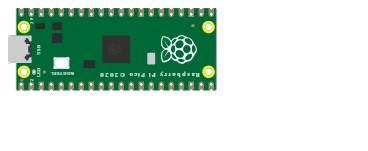

# Raspberry Pi Pico 2

**RP2350** microcontroller board (dual-core ARM Cortex-M33 at 150 MHz), successor to the Pico. Same form factor, same 40-pin layout, **3.3 V** logic level — 26 GPIO pins and 3 analog inputs (ADC).

## Pins

| Pin | Role |
|--------|------|
| **GP0–GP28** | Digital I/O (GP26–GP28 = ADC0–ADC2) |
| **3V3** | 3.3 V output |
| **VSYS / VBUS** | Input power |
| **GND** | Grounds |
| **RUN** | Reset (active low) |

## Usage

- Full pinout via the **K** button (pinout poster) — identical to the Pico.
- **3.3 V logic level**: do not apply 5 V to an input.
- Programmable in **MicroPython**: Kablix loads the `RPI_PICO2` firmware.
- The RP2350 also exists in a RISC-V flavor (Hazard3 cores): Kablix simulates the **Cortex-M33** cores, the `-RISCV-` firmwares do not fit.

> ⚠️ The GPIOs are **not** 5 V tolerant.

> ℹ️ Bare-metal C/C++ is not supported on this board yet: use MicroPython, or the Pico for an Arduino program.

---

*Kablix in-house component. Board drawing after the official Raspberry Pi Ltd artwork. RP2350 © Raspberry Pi Ltd.*
