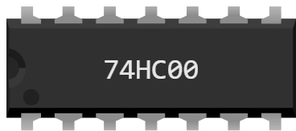

# 74xx00 — 4 puertas NAND de 2 entradas

Encapsulado DIL-14 para la protoboard: **cuatro puertas NAND independientes**, cada una con sus dos entradas y su salida. Una puerta NAND da 0 **solo cuando las dos entradas están a 1**: una AND seguida de un inversor.

Serie 74: las «xx» de la referencia son su **familia** (HC, LS, HCT…). No cambia ni la función ni el patillaje, pero fija el **rango de alimentación** — y por tanto con qué placa funciona el chip.

| Familia | Alimentación |
|---|---|
| HC, AC, ACT | 2 a 6 V |
| C | 3 a 15 V |
| HCT, ALS, F | 4,5 a 5 V |
| S, LS | 4,75 a 5,25 V |

Un Uno da 5 V: todas las familias funcionan. Un **Pico solo da 3,3 V**: allí solo funcionan HC, AC, ACT y C — un 74LS00 en un Pico no hace nada.

## Pines

| Pin | Nombre | Función |
|---|---|---|
| 1 | **A1** | entrada A de la puerta 1 |
| 2 | **B1** | entrada B de la puerta 1 |
| 3 | **Q1** | salida de la puerta 1 |
| 4 | **A2** | entrada A de la puerta 2 |
| 5 | **B2** | entrada B de la puerta 2 |
| 6 | **Q2** | salida de la puerta 2 |
| 7 | **GND** | masa — **cable negro** |
| 8 | **Q3** | salida de la puerta 3 |
| 9 | **B3** | entrada B de la puerta 3 |
| 10 | **A3** | entrada A de la puerta 3 |
| 11 | **Q4** | salida de la puerta 4 |
| 12 | **A4** | entrada A de la puerta 4 |
| 13 | **B4** | entrada B de la puerta 4 |
| 14 | **VCC** | alimentación — **cable rojo** |

## Tabla de verdad

Una puerta; las demás son idénticas.

| A | B | Q |
|---|---|---|
| 0 | 0 | 1 |
| 0 | 1 | 1 |
| 1 | 0 | 1 |
| 1 | 1 | 0 |

## Propiedades

| Propiedad | Función | Por defecto |
|---|---|---|
| `ref` | Referencia — cambiarla cambia el patillaje, no el dibujo | 74xx00 |
| `family` | Familia de la serie 74: fija el rango de alimentación | HC |

## Simulación

- **La alimentación no es opcional**: sin un cable rojo en VCC (pin 14) y un cable negro en GND (pin 7), el chip no da ninguna salida.
- Fuera del rango **de la familia elegida (2 a 6 V para HC)**, Kablix indica «Tensión de alimentación incompatible». **Por debajo**, el chip no hace nada; **por encima**, el chip queda DESTRUIDO — cruz roja, y sigue así hasta la siguiente ejecución.
- Una **entrada al aire no es un 0**: la salida queda indefinida mientras esa entrada cuente (aquí basta una sola entrada a 0 para decidir).
- Una salida ataca el montaje igual que un pin de la placa: un LED **con su resistencia**, la base de un transistor o la entrada de otro chip.

## Uso

- La NAND es la puerta **universal**: con ella se pueden construir todas las demás funciones. Unidas sus dos entradas, se convierte en un inversor.
- Las 4 puertas del encapsulado son independientes: un solo chip puede servir para 4 cosas sin relación entre sí.
- Conecte las entradas a salidas de la placa y la salida a una entrada de la placa: el programa lee entonces un resultado calculado por el chip, no por el microcontrolador.
- Prueba lista para usar: `CI-uno` y `CI-pico` en `testkablix/` — los doce chips cableados juntos, cada puerta comprobada.

---

*Componente propio de Kablix — dibujo de Frank Sauret.*
