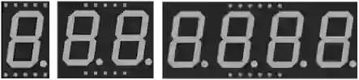

# Display de 7 segmentos

Display de siete segmentos (+ punto decimal) para cifras y símbolos sencillos. De 1 a 4 dígitos, cátodo común o ánodo común.

## Pines

| Pin | Función |
|--------|------|
| **A–G** | Los 7 segmentos |
| **DP** | Punto decimal |
| **COM / COM.1 / COM.2** | Común (cátodo o ánodo) |
| **DIG1–DIG4** | Comunes de cada dígito (varios dígitos) |

## Propiedades

| Propiedad | Función | Por defecto |
|-----------|------|--------|
| `color` | Color | rojo |
| `common` | Común (cátodo/ánodo) | cátodo |
| `digits` | Número de dígitos (1/2/4) | 1 |
| `colon` | Dos puntos de reloj | — |

## Uso

- Una resistencia por segmento.
- Cátodo común: COM a masa, segmentos a +; ánodo común: al revés.
- Varios dígitos: multiplexado (encender un dígito cada vez, muy deprisa).
- **Modo reloj** (`colon`, 4 dígitos): los puntos decimales dejan sitio a los dos puntos centrales, que se encienden en cuanto se activa cualquier DP. Para mantenerlos encendidos permanentemente, conecte DP al **raíl +** de la placa (3,3 V o 5 V) a través de una resistencia — sin necesidad de un pin del microcontrolador: la simulación lo tiene en cuenta.

---

*Ficha adaptada y traducida de la [documentación de Wokwi](https://docs.wokwi.com/parts/wokwi-7segment) — © Wokwi. Componentes `@wokwi/elements` (licencia MIT).*
