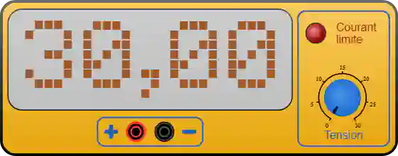

# Fuente de alimentación de laboratorio

Fuente de tensión continua **ajustable de 0 a 30 V**, con limitación de corriente. Alimenta un montaje **sin microcontrolador** (un LED se enciende solo con la fuente) o aporta la potencia que la placa no puede dar: servomotores, borne *Power In* del [controlador PWM PCA9685](pca9685.md), tiras de LED…

Categoría de la paleta: **Instrumentos de medida**.

## Pines

| Borne | Función |
|-------|------|
| **V+** | Borne banana **rojo** — polo positivo (raíl alto del montaje) |
| **GND** | Borne banana **negro** — masa (0 V, común a todo el montaje) |

Los dos bornes están a 20 px (dos pasos de cuadrícula). Los cables conectados a V+ y GND toman automáticamente los colores rojo y negro.

## Propiedades

| Propiedad | Función | Por defecto |
|-----------|------|--------|
| `voltage` | **Tensión al arrancar** (V), de 0 a 30 en pasos de 0,1 | `5` |
| `maxcurrent` | Corriente máxima suministrada (A), de 0,1 a 10 en pasos de 0,1 | `1` |

> `voltage` es el valor al **arrancar** la simulación: después el mando la varía libremente, y la tensión vuelve a este valor en cada nueva ejecución.

## Ajustar la tensión durante la simulación

El mando del panel se gira **con el ratón**, como en un instrumento real: pulse sobre él y gire alrededor de su centro.

- Un recorrido de **300°** en sentido horario va de **0 V a 30 V** (es decir, 10° por voltio); los 60° restantes son una **zona muerta** — al entrar en ella, el mando se queda en el extremo más cercano (0 V o 30 V).
- La pantalla muestra la tensión actual con dos decimales (`0.00` a `30.00`).
- El mando está **inactivo durante la edición**: solo gira cuando la simulación está en marcha. Se tienen en cuenta el zoom y la rotación del componente.

## Limitación de corriente

Kablix estima continuamente la corriente que suministra la fuente (una aproximación pedagógica, recalculada en cada fotograma):

- camino resistivo más directo de **V+ a masa** (ley de Ohm; un cable que une directamente V+ con GND es un **cortocircuito**);
- cada **LED** que vuelve al V+ de la fuente: `(V − Vf) / R`;
- **0,2 A por servomotor** alimentado por el raíl V+;
- el consumo declarado de los módulos alimentados (borne del PCA9685…).

Cuando esa corriente supera `maxcurrent`, el LED **«Current limit»** se enciende en rojo vivo con halo — exactamente como una fuente real que entra en limitación de corriente. Aumente la corriente máxima o corrija el montaje (resistencia en serie ausente, cortocircuito).

## Uso

- Conecte **V+** al raíl positivo del montaje y **GND** a masa — la masa debe ser **común** con la de la placa si ambas alimentan el mismo circuito.
- Compruebe la tensión **antes** de conectar: 30 V en un LED + 220 Ω lo quema, 2,5 V en un LED azul no lo enciende.
- Para servos o un PCA9685: **~5 V** y una corriente máxima que cubra la carga (0,2 A por servo). Por debajo, las salidas no se mueven.

---

*Dibujo del instrumento realizado por Frank para Kablix.*
