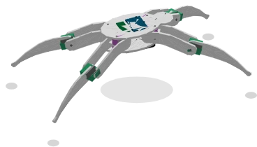

# Robot araña

Un **robot cuadrúpedo** completo: un chasis y **4 patas de 2 articulaciones cada una** (coxa y patella), es decir **8 servomotores**. Toda la electrónica va **a bordo, dentro del cuerpo** — un **Pico W**, un [controlador PWM PCA9685](pca9685.md) y la batería: los 8 servos están cableados internamente, nunca aparecen en la hoja.

**El robot no tiene ningún pin: no hay nada que cablear.** *Es* la placa. Al colocarlo en la hoja se elige el **Pico W** como placa de destino, y el programa que escriba se ejecuta dentro de él, exactamente como en un Pico W desnudo. La placa está dibujada sobre el lomo del chasis — la referencia que dice dónde va el código.

El robot se dibuja **en 3D** (vista isométrica): las coxas barren el suelo y las patellas levantan las patas.

> Es casi el **robot real**: sus piezas son las de PMMA cortadas con láser — cuerpo en sándwich, fémur y tibia de cada pata, servos y placas en su sitio. Las longitudes, la separación de las coxas, la altura del cuerpo y los recorridos salen todos del dibujo; el componente no fija ninguno. Volver a dibujar una pieza cambia, por tanto, el robot en pantalla, sin tocar el código.

Categoría de la paleta: **Sistemas**.

## Pines

**Ninguno.** El bus I²C, la alimentación y los 8 servos son internos al robot: no hay nada que conectar fuera.

## Propiedades

| Propiedad                    | Función                                                                       | Por defecto |
| ---------------------------- | ----------------------------------------------------------------------------- | ---------- |
| `ad0` … `ad5`                | Estado de los seis pads de dirección del PCA9685 de a bordo (marcado = pad **alto**) | todos marcados |
| `pulsemin`                   | Anchura del pulso para 0° (µs), para los ocho servos                          | `500`      |
| `pulsemax`                   | Anchura del pulso para 180° (µs), para los ocho servos                        | `2500`     |
| `speed`                      | Tiempo para una vuelta completa de 360° a plena velocidad (s), 0 = movimiento instantáneo | `2` |
| `chcoxa0` … `chpatella3`     | Canal del PCA9685 en el que está **enchufado** este servo (0 a 15)            | **vacío**  |
| `revcoxa0` … `revpatella3`   | Servo montado **al revés**: la misma consigna lo gira en el otro sentido      | sin marcar |
| `zerocoxa0` … `zeropatella3` | Ángulo **dibujado** cuando el programa envía 0° a ese servo (−360 a +360°)    | `0`        |

### Treinta y tres ajustes en cinco cajones

El robot tiene más que cualquier otro componente, así que se ordenan en **cinco secciones plegables**, **todas cerradas** al seleccionarlo.

| Sección                        | Lo que ajusta                                                                                       |
| ------------------------------ | --------------------------------------------------------------------------------------------------- |
| **Configurar la placa de 16 servos** | Los seis pads de dirección del PCA9685 de a bordo                                             |
| **Cablear los servos**         | La salida del PCA9685 en la que está enchufado cada uno de los ocho servos — hay que rellenarla, no se supone nada |
| **Invertir los servos**        | Las ocho casillas de sentido de montaje. El sentido de giro debe coincidir con el del modelo real para que el código sea portable |
| **Ajustar el cero de los servos** | Los ocho desfases de brazo. Por la misma razón.                                                  |
| **Parámetros de los servos**   | Anchuras de pulso a 0° y 180°, tiempo de giro                                                       |

Encima de las secciones, fuera de todo cajón, la **dirección I²C** calculada: es lo que más a menudo se viene a buscar, no debería costar encontrarlo.

La dirección del PCA9685 de a bordo se fija **como en la placa real**, marcando los seis pads **AD0 a AD5**. Todos marcados — el ajuste de fábrica del módulo Grove — dan **0x7F**, la dirección por defecto del robot. El cálculo completo está en la [ficha del PCA9685](pca9685.md).

Las ocho articulaciones siguen los mismos ángulos que la [pata suelta](patte.md): coxa 90° = reposo (la pata apunta hacia fuera, en el eje de su esquina del chasis), patella 90° = **tibia vertical, robot de pie, las cuatro patas en el suelo**. 180° estira la pata en la prolongación del fémur, 0° la pliega hacia el otro lado.

### Anchura de pulso de los servos

Los ocho servos son idénticos, así que hay **una sola escala** para todos: `pulsemin` es el pulso que significa 0° y `pulsemax` el que significa 180°. Los valores por defecto son los de los servos del robot (**500 – 2500 µs**, hoja de datos del SF90).

Este ajuste es el que hace que los ángulos **intermedios** caigan bien. Una escala errónea no se nota en los extremos — 1500 µs son 90° en casi cualquier escala, y los topes recogen los extremos — pero una consigna de 130° probablemente saldrá desviada, y el robot no adopta la postura que pide el programa.

### Servos montados al revés

En el chasis real, los ocho servos no están atornillados todos del mismo lado: con la misma consigna, algunos giran en el otro sentido. Marque la casilla de la articulación afectada (`revcoxa0` = coxa delantera izquierda, `revpatella3` = patella trasera derecha…) y la simulación aplica **180 − ángulo** a ese servo.

Es un ajuste de **montaje**, no de programa: el código sigue enviando «30°», la mecánica decide hacia qué lado va.

> Imprescindible para reproducir en la simulación el comportamiento de un robot ya montado, sin reescribir su programa.

### El cero de cada servo

La misma historia para el **origen**. En el modelo real, de ocho servos ninguno queda calado exactamente como su vecino, y el robot acaba torcido aunque el programa envíe los mismos ángulos en todas partes.

Se admite una vuelta completa en cada sentido (**−360 a +360°**, al grado). El desfase se aplica **después** de la inversión: la casilla da el sentido, el cero da el origen, y ambos se suman en la misma articulación. Tampoco aquí cambia nada en el programa — es el chasis lo que se describe.

## Canales PWM

Cada articulación indica **en qué salida del PCA9685 de a bordo** está enchufado su servo. Las ocho casillas están **vacías al colocar el robot**: no se supone nada, usted describe su propio cableado.

| Articulación                   | Propiedades              |
| ------------------------------ | ------------------------ |
| Coxa / patella **delantera izquierda** | `chcoxa0` / `chpatella0` |
| Coxa / patella **delantera derecha**   | `chcoxa1` / `chpatella1` |
| Coxa / patella **trasera izquierda**   | `chcoxa2` / `chpatella2` |
| Coxa / patella **trasera derecha**     | `chcoxa3` / `chpatella3` |

### Una casillita por servo, de 0 a 15

El cajón **Cablear los servos** alinea ocho **casillas de dos caracteres** — sin flechas, sin botones **+** / **−**: un número de salida no se busca a tientas, se lee en la placa y se escribe.

> El valor va de **0 a 15**, lo que corresponde a la marca **1 a 16** de la placa: la salida marcada **1** es el canal **0**.

**Un canal no puede usarse dos veces.** Un número ya ocupado por otra articulación se rechaza al escribirlo — la casilla parpadea en rojo y vuelve a su valor anterior. Lo mismo por encima de 15.

Al **arrancar la simulación**, se señalan las casillas que se dejaron vacías: un mensaje en la barra de estado y un marco rojo alrededor del robot. La simulación sigue corriendo — las articulaciones cableadas se mueven, las que se dejaron vacías se quedan quietas.

Es el tercer ajuste de **montaje**, junto con el sentido y el cero: el programa en sí no cambia. Escriba el canal 0 en su código, y se moverá la articulación que tenga `0` en sus propiedades.

Las patas derechas están **en espejo** respecto a las izquierdas, como en el robot: el mismo ángulo de patella dobla los dos lados de forma simétrica.

## Uso

- Coloque el robot **solo** en la hoja: la placa pasa a **Pico W** automáticamente, no hay nada que cablear.
- Abra un bus I²C en su programa (`I2C(0, sda=Pin(0), scl=Pin(1))`): es el bus **interno** del robot, llega al PCA9685 de a bordo sean cuales sean los números de pin elegidos.
- Controle los canales exactamente como los de un PCA9685 colocado en la hoja: ponga el preescalador a 50 Hz y luego escriba la anchura de pulso deseada (500 µs = 0°, 1500 µs = 90°, 2500 µs = 180°).
- Para animar una sola pata, basta con escribir sus dos canales: un canal que nunca se escribe deja quieta su articulación.

Prueba de ejemplo: `araignee-pico` (carpeta `testkablix`).

---

*Robot dibujado por Frank SAURET (plancha *`Composants3D.svg`*) y puesto en volumen por Kablix.*
