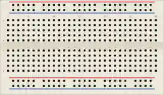

# Protoboard

Placa de prototipado sin soldadura. Los agujeros están unidos en tiras para conectar los componentes con solo insertar sus patillas.

## Conexiones internas

- **Raíles de alimentación** (filas superior e inferior, **+** rojo y **–** azul): todos los agujeros de un raíl están unidos en toda su longitud.
- **Columnas centrales**: los 5 agujeros de una misma columna (a–e, luego f–j) están unidos entre sí.
- La **ranura central** separa las dos mitades (a–e y f–j): práctica para los circuitos integrados.

## Propiedades

| Propiedad | Función | Por defecto |
|-----------|------|--------|
| `size` | Tamaño (mini / media / completa) | media |

## Uso

- Ponga la alimentación en los raíles + / –, los componentes en las columnas.
- Las patillas de los componentes se **enganchan** automáticamente a la cuadrícula de 10 px.

---

*Componente propio de Kablix.*
