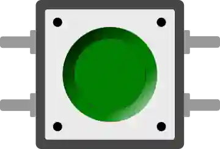

# Pulsador

Pulsador táctil momentáneo de 12 mm. En reposo el circuito está abierto; al pulsarlo, une sus dos contactos.

## Pines

| Pin | Función |
|--------|------|
| **1.l / 1.r** | Primer contacto (izquierda/derecha, siempre unidos) |
| **2.l / 2.r** | Segundo contacto (izquierda/derecha) |

## Propiedades

| Propiedad | Función | Por defecto |
|-----------|------|--------|
| `color` | Color | verde |
| `label` | Texto bajo el pulsador | — |
| `key` | Atajo de teclado | — |

## Uso

- Cableado habitual: un contacto a un pin en **`INPUT_PULLUP`** y el otro a masa → lee `LOW` al pulsar.
- Cableado inverso: un contacto a **+5 V** y el otro a un pin en **`INPUT`** con una resistencia de **10 kΩ** de ese pin a masa → lee `HIGH` al pulsar. Sin esa resistencia el pin queda flotante en reposo, y leerlo no significa nada.
- **Ctrl+clic**: mantiene el pulsador apretado.
- Prevea un **antirrebote**.

---

*Ficha adaptada y traducida de la [documentación de Wokwi](https://docs.wokwi.com/parts/wokwi-pushbutton) — © Wokwi. Componentes `@wokwi/elements` (licencia MIT).*
