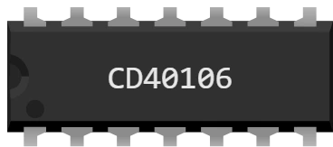

# CD40106 — 6 inversores con disparador Schmitt

Encapsulado DIL-14 para la protoboard: **seis inversores independientes**. Un inversor da en su salida el **contrario** de su entrada — 1 pasa a 0 y 0 pasa a 1.

Serie CMOS 4000: funciona de **3 a 18 V**, el rango más amplio del lote — va igual de bien con los 5 V de un Uno que con los 3,3 V de un Pico.

Estos inversores son de **disparador Schmitt**: en el hardware real, su umbral de conmutación sube a la subida y baja a la bajada, lo que limpia una señal lenta o ruidosa. En simulación los niveles son limpios, así que la histéresis nunca se ve. Su gemelo de la serie 74 es el [74xx14](74xx14.md).

## Pines

| Pin | Nombre | Función |
|---|---|---|
| 1 | **a** | entrada del inversor A |
| 2 | **a̅** | salida del inversor A (barra = invertida) |
| 3 | **b** | entrada del inversor B |
| 4 | **b̅** | salida del inversor B (barra = invertida) |
| 5 | **c** | entrada del inversor C |
| 6 | **c̅** | salida del inversor C (barra = invertida) |
| 7 | **GND** | masa — **cable negro** |
| 8 | **d̅** | salida del inversor D (barra = invertida) |
| 9 | **d** | entrada del inversor D |
| 10 | **e̅** | salida del inversor E (barra = invertida) |
| 11 | **e** | entrada del inversor E |
| 12 | **f̅** | salida del inversor F (barra = invertida) |
| 13 | **f** | entrada del inversor F |
| 14 | **VDD** | alimentación — **cable rojo** |

## Tabla de verdad

Un inversor; los otros cinco son idénticos.

| a | a̅ |
|---|---|
| 0 | 1 |
| 1 | 0 |

## Propiedades

| Propiedad | Función | Por defecto |
|---|---|---|
| `ref` | Referencia — cambiarla cambia el patillaje, no el dibujo | CD40106 |

## Simulación

- **La alimentación no es opcional**: sin un cable rojo en VDD (pin 14) y un cable negro en GND (pin 7), el chip no da ninguna salida.
- Fuera del rango de **3 a 18 V**, Kablix indica «Tensión de alimentación incompatible». **Por debajo**, el chip no hace nada; **por encima**, el chip queda DESTRUIDO — cruz roja, y sigue así hasta la siguiente ejecución.
- Una **entrada al aire no es un 0**: la salida queda indefinida mientras esa entrada cuente — y para esta función siempre cuenta.
- Una salida ataca el montaje igual que un pin de la placa: un LED **con su resistencia**, la base de un transistor o la entrada de otro chip.

## Uso

- Un inversor convierte un nivel lógico en su contrario; dos seguidos dejan el nivel igual pero **limpian la señal**.
- Los 6 inversores del encapsulado son independientes: un solo chip puede servir para 6 cosas sin relación entre sí.
- Conecte las entradas a salidas de la placa y la salida a una entrada de la placa: el programa lee entonces un resultado calculado por el chip, no por el microcontrolador.
- Prueba lista para usar: `CI-uno` y `CI-pico` en `testkablix/` — los doce chips cableados juntos, cada puerta comprobada.

---

*Componente propio de Kablix — dibujo de Frank Sauret.*
