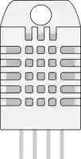

# Sensor de temperatura/humedad DHT22

Sensor digital de temperatura y humedad de un solo hilo.

## Pines

| Pin | Función |
|--------|------|
| **VCC** | Alimentación (+) |
| **SDA** | Datos (un hilo) |
| **NC** | No conectado |
| **GND** | Masa |

## Propiedades

| Propiedad | Función | Por defecto |
|-----------|------|--------|
| `temperature` | Temperatura (°C) | 22 |
| `humidity` | Humedad (%) | 50 |

## Uso

- SDA a un pin digital (pull-up de 10 kΩ).
- Biblioteca DHT: una lectura cada ~2 s.
- Durante la simulación, dos cursores ajustan la temperatura y la humedad **en directo**: la siguiente lectura devuelve el nuevo valor.
- Si el valor mostrado parece congelado, compruebe que el programa espera al menos 2 s entre lecturas: la biblioteca DHT devuelve su **valor en caché** si se la consulta más deprisa, exactamente como un sensor real.

---

*Ficha adaptada y traducida de la [documentación de Wokwi](https://docs.wokwi.com/parts/wokwi-dht22) — © Wokwi. Componentes `@wokwi/elements` (licencia MIT).*
