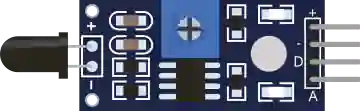

# Sensor de llama

Detector de llama (infrarrojo). Salidas analógica y digital.

## Pines

| Pin | Función |
|--------|------|
| **VCC** | Alimentación (+) |
| **GND** | Masa |
| **DOUT** | Salida digital (1 = llama) |
| **AOUT** | Salida analógica |

## Propiedades

| Propiedad | Función | Por defecto |
|-----------|------|--------|
| `state` | Llama detectada (0/1) | 0 |

## Uso

- DOUT a una entrada digital.
- Cambie el estado en el inspector.

---

*Ficha adaptada y traducida de la [documentación de Wokwi](https://docs.wokwi.com/parts/wokwi-flame-sensor) — © Wokwi. Componentes `@wokwi/elements` (licencia MIT).*
