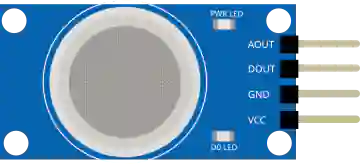

# Sensor de gas (MQ)

Sensor de gas/humo de la serie MQ. Salidas analógica (concentración) y digital (umbral).

## Pines

| Pin | Función |
|--------|------|
| **VCC** | Alimentación (+) |
| **GND** | Masa |
| **AOUT** | Salida analógica |
| **DOUT** | Salida digital (umbral) |

## Propiedades

| Propiedad | Función | Por defecto |
|-----------|------|--------|
| `value` | Nivel de gas simulado (%) | 20 |

## Uso

- AOUT a una entrada analógica.
- El sensor real necesita un precalentamiento.

---

*Ficha adaptada y traducida de la [documentación de Wokwi](https://docs.wokwi.com/parts/wokwi-gas-sensor) — © Wokwi. Componentes `@wokwi/elements` (licencia MIT).*
