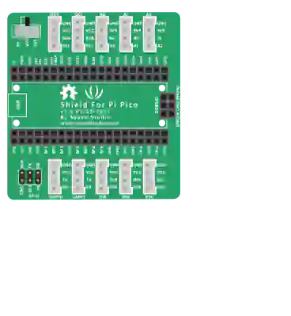

# Grove Shield (Pico)

Placa de expansión **Grove Shield for Pi Pico v1.0** (Seeed Studio). El Pico (o Pico W) se inserta en las dos filas centrales; el shield lleva sus E/S a 10 puertos Grove de cuatro pines, más un conector SPI de 2×3.

## Puertos Grove

| Puerto | Pines (de arriba abajo) | GPIO del Pico |
|------|---------------------|-----------|
| **I2C0** | GND · VCC · SDA · SCL | GP8 / GP9 |
| **I2C1** | GND · VCC · SDA · SCL | GP6 / GP7 |
| **A0** | GND · 3V3 · NC · A0 | GP26 |
| **A1** | GND · 3V3 · A0 · A1 | GP26 / GP27 |
| **A2** | GND · 3V3 · A1 · A2 | GP27 / GP28 |
| **UART0** | GND · VCC · TX · RX | GP0 / GP1 |
| **UART1** | GND · VCC · TX · RX | GP4 / GP5 |
| **D16** | GND · VCC · D17 · D16 | GP17 / GP16 |
| **D18** | GND · VCC · D19 · D18 | GP19 / GP18 |
| **D20** | GND · VCC · D21 · D20 | GP21 / GP20 |
| **SPI** | SCK · TX · RX / GND · 3V3 · CS | GP2 / GP3 / GP4 / GP5 |

Los puertos digitales y serie ofrecen **dos** señales: la segunda es el GPIO que da nombre al puerto. Los puertos analógicos comparten un canal con su vecino (A1 repite A0, A2 repite A1).

## Propiedades

| Propiedad | Función | Por defecto |
|-----------|------|--------|
| `pwr` | Raíl VCC de los puertos Grove: `3v3` o `5v` (VBUS) | `3v3` |

## Uso

- Coloque el shield y luego **arrastre el Pico encima**: se inserta en el zócalo y queda delante. El cableado de los puertos Grove sigue entonces el patillaje de arriba, sin ningún cable que llevar hasta el Pico.
- El interruptor `pwr` fija el raíl VCC de los puertos **I2C / UART / D16-D20**. Los puertos analógicos y el conector SPI siempre se quedan a 3,3 V.
- A 5 V, VCC viene de VBUS (USB): las señales siguen a 3,3 V — compruebe que su módulo Grove lo acepta.
- Todas las masas (zócalo, puertos, SPI) están en un único raíl.
- **El GPIO se escribe en la burbuja del pin**: al pasar el ratón sobre `A1.A0` se ve `A1.A0.GP26` — `GP26` es lo que debe usar su programa. Los pines de alimentación (VCC, GND, 3V3, NC) conservan su nombre simple.

---

*Componente de Kablix — patillaje tomado del esquema oficial de Seeed `Grove_shield_for_PI_PICO v1.0.sch`.*
