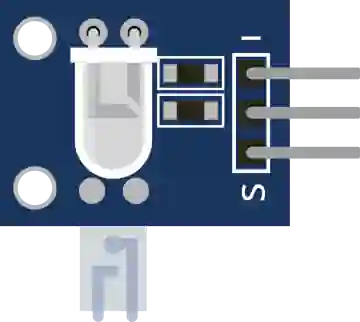

# Sensor de pulso

Sensor óptico de pulso cardíaco. Salida analógica (pulso).

## Pines

| Pin | Función |
|--------|------|
| **VCC** | Alimentación (+) |
| **OUT** | Salida analógica |
| **GND** | Masa |

## Propiedades

| Propiedad | Función | Por defecto |
|-----------|------|--------|
| `value` | Pulso simulado (%) | 50 |

## Uso

- OUT a una entrada analógica.
- Filtre la señal para extraer los latidos.

---

*Ficha adaptada y traducida de la [documentación de Wokwi](https://docs.wokwi.com/parts/wokwi-heart-beat-sensor) — © Wokwi. Componentes `@wokwi/elements` (licencia MIT).*
