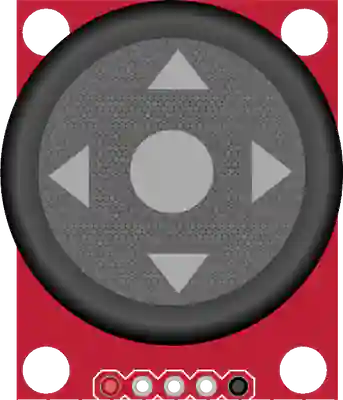

# Joystick analógico

Palanca de 2 ejes (X/Y) con pulsador integrado.

## Pines

| Pin | Función |
|--------|------|
| **VCC** | Alimentación (+) |
| **VERT** | Eje vertical (analógico) |
| **HORZ** | Eje horizontal (analógico) |
| **SEL** | Pulsador (presión) |
| **GND** | Masa |

## Uso

- VERT y HORZ a dos entradas analógicas, SEL en `INPUT_PULLUP`.
- En reposo, los ejes leen ~512 (centro).

## En simulación

- **Palanca**: arrástrela con el ratón para obtener valores continuos en los dos ejes. Vuelve al centro al soltarla — salvo si mantiene **Ctrl** (Cmd en Mac), que **bloquea** la posición.
- **Flechas**: hacer clic en una de las cuatro flechas da el recorrido máximo mientras la mantenga pulsada. Las flechas del teclado hacen lo mismo.
- **Botón SEL**: haga clic en el centro de la palanca. **Ctrl+clic** (Cmd en Mac) **bloquea** la pulsación — práctico para probar un botón mantenido sin tener el dedo en el ratón; un clic normal lo suelta.

---

*Ficha adaptada y traducida de la [documentación de Wokwi](https://docs.wokwi.com/parts/wokwi-analog-joystick) — © Wokwi. Componentes `@wokwi/elements` (licencia MIT).*
