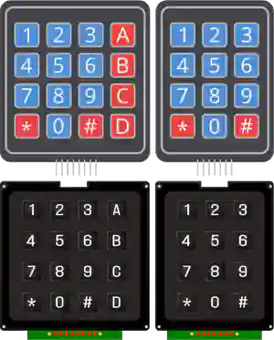

# Teclado matricial

Teclado de membrana o de teclas de 4×3 o 4×4: una matriz de teclas, filas × columnas.

## Pines

| Pin | Función |
|--------|------|
| **L1–L4** | Filas |
| **C1–C4** | Columnas |

## Propiedades

| Propiedad | Función | Por defecto |
|-----------|------|--------|
| `Colonnes` | Número de columnas (3/4) | 4 |

## Uso

- Barrer la matriz: activar una fila y leer las columnas.
---

*Ficha adaptada y traducida de la [documentación de Wokwi](https://docs.wokwi.com/parts/wokwi-membrane-keypad) — © Wokwi. Componentes `@wokwi/elements` (licencia MIT).*
