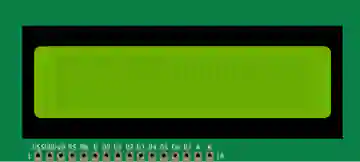

# LCD de texto

Pantalla LCD de caracteres (HD44780). 16×2 o 20×4, en I²C (4 hilos) o en paralelo.

## Pines

| Pin | Función |
|--------|------|
| **GND / VCC** | Alimentación (modo I²C) |
| **SDA / SCL** | Bus I²C (modo I²C) |
| **RS, RW, E, D0–D7** | Bus paralelo (modo paralelo) |
| **V0** | Contraste |
| **A / K** | Retroiluminación |

## Propiedades

| Propiedad | Función | Por defecto |
|-----------|------|--------|
| `pins` | Interfaz (I²C / paralelo) | i2c |
| `lcdSize` | Tamaño (16×2 / 20×4) | 16x2 |

## Uso

- I²C: solo 4 hilos (GND, VCC, SDA, SCL) + dirección (a menudo 0x27).
- El texto solo se simula en **I²C**; en paralelo la pantalla es solo visual.

---

*Ficha adaptada y traducida de la [documentación de Wokwi](https://docs.wokwi.com/parts/wokwi-lcd1602) — © Wokwi. Componentes `@wokwi/elements` (licencia MIT).*
