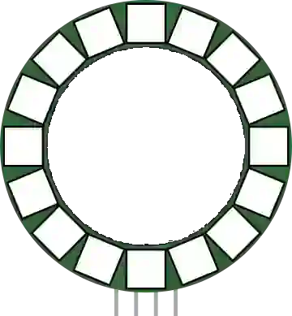

# Anillo NeoPixel

Anillo de LED RGB direccionables (WS2812).

## Pines

| Pin | Función |
|--------|------|
| **VCC** | Alimentación (+) |
| **GND** | Masa |
| **DIN** | Entrada de datos |
| **DOUT** | Salida de datos |

## Propiedades

| Propiedad | Función | Por defecto |
|-----------|------|--------|
| `pixels` | Número de LED | 16 |

## Uso

- DIN a un pin digital.
- Efectos circulares (rotación, indicador).
- Durante la simulación, un **LED apagado se queda blanco** (como en la placa real) y un **LED encendido recibe un halo** de su propio color, más ancho cuanto más brilla.
- Con **poca luminosidad**, la cápsula se queda **blanca con un tinte** y es el halo el que se desvanece: un WS2812 difunde la luz, nunca se vuelve oscuro.
- El anillo **se encadena** como un solo píxel: DOUT al DIN del componente siguiente, y consume `pixels` colores de la trama común.

---

*Ficha adaptada y traducida de la [documentación de Wokwi](https://docs.wokwi.com/parts/wokwi-led-ring) — © Wokwi. Componentes `@wokwi/elements` (licencia MIT).*
