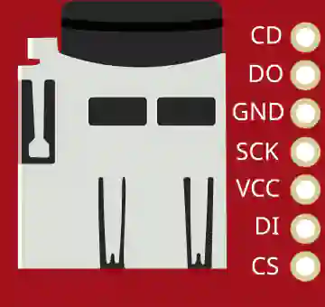

# Tarjeta microSD (SPI)



Lector de tarjetas microSD por SPI: almacenamiento de archivos.

## Pines

| Pin | Función |
|--------|------|
| **VCC / GND** | Alimentación |
| **SCK** | Reloj SPI |
| **DI** | Entrada de datos (MOSI) |
| **DO** | Salida de datos (MISO) |
| **CS** | Selección del chip |
| **CD** | Detección de tarjeta |

## Uso

- Bus SPI + CS. Biblioteca `SD`.
- La tarjeta simulada viene **formateada en FAT16** (unos 2 MB), como una tarjeta recién comprada: `SD.begin()`, `SD.open()`, escribir y volver a leer archivos funcionan sin preparación.
- Su contenido vive en memoria: **se pierde al detener la simulación**, y la tarjeta empieza vacía en la siguiente ejecución.

### Arduino

```cpp
#include <SD.h>
SD.begin(4);                              // CS en D4, bus SPI hardware D11/D12/D13
File f = SD.open("essai.txt", FILE_WRITE);
f.println("Hello from Kablix!");
f.close();
```

### Pico (MicroPython)

MicroPython no incluye ningún controlador de tarjeta SD: deje el archivo `sdcard.py` (de la *micropython-lib* oficial) en una carpeta `lib/` **junto a su programa** — Kablix lo inyecta automáticamente.

```python
from machine import Pin, SPI
import os, sdcard

spi = SPI(0, baudrate=1_320_000, sck=Pin(18), mosi=Pin(19), miso=Pin(16))
os.mount(sdcard.SDCard(spi, Pin(17)), "/sd")   # CS en GP17
with open("/sd/essai.txt", "a") as f:
    f.write("Hello from Kablix!\n")
```

---

*Ficha adaptada y traducida de la [documentación de Wokwi](https://docs.wokwi.com/parts/wokwi-microsd-card) — © Wokwi. Componentes `@wokwi/elements` (licencia MIT).*
