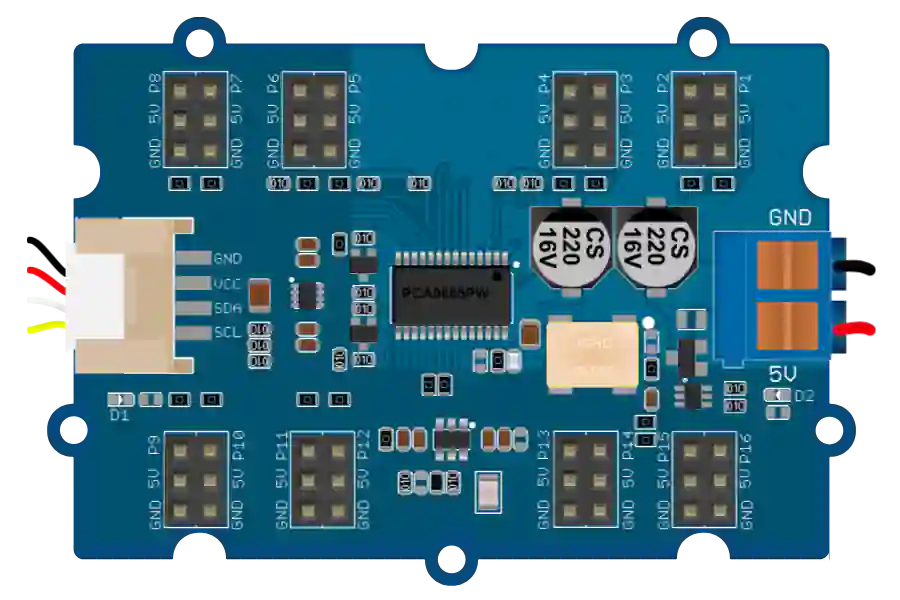

# Controlador PWM de 16 canales (PCA9685)



Módulo Grove **16-Channel PWM Driver** de Seeed (ref. 108020102), basado en el **PCA9685** de NXP: 16 salidas PWM de 12 bits en un bus I²C, pensado para mandar servomotores o LED. 16 conectores de servo **P1 a P16** (canales 0 a 15).

## Pines

| Pin | Función |
|--------|------|
| **SDA / SCL** | Bus I²C (conector Grove, a la izquierda) |
| **VCC / GND** | Alimentación lógica del chip (conector Grove) |
| **V+ / GND.2** | Borne de alimentación de los servos (**Power In**, a la derecha) |
| **PWM0…PWM15** | Señal de cada conector de servo (P1 = PWM0 … P16 = PWM15) |
| **Pn.5V / Pn.GND** | Alimentación de cada conector de servo (rojo/negro) |

## Propiedades

| Propiedad | Función | Por defecto |
|-----------|------|--------|
| `ad0` … `ad5` | Estado de los seis pads de dirección de la placa (marcado = pad **alto**) | todos marcados |

## Dirección I²C


La dirección no se elige en una lista: se fija **como en la placa real**, marcando los seis pads **AD0 a AD5** en el inspector (visibles en la cara inferior del módulo, arriba). La dirección de 7 bits resultante se muestra bajo las casillas y vale:

```
dirección = 1 A5 A4 A3 A2 A1 A0
```

El bit 6 está **cableado a nivel alto** en el módulo y el bit 7 no existe: la dirección va por tanto de **0x40** (todos los pads bajos) a **0x7F** (todos altos).

| AD5 | AD4 | AD3 | AD2 | AD1 | AD0 | Dirección |
|:---:|:---:|:---:|:---:|:---:|:---:|---------|
| 0 | 0 | 0 | 0 | 0 | 0 | `0x40` |
| 0 | 0 | 0 | 0 | 0 | 1 | `0x41` |
| 0 | 0 | 0 | 0 | 1 | 0 | `0x42` |
| … | … | … | … | … | … | … |
| 1 | 1 | 1 | 1 | 1 | 1 | `0x7F` |

> La placa Grove sale de fábrica con **todos sus pads altos → 0x7F** (a diferencia del módulo PCA9685 desnudo de Adafruit, cuyos pads están bajos → 0x40: desmarque las seis casillas para simularlo). Esta es la dirección que debe usar su programa. Con varias placas en el mismo bus, dé a cada una una combinación de pads distinta.

## Alimentación externa obligatoria

Los servomotores **no** se alimentan por la lógica de la placa: hay que conectar una **[fuente de alimentación de laboratorio](alim.md)** (categoría *Instrumentos de medida*) ajustada a **~5 V** con una **corriente suficiente** en el borne **V+ / GND.2** (Power In).

- Sin esa alimentación (o fuera del rango 4,5–5,5 V, o con corriente insuficiente), las salidas **no se mueven** — el chip sigue respondiendo por I²C, exactamente como la placa real.
- Cada servo consume ~0,2 A: ajuste la *corriente máxima suministrada* de la fuente.

## Uso

- Conecte SDA/SCL/VCC/GND al microcontrolador y el borne V+/GND.2 a la fuente.
- Enchufe un servo (PWM/V+/GND) en un conector **P1…P16**.
- El PCA9685 genera 16 señales PWM a 50 Hz; un impulso de 0,5–2,5 ms da un ángulo de 0–180°.
- Acceda a los registros del PCA9685 (MODE1, PRESCALE, LED0_ON_L…) por I²C, o use una biblioteca dedicada (Adafruit PCA9685, `grove_16_channels_pwm`…).

## Para saber más

- [Seeed Studio Wiki — Grove 16-Channel PWM Driver (PCA9685)](https://wiki.seeedstudio.com/Grove-16-Channel_PWM_Driver-PCA9685/) (documentación oficial del módulo: patillaje, pads de dirección, bibliotecas).

---

*Módulo PCA9685 (NXP) — placa Seeed Grove 16-Channel PWM Driver. Dibujo retocado por Frank para Kablix.*
