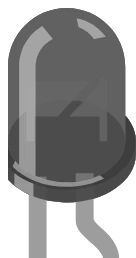

# Fotodiodo



Fotodiodo **desnudo** de dos patillas en cápsula transparente: deja pasar una corriente proporcional a la luz que recibe. Mismo principio que el [fototransistor](phototransistor.md), pero **sin su amplificación**: con la misma iluminación, un fotodiodo deja pasar unas cien veces menos corriente. A cambio, es más rápido y más fiel.

Funciona **en inverso**: el cátodo va al lado del más y el ánodo al lado del menos.

## Pines

| Pin | Función |
|--------|------|
| **K** | Cátodo — el lado de mayor tensión |
| **A** | Ánodo — el lado de masa |

## Propiedades

| Propiedad | Función | Por defecto |
|-----------|------|--------|
| `eemax` | Irradiancia máxima del cursor (mW/cm²) | 5 |
| `ron` | Resistencia a la irradiancia máxima (Ω) | 20 000 |
| `rdark` | Resistencia en oscuridad total (Ω) | 100 000 000 |
| `ee` | Irradiancia en el punto de reposo (mW/cm²) | 1 |

## En simulación

Durante la simulación aparece un **cursor de luminosidad** sobre el componente: va de la oscuridad total hasta `eemax`. La corriente sigue la luz recibida; vista como una resistencia, esa resistencia varía por tanto en sentido contrario:

```
R = ron x eemax / ee
```

limitada entre `ron` (plena luz) y `rdark` (oscuridad total). Con los valores por defecto: 20 kΩ a 5 mW/cm², 100 kΩ a 1 mW/cm², 100 MΩ en la oscuridad.

## Uso

- **La resistencia es obligatoria.** Por sí solo, el fotodiodo solo deja pasar más o menos corriente: nada convierte esa corriente en una tensión legible.
- Montaje habitual: `5V → K ... A → punto medio → resistencia de 100 kΩ → GND`, con el punto medio a una entrada analógica. La tensión sube cuando sube la luz.
- Montaje inverso (`5V → resistencia → punto medio → K ... A → GND`): la tensión sube cuando baja la luz.
- La resistencia de carga es **grande** (100 kΩ típicamente): la corriente es pequeña, hace falta una resistencia alta para sacar de ella una tensión.
- Cuidado con el sentido: cátodo al lado del más. Al revés, el diodo conduce todo el tiempo y la luz ya no cambia nada.

## Fallos señalados

Kablix examina el montaje al arrancar la simulación y marca el componente en dos casos:

- **Sin resistencia en serie**: solo un pin llega a un raíl de alimentación, o ninguno. No hay divisor de tensión, así que no hay nada que medir.
- **Conectado directamente sobre la alimentación**: los dos pines van directamente al más y a masa, sin nada entre medias.

---

*Componente de Kablix — modelo `R = ron x eemax / ee`, limitado entre `ron` y `rdark`.*
