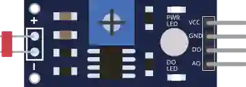

# Fotorresistencia (LDR)

Sensor de luz: su resistencia varía con la iluminación. Salidas analógica y digital.

## Pines

| Pin | Función |
|--------|------|
| **VCC** | Alimentación (+) |
| **GND** | Masa |
| **AO** | Salida analógica (luminosidad) |
| **DO** | Salida digital (umbral) |

## Propiedades

| Propiedad | Función | Por defecto |
|-----------|------|--------|
| `value` | Luminosidad simulada (%) | 50 |

## Uso

- AO a una entrada analógica, leída con `analogRead()`.
- DO conmuta según un umbral ajustable (en la placa real).

---

*Ficha adaptada y traducida de la [documentación de Wokwi](https://docs.wokwi.com/parts/wokwi-photoresistor-sensor) — © Wokwi. Componentes `@wokwi/elements` (licencia MIT).*
