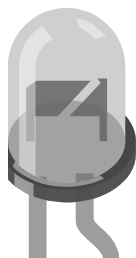

# Fototransistor



Fototransistor **desnudo** de dos patillas en cápsula transparente: cuanta más luz recibe, más corriente deja pasar. Más rápido y más sensible que una [LDR](ldr.md), pero **polarizado** — el colector va al lado del más y el emisor al lado del menos.

## Pines

| Pin | Función |
|--------|------|
| **c** | Colector — el lado de mayor tensión |
| **e** | Emisor — el lado de masa |

## Propiedades

| Propiedad | Función | Por defecto |
|-----------|------|--------|
| `eemax` | Irradiancia máxima del cursor (mW/cm²) | 5 |
| `ron` | Resistencia a la irradiancia máxima (Ω) | 200 |
| `rdark` | Resistencia en oscuridad total (Ω) | 10 000 000 |
| `ee` | Irradiancia en el punto de reposo (mW/cm²) | 1 |

## En simulación

Durante la simulación aparece un **cursor de luminosidad** sobre el componente: va de la oscuridad total hasta `eemax`. La corriente de un fototransistor sigue la luz recibida; vista como una resistencia, esa resistencia varía por tanto en sentido contrario:

```
R = ron x eemax / ee
```

limitada entre `ron` (plena luz) y `rdark` (oscuridad total). Con los valores por defecto: 200 Ω a 5 mW/cm², 1 kΩ a 1 mW/cm², 10 MΩ en la oscuridad.

## Uso

- **La resistencia es obligatoria.** Por sí solo, el fototransistor solo deja pasar más o menos corriente: nada convierte esa corriente en una tensión legible.
- Montaje habitual: `5V → resistencia de 10 kΩ → punto medio → c ... e → GND`, con el punto medio a una entrada analógica. La tensión sube cuando baja la luz.
- Montaje inverso (`5V → c ... e → punto medio → resistencia → GND`): la tensión sube cuando sube la luz.
- La tensión que lee la entrada analógica sigue el divisor de tensión real del montaje.

## Fallos señalados

Kablix examina el montaje al arrancar la simulación y marca el componente en dos casos:

- **Sin resistencia en serie**: solo un pin llega a un raíl de alimentación, o ninguno. No hay divisor de tensión, así que no hay nada que medir.
- **Conectado directamente sobre la alimentación**: los dos pines van directamente al más y a masa, sin nada entre medias. A plena luz, el montaje pondría la alimentación en cortocircuito.

---

*Componente de Kablix — modelo `R = ron x eemax / ee`, limitado entre `ron` y `rdark`.*
