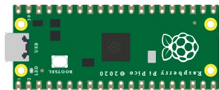

# Raspberry Pi Pico

Placa de microcontrolador RP2040 (doble núcleo ARM Cortex-M0+). 26 pines GPIO, 3 entradas analógicas (ADC), nivel lógico de **3,3 V**.

## Pines

| Pin | Función |
|--------|------|
| **GP0–GP28** | E/S digitales (GP26–GP28 = ADC0–ADC2) |
| **3V3** | Salida de 3,3 V |
| **VSYS / VBUS** | Alimentación de entrada |
| **GND** | Masas |
| **RUN** | Reinicio (activo a nivel bajo) |

## Uso

- Patillaje completo con el botón **K** (póster de patillaje).
- **Nivel lógico de 3,3 V**: no aplique 5 V a una entrada.
- Programable en MicroPython o en C/C++ (Arduino).

> ⚠️ Los GPIO **no** toleran 5 V.

---

*Componente propio de Kablix (dibujo de la placa). RP2040 © Raspberry Pi Ltd.*
