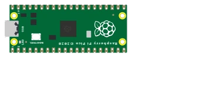

# Raspberry Pi Pico 2

Placa de microcontrolador **RP2350** (doble núcleo ARM Cortex-M33 a 150 MHz), sucesora del Pico. Mismo formato, mismo patillaje de 40 pines, nivel lógico de **3,3 V** — 26 pines GPIO y 3 entradas analógicas (ADC).

## Pines

| Pin | Función |
|--------|------|
| **GP0–GP28** | E/S digitales (GP26–GP28 = ADC0–ADC2) |
| **3V3** | Salida de 3,3 V |
| **VSYS / VBUS** | Alimentación de entrada |
| **GND** | Masas |
| **RUN** | Reinicio (activo a nivel bajo) |

## Uso

- Patillaje completo con el botón **K** (póster de patillaje) — idéntico al del Pico.
- **Nivel lógico de 3,3 V**: no aplique 5 V a una entrada.
- Programable en **MicroPython**: Kablix carga el firmware `RPI_PICO2`.
- El RP2350 también existe en versión RISC-V (núcleos Hazard3): Kablix simula los núcleos **Cortex-M33**, los firmwares `-RISCV-` no sirven.

> ⚠️ Los GPIO **no** toleran 5 V.

> ℹ️ El C/C++ bare-metal todavía no es compatible con esta placa: use MicroPython, o el Pico para un programa Arduino.

---

*Componente propio de Kablix. Dibujo de la placa según los dibujos oficiales de Raspberry Pi Ltd. RP2350 © Raspberry Pi Ltd.*
