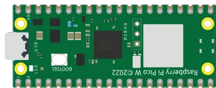

# Raspberry Pi Pico W



Idéntico al Pico (RP2040, 3,3 V, mismos pines) con un módulo **Wi-Fi/Bluetooth** integrado. El patillaje físico es el mismo que el del Pico.

## Pines

| Pin | Función |
|--------|------|
| **GP0–GP28** | E/S digitales (GP26–GP28 = ADC0–ADC2) |
| **3V3** | Salida de 3,3 V |
| **VSYS / VBUS** | Alimentación de entrada |
| **GND** | Masas |
| **RUN** | Reinicio (activo a nivel bajo) |

## Uso

- Patillaje completo con el botón **K**.
- Nivel lógico de **3,3 V** (no tolera 5 V).
- El núcleo **no emula** el Wi-Fi: las peticiones de red pasan por el equipo anfitrión — vea *Hablar con el mundo exterior* más abajo.

## Hablar con el mundo exterior

El chip Wi-Fi (CYW43439) **no se emula**: no existe dentro del núcleo simulado. Kablix lo sustituye por un **puente de red** — el script habla con la extensión, que hace la petición real desde su equipo y devuelve la respuesta. El programa sigue siendo, por tanto, el de una placa real:

```python
import network, urequests, time

wlan = network.WLAN(network.STA_IF)
wlan.active(True)
wlan.connect("mi-ssid", "mi-contraseña")       # se acepta tal cual, la conexión es inmediata
while not wlan.isconnected():
    time.sleep(0.1)
print(wlan.ifconfig())                         # ('192.168.1.50', ...): dirección de fachada

r = urequests.get("https://api.github.com/repos/FrankSAURET/kablix")
print(r.status_code, r.json()["name"])
r.close()
```

Lo que es verdad y lo que no:

- `network.WLAN` es una **fachada**: `connect()` siempre tiene éxito (el SSID y la contraseña se ignoran), `isconnected()` pasa a verdadero, `ifconfig()` devuelve una dirección fija. Nunca se envía ningún paquete Wi-Fi.
- `urequests` (con el alias `requests`) hace **peticiones HTTP REALES**, ejecutadas por VS Code: `get`, `post`, `put`, `patch`, `delete`, `head`, con `data=`, `json=` y `headers=`. La respuesta lleva `status_code`, `reason`, `text`, `content` y `.json()`.
- Solo se retransmiten **http://** y **https://**, con un tiempo de espera de 15 s y un cuerpo de respuesta limitado a **64 KB**: el túnel usa el enlace serie simulado, es lento.
- El `socket` **cliente** (conexión saliente) no se retransmite, ni MQTT, ni Bluetooth: pase por `urequests`. El `socket` **servidor**, en cambio, funciona — vea más abajo.
- Para cortar cualquier acceso saliente: desmarque **`kablix.picowNetworkBridge`** en los ajustes (activado por defecto). El script recibe entonces un `OSError`.


### Punto de acceso y servidor web

El montaje clásico — la placa se declara **punto de acceso**, un teléfono se conecta a ella y controla el LED desde una página web — funciona, con una diferencia: es **su equipo** el que tiene el socket TCP, no la placa. No se crea ninguna red Wi-Fi: el teléfono se queda en la **misma red que el PC** y abre la dirección anunciada al arrancar.

```python
import network, socket
from machine import Pin

led = Pin(15, Pin.OUT)

ap = network.WLAN(network.AP_IF)
ap.config(essid="Kablix-Pico", password="kablix2026")
ap.active(True)
print("Address:", ap.ifconfig()[0])           # la dirección REAL del equipo

address = socket.getaddrinfo("0.0.0.0", 80)[0][-1]
server = socket.socket()
server.bind(address)
server.listen(1)

while True:
    client, _ = server.accept()
    request = client.recv(1024).split(b"\r\n")[0].decode()
    if "/on" in request:
        led.value(1)
    elif "/off" in request:
        led.value(0)
    client.send("HTTP/1.1 200 OK\r\n\r\n<a href='/on'>ON</a> <a href='/off'>OFF</a>")
    client.close()
```

- `network.WLAN(network.AP_IF)` es una **fachada**: `config(essid=…, password=…)` se acepta y se recuerda, `active(True)` tiene éxito, pero no se emite ningún punto de acceso. `ifconfig()[0]`, en cambio, devuelve la **dirección IPv4 real** de su equipo — es la que hay que abrir desde el teléfono.
- El `socket` **servidor** se retransmite de verdad: `getaddrinfo`, `bind`, `listen`, `accept`, `recv`/`read`/`readline`, `send`/`sendall`/`write`, `makefile`, `close`. Los bytes van y vienen tal cual — es su programa el que habla HTTP, exactamente como en la placa real.
- **El puerto pedido no siempre se concede**: el puerto 80 está reservado en la mayoría de los equipos. Kablix pasa entonces al 8080 y luego a cualquier puerto libre, y escribe la dirección abierta en la consola: `[Kablix] Pico W server: http://…`. Esa es **la** dirección a la que hay que apuntar, no el puerto del programa.
- En la primera ejecución, el **cortafuegos** pide permiso: concédalo para la red privada, o el teléfono llamará a una puerta vacía.
- El socket se cierra al detener la simulación; el ajuste **`kablix.picowNetworkBridge`** también lo corta (el script recibe entonces un `OSError`).
- Banco de pruebas listo para usar: `testkablix/wifi-picow.projix` (y su gemelo `testkablix/wifi-pico2w.projix`).

---

*Componente propio de Kablix (dibujo de la placa). RP2040 © Raspberry Pi Ltd.*
