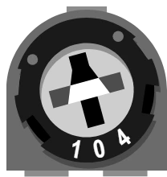

# Potenciómetro de ajuste

Un pequeño potenciómetro **que se ajusta con un destornillador** (trimmer, ajustable): se regula una vez para afinar un umbral, un contraste o un cero, y luego no se toca. Eléctricamente es el mismo componente que el [potenciómetro](pot.md) giratorio — una pista resistiva y un cursor que la recorre.

## Pines

Las patillas llevan las marcas del dibujo: **1** y **2** son los extremos de la pista, **V** es el cursor.

| Pin | Marca | Función |
|-----|---------|------|
| **GND** | 1 | Extremo bajo de la pista (masa) |
| **SIG** | V | Cursor → entrada analógica |
| **VCC** | 2 | Extremo alto de la pista (+) |

## Propiedades

| Propiedad | Función | Por defecto |
|----------|------|---------|
| `ohms` | Valor nominal: resistencia total entre las patillas 1 y 2 (Ω) | 10 000 |
| `value` | Posición inicial (0–100 %) | 50 |

## El código impreso en la carcasa

El valor nominal se imprime solo sobre el componente, en forma de **código de tres cifras**: las dos primeras son las cifras significativas y la tercera indica cuántos ceros añadir.

| Valor | Código |
|-------|------|
| 220 Ω | 221 |
| 4,7 kΩ | 472 |
| 10 kΩ | 103 |
| 100 kΩ | 104 |
| 1 MΩ | 105 |

Cambiar `ohms` reescribe el código: es el componente real que cogería de un cajón, no una etiqueta pegada encima.

## Uso

- V a una entrada analógica (A0…, GP26–GP28), leída con `analogRead()` (0–1023) o `ADC.read_u16()` (0–65535).
- Ajuste en simulación: **arrastre el tornillo** con el ratón, o flechas / Re Pág ↑↓ tras un clic. Como los demás componentes interactivos, **muévalo con el clic derecho** (el clic izquierdo gira el tornillo).
- Mientras corre la simulación, la etiqueta encima del componente da la posición **y** las dos mitades de la pista; siempre suman el valor nominal.
- Conectado como **resistencia variable** (usando un solo extremo), no es más que un reóstato: dejar el otro extremo sin conectar sigue significando una entrada flotante en el microcontrolador.

---

*Componente propio de Kablix — dibujo de Frank Sauret.*
