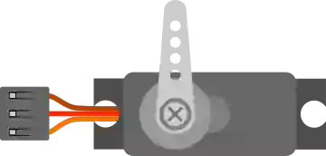

# Servomotor

Servomotor de posición controlado por una señal PWM (ángulo 0–180°).

## Pines

| Pin | Función |
|--------|------|
| **PWM** | Señal de control |
| **V+** | Alimentación (+) |
| **GND** | Masa |

## Propiedades

| Propiedad | Función | Por defecto |
|-----------|------|--------|
| `horn` | Tipo de brazo (simple/doble/cruz) | simple |

## Uso

- PWM a un pin, V+ a +5 V, GND a masa.
- Biblioteca `Servo`: `attach()` y luego `write(ángulo)`.

---

*Ficha adaptada y traducida de la [documentación de Wokwi](https://docs.wokwi.com/parts/wokwi-servo) — © Wokwi. Componentes `@wokwi/elements` (licencia MIT).*
