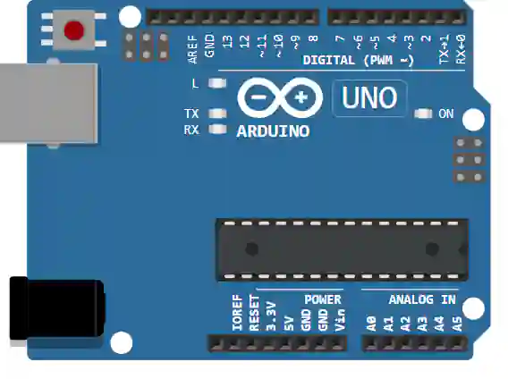

# Arduino Uno

Placa ATmega328P: 14 E/S digitales (6 PWM), 6 entradas analógicas, USB.

## Pines

| Pin | Función |
|--------|------|
| **0–13** | E/S digitales (~ = PWM) |
| **A0–A5** | Entradas analógicas |
| **5V / 3.3V / VIN** | Alimentación |
| **GND** | Masas |
| **AREF / RESET** | Referencia del ADC / reinicio |

## Uso

- Patillaje completo con el botón **K** (póster).
- Nivel lógico de 5 V.

---

*Ficha adaptada y traducida de la [documentación de Wokwi](https://docs.wokwi.com/parts/wokwi-arduino-uno) — © Wokwi. Componentes `@wokwi/elements` (licencia MIT).*
