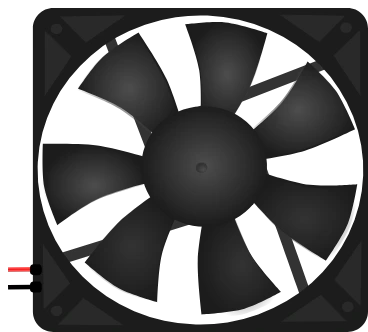

# Ventilador

Ventilador de corriente continua. Las aspas giran más deprisa cuanto mayor es la tensión aplicada; también se puede controlar por **PWM**.

## Pines

| Pin | Función |
|--------|------|
| **+** | Alimentación (hilo rojo) |
| **−** | Masa (hilo negro) |

## Propiedades

| Propiedad | Función | Por defecto |
|-----------|------|--------|
| `voltage` | Tensión nominal (V) | 5 |
| `current` | Corriente consumida (A) | 0.85 |
| `angle` | Orientación (0/90/180/270°) | 0 |

## Uso

- Física **estricta**: el ventilador solo arranca si la fuente puede suministrar de verdad `current`. Por debajo del 30 % de su velocidad nominal se queda quieto, como un motor real que zumba sin girar.
- **Un pin del microcontrolador no basta**: da 40 mA como mucho, frente a los 850 mA necesarios. Use una alimentación externa conmutada por un transistor o un MOSFET.
- Control PWM: `analogWrite()` (Arduino) o `PWM` (MicroPython) en el pin de mando; la velocidad de las aspas sigue el ciclo de trabajo.
- Añada un diodo de rueda libre en bornes del motor para absorber el pico al cortar.
- **Leer la velocidad en pantalla**: a 3000 rpm, un ventilador de 7 aspas hace pasar 350 aspas por segundo ante su ojo — solo se ve un parpadeo, y cambiar la tensión no cambia nada visible. Por eso el ventilador gira **a cámara lenta**: de 1,5 a 7 aspas por segundo según el régimen. No es la velocidad real, lo que importa es su **cambio** — aceleraciones y deceleraciones se ven de un vistazo. El **desenfoque de las aspas** refuerza la mitad superior del rango.

---

*Componente propio de Kablix — dibujo de Frank Sauret.*
