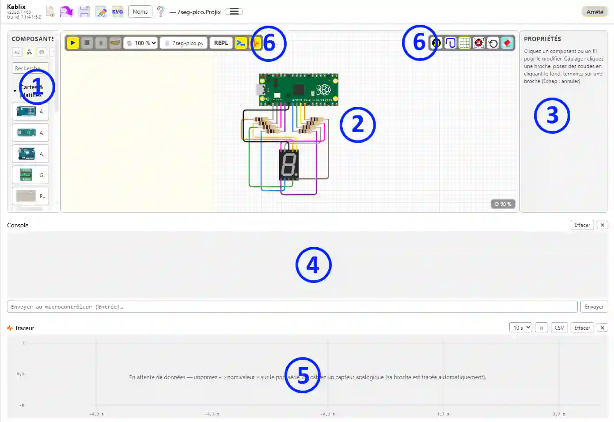

# Kablix — Guide d'utilisation


> English version: [USAGE.md](../en/USAGE.md)

## Sommaire

1. [Démarrage](#démarrage)
2. [L'interface](#linterface)
3. [Construire un montage](#construire-un-montage)
4. [Simuler](#simuler)
  1. [Exécuter du code](#exécuter-du-code)
  2. [MicroPython sur le Pico](#micropython-sur-le-pico)
  3. [Envoyer le programme sur une vraie carte Pico](#envoyer-le-programme-sur-une-vraie-carte-pico)
  4. [Déboguer](#déboguer)
  5. [Moniteur série](#moniteur-série)
  6. [Traceur de courbes](#traceur-de-courbes)
  7. [Éclairage DMX512](#éclairage-dmx512)
5. [Exporter le schéma en SVG](#exporter-le-schéma-en-svg)
6. [Créer ses propres composants](#créer-ses-propres-composants)
7. [Format des composants (.kompix)](#format-des-composants-kompix)
8. [Où trouver des composants existants](#où-trouver-des-composants-existants)
9. [Enregistrer / ouvrir un projet (.projix)](#enregistrer--ouvrir-un-projet-projix)
10. [Interopérabilité Wokwi (diagram.json)](#interopérabilité-wokwi-diagramjson)
11. [Mises à jour des bibliothèques](#mises-à-jour-des-bibliothèques)
12. [Raccourcis clavier](#raccourcis-clavier)

---

## Démarrage

1. Pour démarrer, cliquer sur l'icône  dans la barre d'activité à gauche ;
  - Ou dans un dossier de projet, double cliquer sur un fichier projix ;
  - Ou si vous avez fait l'association, dans l'explorateur Windows double cliquer sur un fichier projix.

L'icône **ne crée un nouveau projet que s'il n'y en a aucun d'ouvert** : si un montage est déjà là — y compris rouvert tout seul après un changement de dossier — elle revient dessus au lieu d'ouvrir un deuxième atelier.

<video src="../../media/demarrer.mp4" title="Démarrer Kablix" controls autoplay loop muted playsinline></video>

1. **Construire son montage** : Glisser/poser un composant à partir de la bibliothèque à gauche. Relier les broches en direct et cliquer sur le bouton autoroutage (route les composants sélectionnés ou tout le montage si aucun n'est sélectionné).

<video src="../../media/dessiner.mp4" title="Construire un montage" controls autoplay loop muted playsinline></video>

1. **Exécuter son code** : Associer un fichier de code (attention les codes ino doivent être dans un dossier de même nom) puis **▶ « démarrer »** :
  - `.ino`/`.c`/`.cpp` -> compilation via la toolchain locale ;
  - `.py` -> MicroPython sur le Pico simulé (firmware `.uf2` requis, voir ci-dessous) ;
  - `.hex` / `.uf2`/`.elf` / `.bin` -> chargé directement sans compilation.
  Le **▶ enregistre d'abord** le schéma et le fichier de code : ce qui tourne dans le simulateur est toujours ce qui est sur le disque. Un projet jamais enregistré (sans nom) est laissé tel quel — aucune boîte de dialogue ne vient couper le lancement.
2. **Enregistrer son montage** : « Kablix : Enregistrer le projet (.projix) » ; un `.projix` se rouvre ensuite d'un double-clic dans l'explorateur. À la réouverture, le programme associé au projet s'ouvre **aussi**, dans le volet de code à côté du montage — le curseur, lui, reste dans Kablix. Import/export au format Wokwi (`diagram.json`) également disponibles.

<video src="../../media/simuler.mp4" title="Simuler dans Kablix" controls autoplay loop muted playsinline></video>

## L'interface

  
*Interface de Kablix : **①** la **palette** des composants à gauche, **②** le **canvas** de montage au centre, **③** l'**inspecteur** (Propriétés/variables) à droite, **④** le **moniteur série/Console/REPL**, **⑤** le **Traceur** en bas et **⑥** les **barres d'outils** — celle de Kablix tout en haut, celle de **simulation** à gauche du canvas et celle de **dessin** à droite.*

- **Palette** : cliquer un composant le pose sur le canvas. Deux tris au choix (boutons en haut) : alphabétique ou  par catégories Une zone **« Derniers utilisés »** (10 max) peut rester en tête (troisième bouton). Le dernier bouton permet de changer le mode de réaction de la bibliothèque.
- **Barre d'outil Kablix** (en haut de la fenêtre)  

  - **Charger un fichier Binaire** : charge un .hex/.uf2 déjà compilé du workspace, sans recompiler. **Masqué par défaut** — la case Afficher le bouton « Charger binaire » des paramètres de Kablix le ramène.
  - les fonctions habituelles de gestion de fichier : **nouveau projet**, **ouvrir**, **enregistrer**, **enregistrer sous**, **exporter le schéma en SVG**.
  - le bouton **Noms** qui fait apparaitre le nom sur le composant **sélectionné** ou tous les composants ou l'id (le repère) des composants.
  - **réarranger** : rétablit l'organisation Kablix (code d'un côté, Kablix de l'autre, panneaux fermés). Vous pouvez inverser les deux zones et régler leur largeur à la souris, puis **Sauvegarder cette organisation par défaut** (menu hamburger) : le côté de Kablix **et** la largeur sont mémorisés, et « réarranger » les rétablit — y compris en remettant Kablix du côté choisi s'il en a changé depuis. 
  - le **menu hamburger** pour les fonctions moins fréquentes : importer / exporter un schéma **Wokwi**, exporter la **liste des composants (CSV)**, mettre à jour le **firmware Pico**, vérifier les **mises à jour des bibliothèques**, sauvegarder l'organisation par défaut.
  - accés à cette **aide**.
  - le **nom du projet** courant.
  - le **fichier de code** du projet, juste à droite du nom : **clic = changer**, **double-clic = ouvrir** (il s'ouvre du côté du code).
  - la zone d'**état** (« Prêt », messages de compilation…) et, seulement quand la page ne suit plus, le badge **« Ralentie : 0,45× le temps réel »**.
- **Barre de simulation** (à gauche, par-dessus le canvas)  

  - **▶ démarrer** (enregistre d'abord le schéma et le code)
  - **■ arrêter**
  - **⏸ pause/reprendre**
  - **pas à pas**
  - le sélecteur de **vitesse**, un animal par réglage : 🦅 500 %, 🐆 200 %, 🐇 100 % (temps réel), 🐢 10 %, 🐌 1 %. L'accéléré est un **souhait** : la simulation va aussi vite qu'elle peut, jamais plus.
  - **REPL** : pour Pico uniquement, affiche la console python traditionnelle (n'apparaît que si la carte posée est un Pico)
  - **moniteur série / console**
  - **Traceur** de courbes
  - **explications de défaut** : le cadre rouge et l'étiquette jaune posés sur un composant en défaut. Actif par défaut ; le bouton les masque quand ils gênent la lecture du schéma.
- **Barre de dessin** (à droite, par-dessus le canvas)  

  - **bouton du composant** : affiche le **schéma interne** du composant sélectionné, ou le **brochage complet** de la carte. N'apparaît que si le composant sélectionné en propose un.
  - **autoroutage** route la sélection ou tout le montage
  - **grille** (afficher/masquer)
  - **recentrer/ajuster la vue**
  - **⟲ réinitialiser les composants** : remet chaque composant au repos (interrupteurs relâchés, curseurs au repos) sans toucher au câblage. **Masqué par défaut** — la case *Afficher le bouton « Réinitialiser les composants »* des paramètres de Kablix le ramène.
  - **gomme** : efface le schéma entier, composants et fils (Ctrl+Z annule). **Masqué par défaut** lui aussi — case *Afficher le bouton « Effacer le schéma »*.
- **Propriétés/Variables** (inspecteur) :
  - Pendant le dessin, édite le composant sélectionné (couleur, valeur, angle…) ou fil (couleur Dupont, suppression, noeud [équipotielle])
  - pendant la simulation, affiche les variables.
  - Les composants très réglables (le robot araignée et ses 33 réglages) rangent leurs propriétés en **tiroirs repliables**, tous fermés à la sélection. Ils fonctionnent **en accordéon** : ouvrir un tiroir ferme celui qui l'était.

## Construire un montage

### Poser et déplacer

- **Poser** : clic sur un composant de la palette (posé au centre), ou **glisser-déposer** depuis la palette vers l'endroit voulu du canvas.
- **Déplacer** : glisser le composant (n'importe où sur son corps), ou **glisser avec le clic droit** — indispensable pour les composants interactifs (bouton, potentiomètre, interrupteurs, joystick) dont le clic gauche actionne le contrôle. Le clic droit passe aussi **à travers les pastilles jaunes** : une LED ou une résistance piquée dans une platine d'essai reste attrapable même quand un trou s'allume sous le curseur. Le clic gauche, lui, continue de câbler depuis ce trou.
- **Tourner** : sélectionner le composant puis touches **`+`** (45° horaire) ou **`-`** (45° antihoraire). Les broches et les fils suivent ; un rappel apparaît dans la zone d'aide de l'inspecteur.
- **Zoomer** : **molette** dans le canvas (centré sur le curseur). Le badge **⟳ %** en bas à droite donne le facteur ; un clic dessus réinitialise la vue. Le bouton **ajuster la vue** cadre le **dessin** du montage — pas les cadres invisibles des composants, qui sont plus grands que ce qu'ils montrent : un robot araignée seul remplit désormais l'écran au lieu de flotter au milieu d'une marge.
- **Supprimer** : bouton 🗑 de l'inspecteur, ou touche `Suppr` (ou `Retour arrière`). Elle efface ce qui est sélectionné : un composant, un fil, ou tout un lot — composants **et** câbles pris ensemble dans un rectangle de sélection. Un simple clic sur la feuille suffit à lui rendre le clavier : même si vous veniez de taper dans la recherche de la palette ou dans un champ de l'inspecteur, la touche s'adresse bien au schéma. Tant que le curseur clignote dans un champ, en revanche, `Suppr` efface du texte — c'est ce que l'on attend.

**La feuille a des bords, des quatre côtés.** Elle mesure 4000 × 3000 px et un composant ne peut pas en sortir : il s'arrête au bord, à droite et en bas comme en haut et à gauche. C'est son **dessin** qui butte, pas son cadre invisible — un composant dont le dessin ne remplit pas son cadre (la patte du robot, par exemple) monte donc jusqu'à toucher vraiment le haut. Un lot sélectionné s'arrête **d'un bloc**, dès que l'un de ses composants atteint un bord : les positions relatives sont conservées. Les collages en série (`Ctrl+D`) s'arrêtent au même endroit plutôt que de poser les copies dehors.

### Platine d'essai

Le composant **Platine d'essai** (catégorie Cartes & platines) existe en trois tailles — *mini* (17 colonnes, sans rails), *moyenne* (30 colonnes) et *grande* (63 colonnes) — réglables dans **Propriétés**. Les connexions internes réelles sont simulées : colonnes **a–e** et **f–j** reliées par bande, **rails +/−** sur toute la longueur.

Pendant le déplacement d'un composant au-dessus de la platine, les **bandes qui recevraient ses broches s'allument en jaune**. Au relâchement, le composant s'**enfiche** : il se cale sur les trous et les connexions sont établies automatiquement (sans fil visible). Les fils passent par-dessus les cartes et les platines.

### Câbler

1. Cliquer une **broche** (pastille dorée) : le fil démarre.
2. Chaque clic sur le **fond du canvas** pose un **coude**. Les segments proches de l'horizontale ou de la verticale (±15°) y sont **aimantés**.
3. Cliquer une **autre broche** termine le fil. `Échap` annule.
4. Le glisser-déposer direct broche → broche fonctionne aussi et c'est la méthode que je conseil, l'autoroutage faisant le reste.

Chaque changement de direction est tracé avec un **arrondi**. Couleurs :

- un fil touchant une **masse** (GND) naît **noir** ;
- un fil touchant une **alimentation** (5V, 3V3, VBUS, VSYS, VCC…) naît **rouge** ;
- les autres suivent la rotation des **nappes Dupont arc-en-ciel** (10 couleurs).

La couleur reste **modifiable d'un clic** dans l'inspecteur — elle n'est jamais ré-imposée.

Certains composant spéciaux (seulement LED RVB pour l'instant) ont des couleurs initiales affectés (je vous laisse deviner lesquels dans ce cas).

### Retoucher un fil

- **Sélectionner le fil** : des **poignées** apparaissent sur chaque coude.
- **Glisser une poignée** pour déplacer le coude.
- **Ctrl maintenu** pendant le glissement : un **réticule horizontal/vertical** s'affiche et le coude s'aligne sur ses voisins — les segments deviennent exactement horizontaux ou verticaux.
- **Double-clic sur le fil** : insère un nouveau coude à cet endroit.

### Composants disponibles

La palette compte **74 composants intégrés** (plus leurs variantes : condensateur polarisé, transistors PN2222A/NPN/PNP, claviers 3×4 et 4×4…). Chacun a sa **fiche d'aide** — dessin, brochage, propriétés, ce qui est simulé et ce qui ne l'est pas — ouverte par le bouton **Aide du composant** de l'inspecteur quand le composant est sélectionné. D'autres composants s'ajoutent par la **bibliothèque** (voir [Gestionnaire de composants](#gestionnaire-de-composants-installer-et-désinstaller)).

**Cartes et supports**

| Composant                                     | Comportement simulé                                                            |
| --------------------------------------------- | ------------------------------------------------------------------------------ |
| Arduino Uno, Nano, Mega 2560                  | Processeur AVR simulé (avr8js) : Uno et Nano en ATmega328P, Mega en ATmega2560 |
| Raspberry Pi Pico, Pico W                     | Processeur RP2040 simulé (rp2040js) exécutant MicroPython                      |
| Grove Shield (Pico)                           | Shield d'extension : connecteurs Grove reliés aux broches du Pico              |
| Platine d'essai (mini / half / full)          | Bandes a–e / f–j et rails +/− conducteurs, enfichage automatique               |
| Alimentation de laboratoire, batterie externe | Sources de tension continues (tension réglable dans Propriétés)                |

**Passifs et semi-conducteurs**

| Composant                                           | Comportement simulé                                                                               |
| --------------------------------------------------- | ------------------------------------------------------------------------------------------------- |
| Résistance                                          | Relie ses deux pattes (valeur et angle éditables, code couleur dessiné)                           |
| Condensateur (non polarisé, polarisé)               | Relie ses deux pattes ; la valeur est portée par le dessin                                        |
| Diode                                               | Passante dans un sens (dessin et repère de cathode)                                               |
| Transistor (PN2222A, NPN, PNP)                      | Boîtier TO-92 habillé : inscription et schéma interne selon le modèle                             |
| Thermistances NTC / PTC, capteur de température NTC | Entrée analogique : la température se règle dans Propriétés (ou au curseur pendant la simulation) |
| LDR / photorésistance                               | Entrée analogique : luminosité réglée dans Propriétés                                             |

**Voyants et afficheurs**

| Composant                     | Comportement simulé                                                                                               |
| ----------------------------- | ----------------------------------------------------------------------------------------------------------------- |
| LED, LED RGB, barre de 10 LED | Allumées selon les niveaux des nets (anode haute, cathode basse), luminosité tenant compte de la résistance série |
| Afficheur 7 segments          | Segments A–G + point, cathode commune DIG1 (multiplexage suivi)                                                   |
| NeoPixel, anneau, matrice     | Protocole WS2812 décodé bit à bit : couleur réelle de chaque pixel                                                |
| LCD texte (HD44780)           | Contrôleur émulé : 4 ou 8 bits, curseur, caractères personnalisés                                                 |
| Écran OLED SSD1306            | Mémoire d'affichage décodée et dessinée (SPI + DC + CS)                                                           |
| Écran TFT ILI9341 (SPI)       | Rendu SPI, orientation et fenêtre d'écriture suivies                                                              |

**Entrées**

| Composant                                     | Comportement simulé                                                                                                  |
| --------------------------------------------- | -------------------------------------------------------------------------------------------------------------------- |
| Bouton poussoir (standard, 6 mm)              | Tire la broche MCU à LOW à l'appui (câblé broche ↔ GND)                                                              |
| Interrupteur à glissière                      | Connecte le commun (2) au côté 1 ou 3                                                                                |
| DIP switch ×8                                 | 8 canaux indépendants (na ↔ MCU, nb ↔ GND)                                                                           |
| Clavier matriciel (3×4, 4×4)                  | Matrice lignes/colonnes : la touche cliquée relie sa ligne à sa colonne                                              |
| Potentiomètre (rotatif, glissière, ajustable) | Entrée analogique interactive (A0–A5 sur Uno, GP26–GP28 sur Pico) ; l'ajustable écrit sa valeur en code à 3 chiffres |
| Joystick analogique                           | 2 axes analogiques (VERT / HORZ) + bouton SEL                                                                        |

**Capteurs**

| Composant                                          | Comportement simulé                                                                                                          |
| -------------------------------------------------- | ---------------------------------------------------------------------------------------------------------------------------- |
| Capteur de lumière, de gaz (MQ), de flamme, de son | Sortie analogique AO et sortie numérique DOUT (active basse) ; niveau réglé au curseur pendant la simulation                 |
| Détecteur PIR, capteur d'inclinaison               | Sortie numérique OUT ; le PIR se déclenche au survol de la souris                                                            |
| Capteur à effet Hall                               | Sortie S à drain ouvert (active basse), aimant glissé à la souris pendant la simulation                                      |
| Capteur de pouls                                   | Sortie analogique : pulsation réglée dans Propriétés                                                                         |
| Capteur à ultrason (HC-SR04)                       | Durée d'écho calculée depuis la distance ET la vitesse du son ; deux curseurs en simulation (distance, température de l'air) |
| Température / humidité (DHT11, DHT22)              | Protocole une-broche complet (trame, parité) ; valeurs réglées dans Propriétés                                               |

**Actionneurs et puissance**

| Composant                             | Comportement simulé                                                                                                      |
| ------------------------------------- | ------------------------------------------------------------------------------------------------------------------------ |
| Buzzer                                | Note animée quand une tension existe entre ses broches                                                                   |
| Servomoteur                           | Bras positionné par la largeur d'impulsion (PWM)                                                                         |
| Ventilateur, moteur à courant continu | Vitesse suivant la tension réellement appliquée ; sous-tension, courant insuffisant et surtension signalés sur le schéma |
| Relais OMRON G5V                      | Bobine collant à 80 % de sa tension nominale, contact travail/repos ; diode de roue libre obligatoire                    |
| Pilote PWM 16 canaux (PCA9685)        | Registres I²C émulés : 16 sorties PWM, à condition d'alimenter le bornier V+                                             |
| Carte microSD (SPI)                   | Carte FAT16 d'environ 2 Mo en mémoire : lecture et écriture de fichiers, contenu perdu à l'arrêt                         |

**Logique (boîtiers DIP)**

| Composant                              | Comportement simulé                            |
| -------------------------------------- | ---------------------------------------------- |
| CD4001, CD4011, CD4070, CD4071, CD4081 | Quadruples portes CMOS NOR, NAND, XOR, OR, AND |
| CD40106                                | 6 inverseurs à trigger de Schmitt              |
| 74xx00, 74xx02, 74xx08, 74xx32, 74xx86 | Quadruples portes TTL NAND, NOR, AND, OR, XOR  |
| 74xx14                                 | 6 inverseurs à trigger de Schmitt              |

**Mécanique**

| Composant                        | Comportement simulé                                                                             |
| -------------------------------- | ----------------------------------------------------------------------------------------------- |
| Robot araignée, patte d'araignée | Cinématique complète (33 réglages, tiroirs repliables dans l'inspecteur) pilotée par les servos |

### Nouveaux composants

Ils sont téléchargeables via le bouton gérer les composants. On peut donc les ajouter et les enlever selon besoin. Les composants distribués avec l'extension ne peuvent pas être enlevés. Le partage devient aussi plus facile puisque c'est un simple fichier (.kompix) qui contient tout le composant. Il suffit soit de le télécharger via l'outil de gestion soit de le déposer dans le dossier du projet. Il sera alors automatiquement ajouté aux composants disponible.

Vous pouvez aussi ajouter des sources de composants externes.

> Atention : Les composants simulables contiennent du code. Vérifiez vos sources.


## Simuler

### Exécuter du code

Bouton **Compiler & exécuter le fichier actif** (ou la commande homonyme) — le traitement dépend de l'extension du fichier actif :

| Fichier                          | Traitement                        | Prérequis                         |
| -------------------------------- | --------------------------------- | --------------------------------- |
| `.ino`, `.c`, `.cpp` (carte Uno) | Compilation locale puis exécution | `arduino-cli` **ou** `avr-gcc`    |
| `.c`, `.cpp` (carte Pico)        | Compilation directe RAM (sans OS) | `arm-none-eabi-gcc`               |
| `.py`                            | MicroPython sur le Pico simulé    | firmware `.uf2` (voir ci-dessous) |
| `.hex`                           | Chargé directement (Uno)          | —                                 |
| `.uf2`, `.elf`, `.bin`           | Chargé directement (Pico)         | —                                 |

#### Un croquis inchangé n'est plus recompilé

Le résultat d'une compilation est gardé **sur le disque**, rangé sous la somme du **contenu** des sources (le dossier du croquis et son `src/`, plus la carte visée et la version de Kablix). Relancer un croquis auquel on n'a pas touché repart du binaire déjà produit : quelques dizaines de millisecondes au lieu de dizaines de secondes. Modifier une seule source suffit à invalider l'entrée, et les 60 dernières compilations sont conservées.

> Une compilation Arduino lance des dizaines d'outils et écrit autant de fichiers objets : si elle traîne chez vous, c'est le plus souvent l'antivirus qui inspecte chacun d'eux. Exclure `%LOCALAPPDATA%\Arduino15`, `%TEMP%\arduino` et le dossier du projet change tout.

#### LED embarquées des cartes

Pendant la simulation, la carte s'allume comme la vraie : la **LED verte ON** reste allumée tant que le programme tourne, et la **LED L** — celle de `LED_BUILTIN`, la broche **D13** sur Uno, Nano et Mega — suit l'état de cette broche. Un `blink` sur `LED_BUILTIN` se voit donc **sans câbler la moindre LED**. Sur le Pico, c'est la LED embarquée **GP25** qui joue ce rôle.

#### Vitesse de la simulation

La simulation suit le **temps réel** : une seconde à l'écran est une seconde sur la vraie carte, `delay(1000)` dure bien une seconde. Quand la page est occupée un instant (dessin d'un composant, moniteur série qui défile), la simulation **rattrape** son retard dès qu'elle reprend la main ; seuls les blocages longs (plus d'un quart de seconde, un onglet laissé en arrière-plan) sont abandonnés — le temps est alors **sauté**, jamais rejoué en accéléré.

Le sélecteur d'animaux ralentit volontairement l'exécution — 🐢 10 %, 🐌 1 % du temps réel — pour observer un phénomène rapide. Dans l'autre sens, 🐆 200 % et 🦅 500 % **demandent** l'accéléré : la simulation prend alors tout ce que la machine peut donner, mais elle ne dépasse le temps réel que sur un programme qui laisse le cœur dormir. 🐇 100 % est le temps réel.

Si malgré tout la carte n'arrive plus à suivre, un badge **« Ralentie : 0,45× le temps réel »** apparaît à droite de la barre d'état : la page est trop chargée pour la simulation (schéma volumineux, machine occupée). Le ralenti volontaire du sélecteur n'est pas compté comme un défaut. Le badge disparaît dès que la simulation revient à l'heure, et à l'arrêt.

#### Composants en défaut : cadre rouge et explication

Quand la simulation détecte une erreur de câblage ou un composant détruit, elle **entoure le coupable d'un cadre rouge** sur le schéma et affiche **à côté de lui une étiquette jaune sur fond rouge** qui explique le problème et ce qu'il faut corriger. La barre d'état, elle, ne garde que la dernière phrase : l'étiquette reste, sous les yeux, au bon endroit.

| Ce que Kablix voit                      | Ce que dit l'étiquette                                                                                     |
| --------------------------------------- | ---------------------------------------------------------------------------------------------------------- |
| Diode de roue libre montée à l'envers   | Diode à l'envers                                                                                           |
| Relais sans diode de roue libre         | La bobine renvoie une surtension à la coupure ; elle détruit le transistor de commande, la diode l'absorbe |
| Bobine sous-alimentée                   | Le relais ne colle pas : alimenter la bobine sous sa tension nominale                                      |
| Alimentation trop faible pour la bobine | Augmenter le courant maximal, ou mettre moins de bobines sur la même source                                |
| Moteur sans diode de roue libre (💥)    | Un moteur est une bobine : la surtension de coupure détruit le transistor de commande, la diode l'absorbe  |
| Alimentation trop faible pour le moteur | Une broche de carte est très loin du compte : passer par une alimentation et un transistor                 |
| Moteur survolté (💥)                    | Plus de 1,5 fois sa tension nominale : ses bobinages ne le supportent pas                                  |
| LED grillée (💥)                        | Sans résistance série (ou avec une trop faible), le courant dépasse ce que la jonction supporte            |
| Condensateur claqué (💥)                | Tension de service dépassée : en prendre un de tension nominale supérieure                                 |
| Carte 16 servos grillée (💥)            | Le bornier V+ accepte 5 V, pas plus                                                                        |

Le cadre et l'étiquette n'apparaissent que **pendant la simulation** ; ils disparaissent dès que le défaut est corrigé, et à l'arrêt.

### Ajouter des bibliothèques
Les Raspberry Pi Pico et les Arduino fonctionnent différemment en raison de leur architecture logicielle et de la gestion de la mémoire.
Arduino compile le code C++ en langage machine avant de l'envoyer. Le Pico (en MicroPython) embarque un interprèteur temps réel qui lit les fichiers de scripts directement.

#### Arduino
Du fait de la compilation il faut installer la bibliothèqe sur le PC qui va téléverser le programme dans la carte Arduino. Ici c'est très simple vous lancez « Arduino VsCode IDE » en cliquant sur son icône dans la barre d'activité , le volet de commande s'ouvre. Cliquer sur le gestionnaire de bibliothèque  rechercher puis installer la bibliothèque. Une fois que ce sera fait elle sera toujours utilisable pour tous vos projets.
#### Pico pi
C'est très différent pour les pico pi en micropython. Votre bibliothèque doit être présente dans le même dossier que le programme qui l'appelle (il y a d'autre méthode mais on  va rester simple). Elle devra du reste être aussi présente sur la carte. Le bouton  « envoyer sur la pico » envoie les bibliothèques nécessaires si elles sont dans le dossier.
Les modules suivants son inclus dans le micropython des pico pi : machine, rp2, framebuf, neopixel, time, math, cmath, os, gc, sys, struct, uctypes, json, network, socket, bluetooth (notez que les trois derniers nécessitent un modèle équipé du Wi-Fi/Bluetooth comme la Pico W ou la Pico 2 W). En **simulation**, la puce Wi-Fi n'est pas émulée : Kablix remplace `network` par une façade et relaie les vraies requêtes HTTP (`urequests`) par l'hôte, tandis que `socket` et `bluetooth` restent hors simulation — voir la fiche de la [Pico W](composants/picow.md).
Le pico pi est avant tout un microcontrôleur. Vous pouvez donc aussi le programmer en C et Kablix le permet (Pico et Pico W ; le RP2350 des Pico 2 n'est pas encore porté) mais je n'ai pas créé de suite de développement pour ça. Raspberry Pi y pourvoyant, je vous recommande donc d'installer leur extension.

### MicroPython sur le Pico

1. Ouvrir un fichier `.py` → **Compiler & exécuter le fichier actif**.
2. Au premier lancement, si aucun firmware n'est trouvé, Kablix **propose de le télécharger automatiquement** (choix **Pico / Pico W**) depuis [micropython.org](https://micropython.org/download/RPI_PICO/). Le firmware est mémorisé dans le stockage de l'extension et **réutilisé dans tous vos projets** — la question n'est posée qu'une fois.

Pour fournir votre propre firmware (hors ligne, version précise…) : placez un `.uf2` officiel **dans le workspace** (n'importe quel dossier) ou renseignez son chemin dans le réglage **`kablix.micropythonUf2`** ; il est alors prioritaire.

> ⚠ **Fonctionnement entièrement hors-ligne.** Pour qu'un poste sans Internet n'ait jamais à télécharger le firmware, **placez le `.uf2` dans le dossier du projet** : il sera versionné et distribué avec le projet. Kablix cherche le firmware **d'abord dans le workspace**, puis dans le firmware téléchargé/mémorisé, et ne propose le téléchargement qu'en dernier recours. Un projet qui embarque son firmware est ainsi reproductible et autonome.

Le firmware démarre dans le simulateur (bootrom + flash + USB), puis le script est injecté via le **raw REPL**. Les `print()` apparaissent dans le moniteur série ; à la fin du script, le **REPL interactif** reste disponible via le champ d'envoi ou en cliquant sur le bouton REPL.

### Envoyer le programme sur une vraie carte Pico

Quand un fichier `.py` est ouvert, un bouton **⬆** apparaît dans la barre de son onglet. Un clic envoie le programme sur la carte branchée en USB, **renommé `main.py`** : la carte l'exécutera donc toute seule à chaque mise sous tension.

- **Le bouton s'allume tout seul.** Grisé, aucune carte n'est vue ; Kablix regarde toutes les 4 s les ports USB dont le fabricant est Raspberry Pi (identifiant `2E8A`), ce qui évite de confondre la carte avec le port COM1 de la carte mère. Branchez la carte, le bouton s'allume sans rien faire de plus.
- **Seuls les modules utilisés partent avec lui.** Kablix lit les `import` du programme, puis les `import` de ces modules, et ainsi de suite : un dossier qui contient cinquante `.py` n'en envoie que les quelques-uns dont le programme a réellement besoin. Un module rangé dans `lib/` garde son emplacement sur la carte. C'est exactement la liste utilisée par le simulateur : **ce qui tourne dans Kablix tourne sur la carte**.
- **Rien n'est demandé s'il n'y a qu'un fichier.** Dès qu'il y en a plusieurs, une liste s'ouvre et vous pouvez décocher ce que vous ne voulez pas envoyer (le programme principal, lui, part toujours).
- **Un fichier inchangé n'est pas réécrit.** La comparaison se fait sur le contenu (empreinte SHA-256), pas sur la date : l'horloge du Pico n'est pas sauvegardée hors tension et repart en 2021 à chaque démarrage.

> Le transfert utilise Python 3 et **pyserial** (`pip install pyserial`). Fermez tout moniteur série (Thonny, terminal…) qui tiendrait le port, sinon la carte est inaccessible. Le détail de l'envoi s'affiche dans la sortie **Kablix — Pico upload**.

### Déboguer

- **⏸ Pause / ▶ Reprendre** : gèle la simulation ; l'état des broches et des LED reste affiché. Le sélecteur d'animaux (🦅 500 % → 🐌 1 %) règle le régime d'exécution.
- **Pas** : exécute une ligne du fichier source puis se remet en pause. Le panneau **Variables**  montre alors la ligne courante et les variables globales du programme ; la ligne est aussi surlignée dans l'éditeur VS Code. Une variable qui vient de changer est affichée en rouge
- **Points d'arrêt** : cliquer dans la gouttière de l'éditeur (à gauche des numéros de ligne) avant ou pendant l'exécution ; la simulation se met en pause en atteignant la ligne. Les points d'arrêt peuvent être conditionnels.

Prérequis et limites :

| Langage            | Comment                                                                                            | Limites                                                                                                      |
| ------------------ | -------------------------------------------------------------------------------------------------- | ------------------------------------------------------------------------------------------------------------ |
| C / Arduino (Uno)  | Données de débogage extraites à la compilation (`avr-objdump`, fourni avec arduino-cli ou avr-gcc) | variables **globales** simples (int, float, bool…) ; un `delay()` long avance par tranches de 0,25 s simulée |
| MicroPython (Pico) | le script est instrumenté automatiquement avant injection                                          | variables **globales** uniquement ; la pause prend effet à la ligne suivante ; pas de ralenti                |

Les artefacts chargés directement (`.hex`, `.uf2`, `.elf`, `.bin`) s'exécutent sans infos de débogage : pause et ralenti restent disponibles, pas le pas à pas.

#### Masquer des variables

Un programme expose souvent des variables sans intérêt (constantes, objets de configuration) qui noient les deux ou trois que vous surveillez. Le panneau **Variables** permet de faire le tri :

- **Masquer** : cliquer sur le **👁** à gauche de la variable (bulle « Cliquer pour masquer »). La variable disparaît du panneau.
- **Réafficher** : cliquer sur le titre **🔍 Variables ▾** — la liste déroulante des variables actuellement masquées s'ouvre. Cliquer sur l'une d'elles la remet dans le panneau ; **Tout réafficher** les remet toutes.
- **Mémoriser** : rien à faire de plus. La liste des masquées est rangée **dans le projet** (`.projix`) et réappliquée à sa réouverture. Elle est écrite au prochain **enregistrement** du projet, exactement comme le cadrage de la page : masquer une variable ne marque pas le projet « modifié ».

Une variable masquée continue d'être **suivie** en arrière-plan : au retour, son rouge (« a changé au dernier pas ») est exact, comme si elle n'avait jamais quitté le panneau. Tant que le projet n'est pas enregistré, les masquages tiennent pour l'atelier ouvert — ils survivent aux arrêts et redémarrages de la simulation.

#### Base d'affichage d'une variable

Un masque de bits ou un registre se lit mieux en binaire qu'en décimal. Le nom et la valeur d'une variable sont **cliquables** (le curseur passe en main) : un **clic** ouvre un menu qui propose quatre bases d'affichage : **Binaire**, **Hexadécimal**, **Décimal** (celle par défaut) et **Caractère**. La base retenue est cochée ✓. Le clic droit ouvre le même menu.

La valeur porte alors le **préfixe** de sa base — le même qu'en C ou en Python, donc directement retapable dans le programme — et ses chiffres sont groupés pour être lisibles :

| Base        | `160` affiché  | Groupement |
| ----------- | -------------- | ---------- |
| Binaire     | `0b 1010 0000` | 4 bits     |
| Hexadécimal | `0x A0`        | 4 chiffres |
| Décimal     | `160`          | 3 chiffres |
| Caractère   | `' '`          | —          |

Le séparateur des groupes, comme celui qui détache le préfixe, est une **espace fine insécable** : les groupes se distinguent d'un coup d'œil et le nombre ne se coupe jamais en fin de ligne, même dans un panneau étroit.

En **Caractère**, les codes de contrôle sortent échappés (`'\n'`, `'\t'`, `'\0'`…), les autres valeurs hors plage imprimable en `'\x1f'`. Les valeurs qui ne sont pas des entiers (flottants, chaînes, listes, objets) sont laissées **telles quelles** quelle que soit la base choisie. Dans tous les cas, la bulle de la valeur rappelle l'écriture brute.

Le choix vaut pour **cette variable** et il est mémorisé **dans le projet**, comme les masquages : à la réouverture du `.projix`, chaque variable retrouve sa base. Comme ces réglages font partie du fichier, les changer marque le projet **à enregistrer** (point ● de l'onglet) : `Ctrl+S` les grave.

### Moniteur série

- **Sortie** : USART (Uno), USB-CDC et UART0 (Pico), en temps réel.
- **Entrée** : champ de saisie + `Entrée` (ou bouton Envoyer). Sur le Pico, l'entrée alimente l'USB-CDC (REPL MicroPython) **et** l'UART0.
- **Erreurs de compilation** : quand le programme ne compile pas, les messages **complets** du compilateur s'affichent ici, sous un titre `── Échec de la compilation ──` (le moniteur se déplie tout seul s'il était replié). La bulle de notification, elle, ne rappelle que la **première** erreur — `fichier.ino:12 : 'digitalWrit' was not declared in this scope` : c'est presque toujours celle qu'il faut corriger d'abord, les suivantes en découlent.

### Traceur de courbes

Panneau en bas de l'écran : visualise en temps réel les grandeurs numériques, sans quitter Kablix ni ajouter de dépendance.

Deux sources tracées automatiquement :

- **Télémétrie du programme** : chaque ligne au format **Teleplot** `>nom:valeur` (unité optionnelle `§u`) émise sur le port série devient une courbe. Compatible avec l'outil Teleplot sur vrai matériel — le même sketch trace ici et là-bas. Ces lignes sont **absorbées** par le traceur : elles n'encombrent pas le moniteur série.
- **Sondes internes** : la tension que chaque capteur analogique pose sur sa broche est tracée **sans une ligne de code** dans le sketch (tracé en escalier, la valeur tient entre deux changements). La courbe porte le nom du **canal du convertisseur suivi de la broche** — `ADC0 (A0)` sur Arduino, `ADC0 (GP26)` sur Pico — pour retrouver d'un coup d'œil le `analogRead(A0)` ou le `machine.ADC(0)` du programme.

Exemples d'émission :

| Langage             | Ligne                                                               |
| ------------------- | ------------------------------------------------------------------- |
| C / Arduino         | `Serial.print(">temp:"); Serial.println(t);`                        |
| C / Arduino (unité) | `Serial.print(">tension:"); Serial.print(v); Serial.println("§V");` |
| MicroPython         | `print(">temp:{}".format(t))`                                       |

Commandes du panneau :

- **Fenêtre** : durée affichée (5, 10, 30 ou 60 s), fenêtre glissante qui suit le temps réel.
- **⏸ / ▶** : fige l'affichage ; la collecte continue en arrière-plan.
- **Puces de légende** : clic pour masquer/afficher une courbe ; la valeur courante y est affichée en direct.
- **Survol** : réticule + info-bulle avec la valeur de chaque courbe à l'instant pointé.
- **CSV** : exporte toutes les séries (format long `temps ; grandeur ; valeur ; unité`, séparateur et décimale adaptés à la langue — ouverture directe dans Excel FR).
- **Effacer** : vide les courbes.

À l'arrêt de la simulation, les courbes restent affichées pour analyse.

### Éclairage DMX512

Kablix simule une **ligne DMX512** de bout en bout : le programme envoie la trame, le décodeur la lit, et le **projecteur s'allume vraiment** à la couleur demandée.

Le montage se fait avec deux composants de la **bibliothèque** (à installer via **⚙ Gérer les composants**) :

- **Grove DMX512** — l'interface : son entrée **SIG** se câble sur une broche de la carte, sa sortie est la paire différentielle **+** / **−** ;
- **projecteur PAR 38** — le luminaire : ses pattes **+** / **−** rejoignent celles de l'interface et **GND** ferme le blindage. **Les deux fils de la paire doivent suivre** : un projecteur relié par le seul Data+ n'est pas reconnu, il est à moitié câblé.

L'**adresse DMX** du projecteur se règle dans l'inspecteur (**Propriétés → DMX address**, 1 à 512). Trois canaux sont consommés à partir de là : rouge, vert, bleu. Plusieurs projecteurs peuvent écouter la même ligne, chacun à son adresse — c'est tout le principe du DMX.

Les deux manières d'émettre sont reconnues :

- **UART matériel** — `Serial.begin(250000, SERIAL_8N2)` sur Arduino (broche 1 ; sur Mega aussi 18, 16 et 14), `machine.UART(0, …, stop=2)` sur Pico (GP0). Le BREAK d'ouverture de trame se tient à la main, comme sur une vraie carte. Les 513 octets de la trame **ne remontent pas au moniteur série** : la console resterait illisible.
- **Bibliothèque bit-bang** — **DmxSimple** et consorts, qui produisent la trame à la main sur une **broche ordinaire** (la 3 par défaut). Kablix décode alors le **fil** lui-même, front par front : le programme du commerce fonctionne sans être modifié.

> Seul le start code 0 (éclairage) est retenu : un `Serial.println` sur la même broche n'allume donc aucun projecteur.

## Exporter la liste des composants (nomenclature CSV)

Menu hamburger → **« Exporter la liste des composants (CSV) »**. Une ligne par composant, cinq colonnes :

| Repère | Composant             | Type         | Valeur  | Commentaire                                      |
| ------ | --------------------- | ------------ | ------- | ------------------------------------------------ |
| `C2`   | Condensateur chimique | `condo-p-1`  | `10 µF` | `Tension max : 400 V`                            |
| `R1`   | Résistance            | `resistor`   | `10 kΩ` | `Puissance : 0,25 W`                             |
| `T1`   | Transistor            | `transistor` |         | `Vce max : 40 V · Gain en courant (β) : 100 · …` |

- **Valeur** : celle qu'on lit sur le composant, avec son unité et son préfixe (`10 µF`, `100 kΩ`, `4,7 mH`). Un composant qui n'en a pas — un transistor, un afficheur — laisse la case vide.
- **Commentaire** : toutes les autres caractéristiques de l'inspecteur, séparées par `·`, sous la forme `Tension max : 400 V`.
- Les trois condensateurs se distinguent par leur nom : **plastique**, **tantale** ou **chimique**.
- La liste est triée par famille puis par numéro (`R2` avant `R10`), et le fichier proposé s'appelle **`<nom du projet>.csv`**, à côté du projet.

Séparateur `;`, marque UTF-8 et fins de ligne CRLF : le fichier s'ouvre directement dans un tableur configuré en français.

## Exporter le schéma en SVG

Bouton **Disquette SVG** : le schéma complet (composants avec leurs rotations, fils colorés avec leurs arrondis) est exporté en **fichier SVG autonome** via un dialogue de sauvegarde. Utilisable dans un document, un site, une impression…

> Note : quelques composants stylés par CSS interne peuvent perdre des détails cosmétiques à l'export ; la géométrie et les couleurs principales sont conservées.

## Créer ses propres composants

> ⚠ Expérimentale ⚠

> Guide détaillé : [Modifier les SVG des composants et leurs schémas internes](Editing-svg-components.md) — retoucher le dessin SVG, la grille de 10 px, et modifier les schémas internes (vue K).

Bouton **« + Créer un composant »** en bas de la palette : une fenêtre plein écran s'ouvre, avec le formulaire à gauche et **deux aperçus** à droite (vue externe et vue interne). Les boutons **zoom** en haut (−, %, +, ⛶ *ajuster*) mettent les deux aperçus à l'échelle.

**1. Nom et catégorie.** Le nom est le libellé affiché dans la palette. La catégorie choisit la section de palette où ranger le composant (Cartes, Discrets, Afficheurs & LED, Commandes, Capteurs, Actionneurs, Système, Instruments, Divers, Circuits intégrés) ; laissée vide, il va dans **Composants personnalisés**.

**2. Modèle de simulation.** Définit le comportement électrique :

| Modèle                       | Rôles de broches           | Comportement                                    |
| ---------------------------- | -------------------------- | ----------------------------------------------- |
| LED                          | `A` (anode), `C` (cathode) | Halo lumineux si A=haut et C=bas                |
| Bouton poussoir              | `1.l`, `2.l`               | Clic sur le dessin = appui (broche tirée à GND) |
| Résistance                   | `1`, `2`                   | Relie électriquement ses deux broches           |
| Buzzer                       | `1`, `2`                   | Halo si tension entre les deux broches          |
| Source numérique             | `OUT`                      | État 0/1 réglé dans Propriétés                  |
| Source analogique            | `AO`                       | Valeur 0–100 % réglée dans Propriétés           |
| Capteur ultrason HC-SR04     | `TRIG`, `ECHO`             | Écho de distance (réglable)                     |
| Afficheur LCD I²C (HD44780)  | — (bus I²C)                | Écran piloté par le bus I²C                     |
| Driver PWM I²C (PCA9685)     | — (bus I²C)                | 16 sorties PWM sur le bus I²C                   |
| Afficheur OLED I²C (SSD1306) | — (bus I²C)                | Écran graphique I²C                             |
| Afficheur OLED SPI (SSD1306) | `DC`                       | Écran graphique SPI                             |
| Décoratif                    | —                          | Aucun comportement (annotation, habillage)      |

Le bouton **⇪** à côté de la liste importe des **modèles de simulation** supplémentaires depuis un `.json` (rôles et attributs pré-affectés) ; ils s'ajoutent sous « Modèles importés » et sont persistés.

**3. Dessin externe.** Bouton **« Charger un SVG… »** : chargez le dessin depuis un fichier `.svg`. Kablix lit les **marqueurs de convention** placés dans le SVG (sous Inkscape par exemple) et les retire du composant final :

- **cercle rouge** (opacité 0,8) = une broche → détectée et posée automatiquement ;
- **texte rouge** près d'une broche = son nom (deviendra l'info-bulle) ;
- **cercle vert** (opacité 0,5) = ancre d'alignement de la vue interne (voir 5).

Sans marqueur rouge, **cliquez l'aperçu** pour poser chaque broche à la main.

> ⚠ Les pattes doivent impérativement être sur une grille de 10 px.

**4. Points de connexion.** La liste sous « Points de connexion » permet de **renommer** chaque broche, d'ajuster ses coordonnées **x / y** au pixel, ou de la retirer (✕). Un clic sur l'aperçu externe ajoute toujours un point.

**5. Vue interne (facultative).** Bouton **« Charger un SVG… »** de la colonne interne : un second dessin (schéma de principe) affiché quand on ouvre le composant. Il se cale sur la vue externe par le **cercle vert** (ancre) présent dans les deux SVG — mêmes échelles exigées. La case **Superposition** contrôle le calage sur l'aperçu externe ; **✕** retire la vue interne.

**6. Paramètres de définition** (bouton **＋**). Champs numériques nommés (valeur nominale d'une résistance, etc.) : ils apparaissent dans l'inspecteur du composant **et** deviennent des variables réutilisables dans la caractéristique du contrôle de simulation.

**7. Contrôle de simulation.** Ajoute au composant, pendant la simulation, un **curseur** (sortie analogique) ou un **interrupteur** (sortie numérique) :

- **Curseur** : libellé, unité, min / max / pas, et une **caractéristique** — une expression donnant la tension de sortie **en volts** en fonction de `x` (position du curseur) et des paramètres définis en 6. Vide = rampe linéaire min→max. L'expression est validée en direct.
- **Interrupteur** : un libellé, sortie 0/1.

**8. Enregistrer.** Le composant apparaît dans la palette (★) et est **persisté entre les sessions**. Le bouton **« Soumettre à Kablix… »** explique comment partager le composant (issue GitHub « Submit new component » ou pull request).

Gestion depuis la palette : **clic** = poser sur le canvas, **double-clic** = rouvrir le créateur pour modifier, **⇩** = exporter en `.kompix`. Le ⇩ n'apparaît que sur un composant **fabriqué ici** (repéré par ★) : celui qui vient de la bibliothèque, son `.kompix` existe déjà chez celui qui l'a publié. La **suppression** n'est plus dans la palette — elle vit dans le **⚙ Gérer les composants** (bouton en évidence en bas de la palette), qui liste ce qui est réellement installé et demande confirmation.

### Gestionnaire de composants (installer et désinstaller)

Le bouton **⚙ Gérer les composants**, en bas de la palette (ou la commande **Kablix : Télécharger des composants**), ouvre la liste des composants, filtrable :

- **Nouveaux** : ce que les dépôts proposent et qui n'est pas encore installé ;
- **Installés** : tout ce que contient la bibliothèque locale, y compris les composants créés ici et ceux qu'aucun dépôt ne propose ;
- **Tous** : les deux.

Une carte peut porter la mention **Experimental** (pastille et cadre en pointillés) : le composant est publié, il marche, mais il n'est pas encore figé — son dessin, ses pattes ou sa simulation peuvent changer d'une version à l'autre. Rien n'empêche de s'en servir ; il faut juste s'attendre à devoir le remettre à jour.

On sélectionne les cartes au clic, puis **Télécharger** installe, **Supprimer** désinstalle. La suppression demande confirmation, efface le fichier `.kompix` de la bibliothèque et retire le composant de la palette **et** des schémas ouverts. Elle est définitive : réinstaller passe par le dépôt d'origine, ou par un `.kompix` exporté au préalable (**⇩**).

Où vivent les composants installés : dans un dossier **partagé par tous les projets Kablix** de la machine — par défaut `%APPDATA%\Code\User\globalStorage\electropol-fr.kablix\kablix_components` sous Windows (`~/Library/Application Support/Code/User/globalStorage/...` sur macOS, `~/.config/Code/User/globalStorage/...` sous Linux). Le réglage **Kablix › Components Folder** en désigne un autre, et la commande **Kablix : Ouvrir la bibliothèque de composants** ouvre celui qui sert vraiment, réglage renseigné ou non. Les dépôts consultés par le gestionnaire se règlent de même (**Kablix › Component Repositories**).

## Format des composants (.kompix)

Un composant Kablix est stocké au format **`.kompix`** — une archive ZIP autonome contenant :

- Métadonnées (`manifest.json`)
- Dessin externe (`schema.svg`)
- Optionnel : schéma interne, miniature, code de simulation

Consulter [kompix_specification.md](../kompix_specification.md) pour les détails complets.

### Créer ses propres composants

1. **Créateur intégré** (palette → **+ Créer un composant**) :
  - Importer un SVG (dessin externe + optionnel schéma interne)
  - Placer les broches au clic
  - Configurer le modèle de simulation (kind, rôles, attributs)
  - **Enregistrer** crée un `.kompix` dans la bibliothèque locale
  - **⇩** exporte en fichier `.kompix` (save-as)
2. **Depuis un prompt IA** :
  - Copier le prompt ci-dessous
  - Demander un JSON de base à Claude, ChatGPT, etc.
  - **Importer** le JSON dans le créateur
  - Finaliser et **Enregistrer**

Prompt pour générer un composant (copier et complèter la première ligne) :

```json
{
  "type": "custom-m4k2xyz",
  "label": "Ma LED spéciale",
  "kind": "led",
  "svg": "<svg width=\"40\" height=\"56\" xmlns=\"http://www.w3.org/2000/svg\">…</svg>",
  "pins": [
    { "name": "plus",  "x": 12, "y": 50 },
    { "name": "moins", "x": 28, "y": 50 }
  ],
  "pinRoles": { "A": "plus", "C": "moins" },
  "attrs": {}
}
```

| Champ                     | Type    | Description                                                                                                                                                                                          |
| ------------------------- | ------- | ---------------------------------------------------------------------------------------------------------------------------------------------------------------------------------------------------- |
| `type`                    | chaîne  | Identifiant unique. Généré automatiquement si absent à l'import.                                                                                                                                     |
| `label`                   | chaîne  | **Obligatoire.** Nom affiché dans la palette.                                                                                                                                                        |
| `kind`                    | chaîne  | Modèle de simulation : `led`, `pushbutton`, `resistor`, `buzzer`, `digital-source`, `analog-source` ou `passive` (défaut).                                                                           |
| `svg`                     | chaîne  | **Obligatoire.** Code SVG complet du dessin (balise `<svg>` avec `width`/`height` en pixels).                                                                                                        |
| `pins`                    | tableau | **Obligatoire.** Points de connexion : `name` (unique), `x`, `y` en pixels **relatifs au coin haut-gauche du dessin**.                                                                               |
| `pinRoles`                | objet   | Correspondance *rôle du modèle* → *nom de broche* (voir tableau des modèles). Si absent, les broches doivent porter directement le nom du rôle.                                                      |
| `attrs`                   | objet   | Attributs initiaux. Pour `digital-source` : `{ "state": "0" }` ; pour `analog-source` : `{ "value": "50" }`.                                                                                         |
| `category`                | chaîne  | Section de palette (`Boards`, `Passive`, `Displays & LEDs`, `Controls`, `Sensors`, `Actuators`, `Systems`, `Instruments`, `Misc`, `Integrated circuits`). Absente = « Composants personnalisés ».    |
| `params`                  | tableau | Paramètres de définition : `name` (identifiant), `label`, `value` (nombre). Champs de l'inspecteur, réutilisables dans `control.expr`.                                                               |
| `control`                 | objet   | Contrôle de simulation : `{ "type": "slider", "label", "unit", "min", "max", "step", "expr" }` (tension en volts, `expr` en fonction de `x` et des `params`) **ou** `{ "type": "switch", "label" }`. |
| `innerSvg`                | chaîne  | Vue interne facultative (schéma affiché à l'ouverture du composant).                                                                                                                                 |
| `innerOffset`             | objet   | Décalage `{ x, y }` de la vue interne dans le repère du dessin externe (calage).                                                                                                                     |
| `extAnchor` / `intAnchor` | objet   | Ancres vertes `{ x, y }` mesurées à l'import ; recalculent le calage si un seul SVG est réimporté.                                                                                                   |

Les valeurs de `kind` disponibles pour les modules I²C/SPI complets sont aussi : `ultrasonic` (HC-SR04, rôles `TRIG`/`ECHO`), `i2c-lcd`, `i2c-pwm`, `i2c-oled` (bus I²C, sans rôle), `spi-oled` (rôle `DC`).

Conseils pour le dessin SVG :

- Donnez des `width`/`height` raisonnables (40–200 px) : c'est la taille d'affichage sur le canvas.
- Évitez les `<style>` et les scripts ; préférez les attributs de présentation (`fill`, `stroke`…) — ils survivent à l'export SVG du schéma.
- Placez visuellement vos pastilles de connexion  là où vous déclarez les `pins`.

### Faire générer un composant par une IA

Copiez le prompt ci-dessous dans votre assistant IA préféré (Claude, ChatGPT…), complétez la première ligne, puis importez le JSON obtenu via **⇪ Importer (.json)** :

```text
Crée un composant pour le simulateur Kablix : [DÉCRIS ICI TON COMPOSANT, ex. « un module relais 5V avec une LED témoin »].

Réponds UNIQUEMENT avec un fichier JSON valide (aucun texte autour), au format :

{
  "label": "<nom court affiché dans la palette>",
  "kind": "<modèle de simulation, voir liste>",
  "svg": "<dessin SVG complet sur une seule ligne>",
  "pins": [ { "name": "<nom>", "x": <px>, "y": <px> } ],
  "pinRoles": { "<rôle>": "<nom de broche>" },
  "attrs": {}
}

Contraintes :
- "kind" parmi : "led" (allumé si rôle A=haut et C=bas), "pushbutton" (clic =
  broche tirée à GND, rôles 1.l et 2.l), "resistor" (relie les rôles 1 et 2),
  "buzzer" (actif si tension entre rôles 1 et 2), "digital-source" (sortie
  numérique, rôle OUT, état réglé par l'utilisateur), "analog-source" (sortie
  analogique, rôle AO, valeur 0-100 % réglée par l'utilisateur), "passive"
  (décoratif, aucun rôle).
- "pinRoles" : associe chaque rôle du kind choisi au "name" d'une de tes pins.
- "attrs" : { "state": "0" } pour digital-source, { "value": "50" } pour
  analog-source, {} sinon.
- Le SVG : balise <svg> avec width/height en pixels (60 à 200), attributs de
  présentation uniquement (fill, stroke…), pas de <style> ni de script, pas de
  guillemets typographiques. Dessine des pastilles dorées (cercles ~4 px) aux
  positions exactes des pins déclarées.
- Les coordonnées x/y des pins sont en pixels depuis le coin haut-gauche du SVG.
- Échappe correctement les guillemets dans la valeur "svg".
```

L'aide correspondante (rôles, champs, contraintes) est dans la section [Format des composants](#format-des-composants-kompix) — le prompt en reprend l'essentiel pour que l'IA n'ait besoin d'aucun autre contexte.

## Où trouver des composants existants

- **Intégrés à Kablix** : toute la palette (voir le tableau plus haut) — basée sur [@wokwi/elements](https://github.com/wokwi/wokwi-elements) (licence MIT), galerie visuelle sur [elements.wokwi.com](https://elements.wokwi.com).
- **Dessins SVG pour vos composants personnalisés** :
  - [Wikimedia Commons](https://commons.wikimedia.org/wiki/Category:Electronic_component_symbols) (symboles électroniques, licences libres) ;
  - [SVG Repo](https://www.svgrepo.com) et [Openclipart](https://openclipart.org) (dessins libres) ;
  - les sources de [wokwi-elements](https://github.com/wokwi/wokwi-elements/tree/master/src) contiennent le SVG de chaque composant (MIT — réutilisable dans un composant personnalisé) ;
  - [Fritzing](https://github.com/fritzing/fritzing-parts) (vues « breadboard » en SVG, licence CC-BY-SA).
- **Partage** : un composant exporté (`.kompix`) se dépose dans le dossier de la bibliothèque d'un autre poste (**Kablix : Ouvrir la bibliothèque de composants**), ou se publie sur un dépôt pour que **⚙ Gérer les composants** le propose au téléchargement.

## Enregistrer / ouvrir un projet (.projix)

Un **projet Kablix** réunit dans un seul fichier `.projix` (une archive ZIP) **le schéma** (composants, fils, composants personnalisés) et la **carte** cible. Le `.projix` est léger et autonome — idéal pour archiver, partager ou rendre un schéma. Il **n'embarque pas le code** : le fichier de code est seulement **référencé** (par son chemin), il reste sur le poste.

- **💾 Enregistrer le projet** (bouton de la barre d'outils ou commande **« Kablix : Enregistrer le projet (.projix) »**) : choisissez l'emplacement du fichier `.projix`. Kablix y place le schéma courant, les composants personnalisés utilisés et la carte. Le fichier de code associé (s'il y en a un) est mémorisé sous forme de **référence** dans le manifeste ; son contenu n'est pas copié dans l'archive.
- **`Ctrl+S`** fait exactement la même chose que le bouton 💾 : sur un projet **jamais enregistré** qui a déjà un fichier de code, le nom proposé est celui du **code** (`mon-programme.py` → `mon-programme.projix`), et non un « Nouveau projet ». Sur un projet déjà nommé, il réécrit le fichier sans rien demander.
- **📂 Ouvrir un projet** (bouton ou commande **« Kablix : Ouvrir un projet (.projix) »**) : sélectionnez un `.projix`. Le schéma et la carte sont rechargés dans le simulateur. Si un fichier de code était référencé, Kablix tente de le retrouver sur le poste, dans cet ordre : le chemin relatif à côté du `.projix`, puis dans chaque dossier du workspace, puis le **programme portant le nom du projet** posé à côté de lui (`mon-projet.ino` ou `mon-projet.py`), et enfin le chemin absolu mémorisé à l'enregistrement.
- **Enregistrer sous** dans un autre dossier : les **composants de la bibliothèque** utilisés par le schéma sont regravés dans la nouvelle archive (le montage s'ouvre donc entier même sur un poste où ils ne sont pas installés), et le programme adopté est celui qui **porte le nom du projet** s'il existe à côté — sans quoi l'atelier compilerait toujours le sketch du projet d'origine.

Contenu d'une archive `.projix` :

| Entrée         | Rôle                                                                                                        |
| -------------- | ----------------------------------------------------------------------------------------------------------- |
| `kablix.json`  | Manifeste : format, version, version de l'app, carte, date, **référence** du fichier de code                |
| `diagram.json` | Schéma (composants + fils), composants personnalisés **et dessins des composants de bibliothèque** utilisés |

> ⚠ Le code **n'est pas inclus** dans le `.projix` : seul le schéma est archivé. Pour partager aussi le code, transmettez le fichier source à côté du `.projix`.

## Interopérabilité Wokwi (diagram.json)

Les composants intégrés de Kablix sont les éléments **@wokwi/elements** (mêmes types, mêmes noms de broches), ce qui permet d'échanger des schémas avec le format de projet **Wokwi** (`diagram.json`).

- **Exporter** (Bouton hamburger ou palette de commandes → **« Kablix : Exporter le schéma Wokwi (diagram.json) »**) : écrit le schéma courant au format Wokwi.
- **Importer** (Bouton hamburger ou **« Kablix : Importer un schéma Wokwi (diagram.json) »**) : charge un `diagram.json` ; les types Wokwi non pris en charge par Kablix sont ignorés (leur nombre est indiqué dans la barre d'état).

> ⚠ Le **retournement** (flipH/flipV) et les **coudes des fils** n'ont pas  d'équivalent standard dans `diagram.json` : Kablix les conserve dans un bloc d'extension `kablix` (clé ignorée par Wokwi), si bien qu'un aller-retour Kablix → diagram.json → Kablix les restitue à l'identique. Ouvert dans Wokwi, le schéma reste valide (composants et liaisons standard), simplement sans le retournement ni les coudes.
> Limite restante : les **composants personnalisés** Kablix (`kablix-custom-part`) et les types Wokwi inconnus ne sont pas convertis (ignorés, comptés dans la barre d'état).

## Mises à jour des bibliothèques

Kablix embarque trois bibliothèques de simulation (`avr8js`, `rp2040js`, `@wokwi/elements`). L'extension est **hors-ligne par défaut** : aucun service distant n'est sollicité sans votre accord.

- **Vérification manuelle** : palette de commandes (`Ctrl+Shift+P`) → **« Kablix : Vérifier les mises à jour des bibliothèques »**. Kablix interroge alors le registre npm et vous indique si une version plus récente existe (ou que tout est à jour).
- **Vérification au démarrage** (optionnelle) : activez le réglage **`kablix.checkUpdatesOnStartup`** (désactivé par défaut). Une notification n'apparaît alors qu'en cas de mise à jour disponible, en silence sinon.
- **La notification propose trois réponses** : **Installer** (ouvre la page npm ; dans le dépôt de l'extension, lance directement le `npm install`), **Plus tard** (elle revient à l'ouverture suivante) et **Pas cette version** (celle-ci n'est plus jamais proposée ; une version encore plus récente le sera). La vérification manuelle, elle, répond toujours — même sur une version refusée.

> **Avertissement** : mettre à jour ces bibliothèques peut **casser l'extension** (changements d'API). En cas de problème, ouvrez une demande sur le dépôt GitHub : [github.com/FrankSAURET/kablix/issues](https://github.com/FrankSAURET/kablix/issues). Une vérification réseau absente ou échouée reste silencieuse et n'affecte pas le fonctionnement hors-ligne.

## Extensions conseillées

Kablix **simule** ; ces deux extensions s'occupent du reste de la chaîne et se marient bien avec elle. Elles sont **facultatives** — Kablix fonctionne seul.

| Extension                                                                                                                  | À quoi elle sert                                                                                         |
| -------------------------------------------------------------------------------------------------------------------------- | -------------------------------------------------------------------------------------------------------- |
| [`electropol-fr.arduino-vscode-ide`](https://marketplace.visualstudio.com/items?itemName=electropol-fr.arduino-vscode-ide) | Chaîne Arduino dans VS Code : cartes, bibliothèques, compilation et **téléversement sur la vraie carte** |
| [`raspberry-pi.raspberry-pi-pico`](https://marketplace.visualstudio.com/items?itemName=raspberry-pi.raspberry-pi-pico)     | Raspberry Pi Pico en MicroPython : envoi des fichiers sur la carte, REPL matériel                        |

Kablix les propose **une seule fois** à sa première activation. Pour y revenir : palette de commandes (`Ctrl+Shift+P`) → **« Kablix : Extensions conseillées »**.

### La carte choisie dans Kablix devient celle du projet Arduino

Si **`electropol-fr.arduino-vscode-ide`** est installée, choisir **Uno**, **Nano** ou **Mega** dans le sélecteur de carte de Kablix la choisit **aussi de son côté** : votre sketch `.ino` est reconnu du même coup (langage, IntelliSense, compilation, téléversement), sans aller re-choisir la carte dans l'autre extension. Cela vaut aussi à l'ouverture d'un projet `.projix` — la carte enregistrée dedans est reportée.

Le réglage de l'autre extension est un fichier : **`.vscode/arduino.yaml`**, où Kablix écrit deux lignes, `board` (l'identifiant complet de la carte, par exemple `arduino:avr:mega`) et `configuration` (l'option de processeur, `cpu=atmega2560`). Tout le reste du fichier — sketch, port, dossier de sortie — est laissé intact.

Trois garde-fous :

- **Pico et Pico W ne touchent à rien** : ce sont des cartes MicroPython, la carte Arduino déjà choisie n'est pas effacée.
- **Aucun fichier n'est semé** dans un dossier qui n'a rien d'Arduino : Kablix n'écrit que si `.vscode/arduino.yaml` existe déjà ou si le dossier contient un sketch `.ino`.
- **Rien n'est réécrit** quand la carte y est déjà.

Pour couper la synchronisation : réglage **`kablix.syncArduinoIdeBoard`** (actif par défaut).

### Plus rien de souligné en rouge dans le code

Un sketch `.ino` n'est pas du C++ de bureau, et un programme MicroPython n'est pas du Python de bureau. Sans un coup de pouce, l'analyseur de VS Code ne connaît ni `Serial` ni `pinMode` d'un côté, ni `machine` ni `neopixel` de l'autre : tout se retrouve souligné alors que le programme est bon. Kablix pose ce coup de pouce tout seul, parce qu'il sait de quelle carte on parle.

- **Carte Arduino** (Uno, Nano, Mega) : juste après avoir écrit la carte dans `.vscode/arduino.yaml`, Kablix demande à **`electropol-fr.arduino-vscode-ide`** de refabriquer sa configuration IntelliSense pour cette carte-là. C'est elle qui écrit `.vscode/c_cpp_properties.json` ; Kablix n'y touche jamais.
- **Carte Pico** (Pico, Pico W, Pico 2, Pico 2 W) : Kablix montre à Pylance le dossier de **déclarations MicroPython** livré avec l'extension **MicroPico** (`paulober.pico-w-go`). Trois réglages sont ajoutés dans le `.vscode/settings.json` du dossier de travail : `python.analysis.extraPaths`, `python.analysis.typeshedPaths` et `reportMissingModuleSource` à `none` — ce dernier parce que les déclarations sont des fiches `.pyi` sans code source : le vrai module vit dans la puce, il est normal de ne pas le trouver sur le disque.

Trois garde-fous, là encore :

- **Rien n'est écrasé** : vos propres chemins et vos propres réglages de diagnostic sont conservés, Kablix n'ajoute que ce qui manque.
- **Rien n'est écrit** si l'extension correspondante n'est pas installée, ou si tout est déjà en place.
- **Une fois par carte et par dossier** : rouvrir un projet ne relance pas le travail.

Pour couper cette mise au point : réglage **`kablix.syncIntelliSense`** (actif par défaut).

> L'extension **`raspberry-pi.raspberry-pi-pico`** sert au C/C++ du SDK Pico, pas au MicroPython : elle ne joue aucun rôle dans le soulignement d'un `.py`. C'est bien **MicroPico** qui apporte les déclarations.

## Raccourcis clavier

| Touche                                       | Action                                                                                               |
| -------------------------------------------- | ---------------------------------------------------------------------------------------------------- |
| `+` / `=`                                    | Tourner le composant sélectionné de +45°                                                             |
| `-`                                          | Tourner de −45°                                                                                      |
| `Suppr` / `Retour arrière`                   | Supprimer la sélection : un composant, un fil, ou un lot entier (composants **et** câbles)           |
| `Échap`                                      | Annuler le câblage en cours / désélectionner                                                         |
| `Ctrl` (pendant le glissement d'une poignée) | Réticule + alignement H/V du coude                                                                   |
| `Ctrl+A`                                     | Sélectionner tous les composants                                                                     |
| `Ctrl+C`                                     | Copier la sélection (composants + fils) — autorisé même en simulation                                |
| `Ctrl+V`                                     | Coller la sélection, **y compris dans un autre projet Kablix**                                       |
| `Ctrl+D`                                     | Dupliquer la sélection sur place                                                                     |
| `Ctrl+S`                                     | Enregistrer le projet — identique au bouton **Enregistrer** (nom proposé = celui du fichier de code) |
| `Entrée` (champ série)                       | Envoyer la ligne au microcontrôleur                                                                  |

### Copier-coller d'un projet à l'autre

`Ctrl+C` place dans le presse-papier **une image SVG** de la sélection : collée dans un document, un mail ou un logiciel de dessin, elle reste un dessin vectoriel comme avant. Ce même SVG transporte discrètement le schéma (composants, positions, réglages, fils) dans une balise `<metadata>` que les visionneuses ignorent.

Résultat : `Ctrl+V` dans **un autre projet Kablix** recrée les composants et leurs fils, décalés de 20 px pour rester visibles ; un second collage se décale encore. Les composants inconnus du projet d'accueil (composants personnalisés absents) sont ignorés, le reste est collé. Coller un texte quelconque ne fait rien, et le collage est refusé pendant une simulation.
