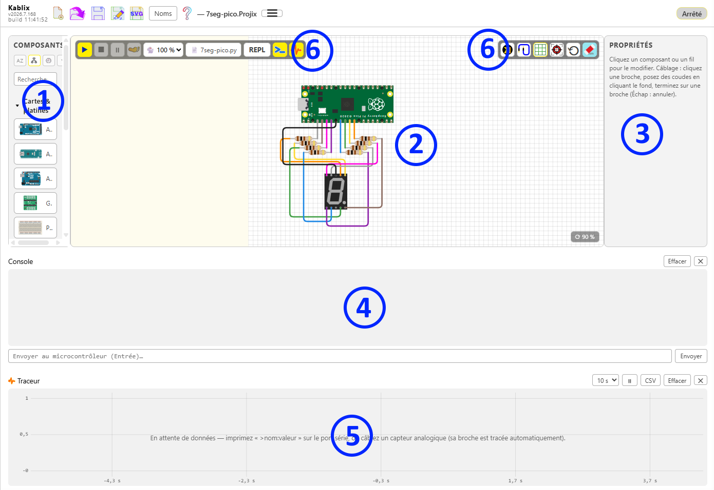

# Kablix — Guide d'utilisation

> English version: [USAGE.md](../en/USAGE.md)

## Sommaire

1. [Démarrage](#démarrage)
2. [Fonctionnalités](#fonctionnalités)
3. [L'interface](#linterface)
4. [Construire un montage](#construire-un-montage)
5. [Exécuter du code](#exécuter-du-code)
6. [MicroPython sur le Pico](#micropython-sur-le-pico)
7. [Déboguer pas à pas](#déboguer-pas-à-pas)
8. [Moniteur série](#moniteur-série)
9. [Traceur de courbes](#traceur-de-courbes)
10. [Exporter le schéma en SVG](#exporter-le-schéma-en-svg)
11. [Créer ses propres composants](#créer-ses-propres-composants)
12. [Format de fichier des composants (.kablix-part.json)](#format-de-fichier-des-composants-kablix-partjson)
13. [Où trouver des composants existants](#où-trouver-des-composants-existants)
14. [Enregistrer / ouvrir un projet (.projix)](#enregistrer--ouvrir-un-projet-projix)
15. [Interopérabilité Wokwi (diagram.json)](#interopérabilité-wokwi-diagramjson)
16. [Mises à jour des bibliothèques](#mises-à-jour-des-bibliothèques)
17. [Raccourcis clavier](#raccourcis-clavier)

---

## Démarrage

1. Pour démarrer, cliquer sur l'icône  dans la barre d'activité à gauche ;
  - Ou dans un dossier de projet, double cliquer sur un fichier projix ;
  - Ou si vous avez fait l'association, dans l'explorateur Windows double cliquer sur un fichier projix.


2. **Construire son montage** : Glisser/poser un composant à partir de la bibliothèque à gauche. Relier les broches en direct et cliquer sur le bouton autoroutage (route les composants sélectionnés ou tout le montage si aucun n'est sélectionné).


3. **Exécuter son code** : Associer un fichier de code (attention les codes ino doivent être dans un dossier de même nom) puis **▶ « démarrer »** :
  - `.ino`/`.c`/`.cpp` -> compilation via la toolchain locale ;
  - `.py` -> MicroPython sur le Pico simulé (firmware `.uf2` requis, voir ci-dessous) ;
  - `.hex` / `.uf2`/`.elf` / `.bin` -> chargé directement sans compilation.

4. **Enregistrer son montage** : « Kablix : Enregistrer le projet (.projix) » ;
  un `.projix` se rouvre ensuite d'un double-clic dans l'explorateur.
  Import/export au format Wokwi (`diagram.json`) également disponibles.


## L'interface

*Interface de Kablix : **①** la **palette** des composants à gauche, **②** le **canvas** de montage au centre, **③** l'**inspecteur** (Propriétés/variables) à droite, **④** le **moniteur série/Console/REPL**, **⑤** le **Traceur** en bas et **⑥** les **barres d'outils** (Simulation et dessin) en haut.*

- **Palette** : cliquer un composant le pose sur le canvas. Deux tris au choix (boutons en haut) : alphabétique ou  par catégories
Une zone **« Derniers utilisés »** (10 max) peut rester en tête (troisième bouton). Le dernier bouton permet de changer le mode de réaction de la bibliothèque.
- **Barre d'outil Kablix**

    - les fonctions habituelles de gestion de fichier,
    - le bouton Noms qui fait apparaitre le nom sur le composant **sélectionné** ou tous les composants
    - le menu hamburger pour des fonctions d'utiliation  moins fréquentes.
    - accés à cette aide.
- **Barre de simulation**

    - **▶ démarrer**
    - **■ arrêter**
    - **⏸ pause/reprendre**
    - **pas à pas**
    - le sélecteur de **vitesse** 🐇/🐢/🐌 pour accélérer ou ralentir la simulation
    - **fichier de code**  clic = changer, double-clic = ouvrir (ouvre le fichier de code du projet sur la gauche) 
    - **REPL** : pour Pico uniquement affiche la console python traditionnelle
    - **moniteur série / console**
    - **Traceur** de courbes.
- **Barre de dessin**

  - **Bouton Kablix** Affiche le schéma interne ou le brochage complet du composant.
    - **autoroutage** route la sélection ou tout le montage
    - **grille** (afficher/masquer)
    - **recentrer/ajuster la vue**
    - **⟲ réinitialiser** les composants
    - **gomme** (effacer le schéma).
- **Propriétés/Variables** (inspecteur) : 
    - Pendant le dessin, édite le composant
    sélectionné (couleur, valeur, angle…) ou fil (couleur Dupont, suppression, noeud [équipotielle])
    - pendant la simulation, affiche les variables.

## Construire un montage

### Poser et déplacer

- **Poser** : clic sur un composant de la palette (posé au centre), ou
  **glisser-déposer** depuis la palette vers l'endroit voulu du canvas.
- **Déplacer** : glisser le composant (n'importe où sur son corps), ou **glisser avec le clic droit** — indispensable pour les composants interactifs (bouton, potentiomètre, interrupteurs, joystick) dont le clic gauche actionne le contrôle.
- **Tourner** : sélectionner le composant puis touches **`+`** (45° horaire) ou **`-`** (45° antihoraire). Les broches et les fils suivent ; un rappel apparaît dans la zone d'aide de l'inspecteur.
- **Zoomer** : **molette** dans le canvas (centré sur le curseur). Le badge **⟳ %** en bas à droite donne le facteur ; un clic dessus réinitialise la vue.
- **Supprimer** : bouton 🗑 de l'inspecteur, ou touche `Suppr`.

### Platine d'essai

Le composant **Platine d'essai** (catégorie Cartes & platines) existe en trois tailles — *mini* (17 colonnes, sans rails), *moyenne* (30 colonnes) et *grande*
(63 colonnes) — réglables dans **Propriétés**. Les connexions internes réelles sont simulées : colonnes **a–e** et **f–j** reliées par bande, **rails +/−**
sur toute la longueur.

Pendant le déplacement d'un composant au-dessus de la platine, les **bandes qui recevraient ses broches s'allument en jaune**. Au relâchement, le composant s'**enfiche** : il se cale sur les trous et les connexions sont établies automatiquement (sans fil visible). Les fils passent par-dessus les cartes et les platines.

### Câbler

1. Cliquer une **broche** (pastille dorée) : le fil démarre.
2. Chaque clic sur le **fond du canvas** pose un **coude**. Les segments proches de l'horizontale ou de la verticale (±15°) y sont **aimantés**.
3. Cliquer une **autre broche** termine le fil. `Échap` annule.
4. Le glisser-déposer direct broche → broche fonctionne aussi et c'est la méthode que je conseil, l'autoroutage faisant le reste.

Chaque changement de direction est tracé avec un **arrondi**. Couleurs :

- un fil touchant une **masse** (GND) naît **noir** ;
- un fil touchant une **alimentation** (5V, 3V3, VBUS, VSYS, VCC…) naît **rouge** ;
- les autres suivent la rotation des **nappes Dupont arc-en-ciel** (10 couleurs).

La couleur reste **modifiable d'un clic** dans l'inspecteur — elle n'est jamais ré-imposée.

Certains composant spéciaux (seulement LED RVB pour l'instant) ont des couleurs initiales affectés (je vous laisse deviner lesquels dans ce cas).

### Retoucher un fil

- **Sélectionner le fil** : des **poignées** apparaissent sur chaque coude.
- **Glisser une poignée** pour déplacer le coude.
- **Ctrl maintenu** pendant le glissement : un **réticule horizontal/vertical** s'affiche et le coude s'aligne sur ses voisins — les segments deviennent exactement horizontaux ou verticaux.
- **Double-clic sur le fil** : insère un nouveau coude à cet endroit.

### Composants disponibles

| Composant | Comportement simulé |
| --- | --- |
| Arduino Uno / Raspberry Pi Pico | Cartes (processeur simulé) |
| Platine d'essai (mini/half/full) | Bandes a–e / f–j et rails +/− conducteurs, enfichage automatique |
| LED, LED RGB, barre de 10 LED | Allumées selon les niveaux des nets (anode haute, cathode basse) |
| Afficheur 7 segments | Segments A–G + point, cathode commune DIG1 |
| Bouton poussoir | Tire la broche MCU à LOW à l'appui (câblé broche ↔ GND) |
| Interrupteur à glissière | Connecte le commun (2) au côté 1 ou 3 |
| DIP switch ×8 | 8 canaux indépendants (na ↔ MCU, nb ↔ GND) |
| Résistance | Relie ses deux pattes (valeur/angle éditables) |
| Buzzer | Note animée quand une tension existe entre ses broches |
| Potentiomètre (rotatif / glissière) | Entrée analogique interactive (A0–A5 Uno, GP26–GP28 Pico) |
| Joystick analogique | 2 axes analogiques (VERT/HORZ) + bouton SEL |
| Photorésistance (LDR) | Sortie analogique AO, luminosité réglée dans Propriétés |
| Détecteur PIR, capteur d'inclinaison | Sortie numérique OUT, état réglé dans Propriétés |
| Servomoteur | Bras à 90° quand la broche PWM est haute (simplifié) |

## Exécuter du code

Bouton **Compiler & exécuter le fichier actif** (ou la commande homonyme) — le traitement dépend de l'extension du fichier actif :

| Fichier | Traitement | Prérequis |
| --- | --- | --- |
| `.ino`, `.c`, `.cpp` (carte Uno) | Compilation locale puis exécution | `arduino-cli` **ou** `avr-gcc` |
| `.c`, `.cpp` (carte Pico) | Compilation directe RAM (sans OS) | `arm-none-eabi-gcc` |
| `.py` | MicroPython sur le Pico simulé | firmware `.uf2` (voir ci-dessous) |
| `.hex` | Chargé directement (Uno) | — |
| `.uf2`, `.elf`, `.bin` | Chargé directement (Pico) | — |

## MicroPython sur le Pico
1. Ouvrir un fichier `.py` → **Compiler & exécuter le fichier actif**.
2. Au premier lancement, si aucun firmware n'est trouvé, Kablix **propose de le télécharger automatiquement** (choix **Pico / Pico W**) depuis [micropython.org](https://micropython.org/download/RPI_PICO/). Le firmware est mémorisé dans le stockage de l'extension et **réutilisé dans tous vos projets** — la question n'est posée qu'une fois.

Pour fournir votre propre firmware (hors ligne, version précise…) : placez un `.uf2` officiel **dans le workspace** (n'importe quel dossier) ou renseignez son chemin dans le réglage **`kablix.micropythonUf2`** ; il est alors prioritaire.

> ⚠ **Fonctionnement entièrement hors-ligne.** Pour qu'un poste sans Internet n'ait jamais à télécharger le firmware, **placez le `.uf2` dans le dossier du projet** : il sera versionné et distribué avec le projet. Kablix cherche le firmware **d'abord dans le workspace**, puis dans le firmware téléchargé/mémorisé, et ne propose le téléchargement qu'en dernier recours. Un projet qui embarque son firmware est ainsi reproductible et autonome.

Le firmware démarre dans le simulateur (bootrom + flash + USB), puis le script est injecté via le **raw REPL**. Les `print()` apparaissent dans le moniteur série ; à la fin du script, le **REPL interactif** reste disponible via le
champ d'envoi ou en cliquant sur le bouton REPL.

## Déboguer pas à pas

Pensé pour observer un programme, sans débogueur externe.

- **⏸ Pause / ▶ Reprendre** : gèle la simulation ; l'état des broches et des LED reste affiché. Le sélecteur 🐇/🐢/🐌 ralentit l'exécution (Uno).
- **Pas** : exécute une ligne du fichier source puis se remet en pause. Le panneau **Variables**  montre alors la ligne courante et les variables globales du programme ; la ligne est aussi surlignée dans l'éditeur VS Code.
Une variable qui vient de changer est affichée en rouge
- **Points d'arrêt** : cliquer dans la gouttière de l'éditeur (à gauche des numéros de ligne) avant ou pendant l'exécution ; la simulation se met en pause en atteignant la ligne. Les points d'arrêt peuvent être conditionnels.

Prérequis et limites :

| Langage | Comment | Limites |
| --- | --- | --- |
| C / Arduino (Uno) | infos DWARF extraites à la compilation (`avr-objdump`, fourni avec arduino-cli ou avr-gcc) | variables **globales** simples (int, float, bool…) ; un `delay()` long avance par tranches de 0,25 s simulée |
| MicroPython (Pico) | le script est instrumenté automatiquement avant injection | variables **globales** uniquement ; la pause prend effet à la ligne suivante ; pas de ralenti |

Les artefacts chargés directement (`.hex`, `.uf2`, `.elf`, `.bin`) s'exécutent sans infos de débogage : pause et ralenti restent disponibles, pas le pas à pas.

## Moniteur série

- **Sortie** : USART (Uno), USB-CDC et UART0 (Pico), en temps réel.
- **Entrée** : champ de saisie + `Entrée` (ou bouton Envoyer). Sur le Pico, l'entrée alimente l'USB-CDC (REPL MicroPython) **et** l'UART0.

## Traceur de courbes

Panneau en bas de l'écran : visualise en temps réel les grandeurs numériques, sans quitter Kablix ni ajouter de dépendance.

Deux sources tracées automatiquement :

- **Télémétrie du programme** : chaque ligne au format **Teleplot** `>nom:valeur` (unité optionnelle `§u`) émise sur le port série devient une courbe. Compatible avec l'outil Teleplot sur vrai matériel — le même sketch trace ici et là-bas. Ces lignes sont **absorbées** par le traceur : elles n'encombrent pas le moniteur série.
- **Sondes internes** : la tension que chaque capteur analogique pose sur sa broche est tracée **sans une ligne de code** dans le sketch (tracé en escalier, la valeur tient entre deux changements).

Exemples d'émission :

| Langage | Ligne |
| --- | --- |
| C / Arduino | `Serial.print(">temp:"); Serial.println(t);` |
| C / Arduino (unité) | `Serial.print(">tension:"); Serial.print(v); Serial.println("§V");` |
| MicroPython | `print(">temp:{}".format(t))` |

Commandes du panneau :

- **Fenêtre** : durée affichée (5, 10, 30 ou 60 s), fenêtre glissante qui suit le temps réel.
- **⏸ / ▶** : fige l'affichage ; la collecte continue en arrière-plan.
- **Puces de légende** : clic pour masquer/afficher une courbe ; la valeur courante y est affichée en direct.
- **Survol** : réticule + info-bulle avec la valeur de chaque courbe à l'instant pointé.
- **CSV** : exporte toutes les séries (format long `temps ; grandeur ; valeur ; unité`, séparateur et décimale adaptés à la langue — ouverture directe dans Excel FR).
- **Effacer** : vide les courbes.

À l'arrêt de la simulation, les courbes restent affichées pour analyse.

## Exporter le schéma en SVG

Bouton **Disquette SVG** : le schéma complet (composants avec leurs rotations, fils colorés avec leurs arrondis) est exporté en **fichier SVG autonome** via un dialogue de sauvegarde. Utilisable dans un document, un site, une impression…

> Note : quelques composants stylés par CSS interne peuvent perdre des détails cosmétiques à l'export ; la géométrie et les couleurs principales sont conservées.

## Créer ses propres composants
> ⚠ Expérimentale ⚠

> Guide détaillé : [Modifier les SVG des composants et leurs schémas internes](Modifier-svg-composants.md) — retoucher le dessin SVG, la grille de 10 px, et modifier les schémas internes (vue K).

Bouton **« + Créer un composant »** en bas de la palette : une fenêtre plein écran s'ouvre, avec le formulaire à gauche et **deux aperçus** à droite (vue externe et vue interne). Les boutons **zoom** en haut (−, %, +, ⛶ *ajuster*) mettent les deux aperçus à l'échelle.

**1. Nom et catégorie.** Le nom est le libellé affiché dans la palette. La catégorie choisit la section de palette où ranger le composant (Cartes, Discrets, Afficheurs & LED, Commandes, Capteurs, Actionneurs, Instruments, Divers) ; laissée vide, il va dans **Composants personnalisés**.

**2. Modèle de simulation.** Définit le comportement électrique :

| Modèle | Rôles de broches | Comportement |
| --- | --- | --- |
| LED | `A` (anode), `C` (cathode) | Halo lumineux si A=haut et C=bas |
| Bouton poussoir | `1.l`, `2.l` | Clic sur le dessin = appui (broche tirée à GND) |
| Résistance | `1`, `2` | Relie électriquement ses deux broches |
| Buzzer | `1`, `2` | Halo si tension entre les deux broches |
| Source numérique | `OUT` | État 0/1 réglé dans Propriétés |
| Source analogique | `AO` | Valeur 0–100 % réglée dans Propriétés |
| Capteur ultrason HC-SR04 | `TRIG`, `ECHO` | Écho de distance (réglable) |
| Afficheur LCD I²C (HD44780) | — (bus I²C) | Écran piloté par le bus I²C |
| Driver PWM I²C (PCA9685) | — (bus I²C) | 16 sorties PWM sur le bus I²C |
| Afficheur OLED I²C (SSD1306) | — (bus I²C) | Écran graphique I²C |
| Afficheur OLED SPI (SSD1306) | `DC` | Écran graphique SPI |
| Décoratif | — | Aucun comportement (annotation, habillage) |

Le bouton **⇪** à côté de la liste importe des **modèles de simulation** supplémentaires depuis un `.json` (rôles et attributs pré-affectés) ; ils s'ajoutent sous « Modèles importés » et sont persistés.

**3. Dessin externe.** Bouton **« Charger un SVG… »** : chargez le dessin depuis un fichier `.svg`. Kablix lit les **marqueurs de convention** placés dans le SVG (sous Inkscape par exemple) et les retire du composant final :

- **cercle rouge** (opacité 0,8) = une broche → détectée et posée automatiquement ;
- **texte rouge** près d'une broche = son nom (deviendra l'info-bulle) ;
- **cercle vert** (opacité 0,5) = ancre d'alignement de la vue interne (voir 5).

Sans marqueur rouge, **cliquez l'aperçu** pour poser chaque broche à la main.
> ⚠ Les pattes doivent impérativement être sur une grille de 10 px.

**4. Points de connexion.** La liste sous « Points de connexion » permet de **renommer** chaque broche, d'ajuster ses coordonnées **x / y** au pixel, ou de la retirer (✕). Un clic sur l'aperçu externe ajoute toujours un point.

**5. Vue interne (facultative).** Bouton **« Charger un SVG… »** de la colonne interne : un second dessin (schéma de principe) affiché quand on ouvre le composant. Il se cale sur la vue externe par le **cercle vert** (ancre) présent dans les deux SVG — mêmes échelles exigées. La case **Superposition** contrôle le calage sur l'aperçu externe ; **✕** retire la vue interne.

**6. Paramètres de définition** (bouton **＋**). Champs numériques nommés (valeur nominale d'une résistance, etc.) : ils apparaissent dans l'inspecteur du composant **et** deviennent des variables réutilisables dans la caractéristique du contrôle de simulation.

**7. Contrôle de simulation.** Ajoute au composant, pendant la simulation, un **curseur** (sortie analogique) ou un **interrupteur** (sortie numérique) :

- **Curseur** : libellé, unité, min / max / pas, et une **caractéristique** — une expression donnant la tension de sortie **en volts** en fonction de `x` (position du curseur) et des paramètres définis en 6. Vide = rampe linéaire min→max. L'expression est validée en direct.
- **Interrupteur** : un libellé, sortie 0/1.

**8. Enregistrer.** Le composant apparaît dans la palette (★) et est **persisté entre les sessions**. Le bouton **« Soumettre à Kablix… »** explique comment partager le composant (issue GitHub « Submit new component » ou pull request).

Gestion depuis la palette : **clic** = poser sur le canvas, **double-clic** = rouvrir le créateur pour modifier, **⇩** = exporter en `.json`, **✕** = supprimer, **⇪ Importer (.json)** = charger un composant partagé.

## Format de fichier des composants (.kablix-part.json)

Un composant exporté est un fichier **JSON** autonome :

```json
{
  "type": "custom-m4k2xyz",
  "label": "Ma LED spéciale",
  "kind": "led",
  "svg": "<svg width=\"40\" height=\"56\" xmlns=\"http://www.w3.org/2000/svg\">…</svg>",
  "pins": [
    { "name": "plus",  "x": 12, "y": 50 },
    { "name": "moins", "x": 28, "y": 50 }
  ],
  "pinRoles": { "A": "plus", "C": "moins" },
  "attrs": {}
}
```

| Champ | Type | Description |
| --- | --- | --- |
| `type` | chaîne | Identifiant unique. Généré automatiquement si absent à l'import. |
| `label` | chaîne | **Obligatoire.** Nom affiché dans la palette. |
| `kind` | chaîne | Modèle de simulation : `led`, `pushbutton`, `resistor`, `buzzer`, `digital-source`, `analog-source` ou `passive` (défaut). |
| `svg` | chaîne | **Obligatoire.** Code SVG complet du dessin (balise `<svg>` avec `width`/`height` en pixels). |
| `pins` | tableau | **Obligatoire.** Points de connexion : `name` (unique), `x`, `y` en pixels **relatifs au coin haut-gauche du dessin**. |
| `pinRoles` | objet | Correspondance *rôle du modèle* → *nom de broche* (voir tableau des modèles). Si absent, les broches doivent porter directement le nom du rôle. |
| `attrs` | objet | Attributs initiaux. Pour `digital-source` : `{ "state": "0" }` ; pour `analog-source` : `{ "value": "50" }`. |
| `category` | chaîne | Section de palette (`Boards`, `Passive`, `Displays & LEDs`, `Controls`, `Sensors`, `Actuators`, `Instruments`, `Divers`). Absente = « Composants personnalisés ». |
| `params` | tableau | Paramètres de définition : `name` (identifiant), `label`, `value` (nombre). Champs de l'inspecteur, réutilisables dans `control.expr`. |
| `control` | objet | Contrôle de simulation : `{ "type": "slider", "label", "unit", "min", "max", "step", "expr" }` (tension en volts, `expr` en fonction de `x` et des `params`) **ou** `{ "type": "switch", "label" }`. |
| `innerSvg` | chaîne | Vue interne facultative (schéma affiché à l'ouverture du composant). |
| `innerOffset` | objet | Décalage `{ x, y }` de la vue interne dans le repère du dessin externe (calage). |
| `extAnchor` / `intAnchor` | objet | Ancres vertes `{ x, y }` mesurées à l'import ; recalculent le calage si un seul SVG est réimporté. |

Les valeurs de `kind` disponibles pour les modules I²C/SPI complets sont aussi :
`ultrasonic` (HC-SR04, rôles `TRIG`/`ECHO`), `i2c-lcd`, `i2c-pwm`, `i2c-oled`
(bus I²C, sans rôle), `spi-oled` (rôle `DC`).

Conseils pour le dessin SVG :

- Donnez des `width`/`height` raisonnables (40–200 px) : c'est la taille d'affichage sur le canvas.
- Évitez les `<style>` et les scripts ; préférez les attributs de présentation (`fill`, `stroke`…) — ils survivent à l'export SVG du schéma.
- Placez visuellement vos pastilles de connexion  là où vous déclarez les `pins`.

### Faire générer un composant par une IA

Copiez le prompt ci-dessous dans votre assistant IA préféré (Claude, ChatGPT…), complétez la première ligne, puis importez le JSON obtenu via **⇪ Importer (.json)** :

```text
Crée un composant pour le simulateur Kablix : [DÉCRIS ICI TON COMPOSANT, ex. « un module relais 5V avec une LED témoin »].

Réponds UNIQUEMENT avec un fichier JSON valide (aucun texte autour), au format :

{
  "label": "<nom court affiché dans la palette>",
  "kind": "<modèle de simulation, voir liste>",
  "svg": "<dessin SVG complet sur une seule ligne>",
  "pins": [ { "name": "<nom>", "x": <px>, "y": <px> } ],
  "pinRoles": { "<rôle>": "<nom de broche>" },
  "attrs": {}
}

Contraintes :
- "kind" parmi : "led" (allumé si rôle A=haut et C=bas), "pushbutton" (clic =
  broche tirée à GND, rôles 1.l et 2.l), "resistor" (relie les rôles 1 et 2),
  "buzzer" (actif si tension entre rôles 1 et 2), "digital-source" (sortie
  numérique, rôle OUT, état réglé par l'utilisateur), "analog-source" (sortie
  analogique, rôle AO, valeur 0-100 % réglée par l'utilisateur), "passive"
  (décoratif, aucun rôle).
- "pinRoles" : associe chaque rôle du kind choisi au "name" d'une de tes pins.
- "attrs" : { "state": "0" } pour digital-source, { "value": "50" } pour
  analog-source, {} sinon.
- Le SVG : balise <svg> avec width/height en pixels (60 à 200), attributs de
  présentation uniquement (fill, stroke…), pas de <style> ni de script, pas de
  guillemets typographiques. Dessine des pastilles dorées (cercles ~4 px) aux
  positions exactes des pins déclarées.
- Les coordonnées x/y des pins sont en pixels depuis le coin haut-gauche du SVG.
- Échappe correctement les guillemets dans la valeur "svg".
```

L'aide correspondante (rôles, champs, contraintes) est dans la section [Format de fichier](#format-de-fichier-des-composants-kablix-partjson) — le prompt en reprend l'essentiel pour que l'IA n'ait besoin d'aucun autre contexte.

## Où trouver des composants existants

- **Intégrés à Kablix** : toute la palette (voir le tableau plus haut) — basée sur [@wokwi/elements](https://github.com/wokwi/wokwi-elements) (licence MIT), galerie visuelle sur [elements.wokwi.com](https://elements.wokwi.com).
- **Dessins SVG pour vos composants personnalisés** :
  - [Wikimedia Commons](https://commons.wikimedia.org/wiki/Category:Electronic_component_symbols) (symboles électroniques, licences libres) ;
  - [SVG Repo](https://www.svgrepo.com) et [Openclipart](https://openclipart.org) (dessins libres) ;
  - les sources de [wokwi-elements](https://github.com/wokwi/wokwi-elements/tree/master/src) contiennent le SVG de chaque composant (MIT — réutilisable dans un composant personnalisé) ;
  - [Fritzing](https://github.com/fritzing/fritzing-parts) (vues « breadboard » en SVG, licence CC-BY-SA).
- **Partage** : un composant exporté (`.kablix-part.json`) s'importe sur n'importe quel autre poste via **⇪ Importer (.json)** — pratique pour distribuer une bibliothèque.

## Enregistrer / ouvrir un projet (.projix)

Un **projet Kablix** réunit dans un seul fichier `.projix` (une archive ZIP) **le schéma** (composants, fils, composants personnalisés) et la **carte** cible. Le `.projix` est léger et autonome — idéal pour archiver, partager ou rendre un schéma. Il **n'embarque pas le code** : le fichier de code est seulement **référencé** (par son chemin), il reste sur le poste.

- **💾 Enregistrer le projet** (bouton de la barre d'outils ou commande **« Kablix : Enregistrer le projet (.projix) »**) : choisissez l'emplacement du fichier `.projix`. Kablix y place le schéma courant, les composants personnalisés utilisés et la carte. Le fichier de code associé (s'il y en a un) est mémorisé sous forme de **référence** dans le manifeste ; son contenu n'est pas copié dans l'archive.
- **📂 Ouvrir un projet** (bouton ou commande **« Kablix : Ouvrir un projet (.projix) »**) : sélectionnez un `.projix`. Le schéma et la carte sont rechargés dans le simulateur. Si un fichier de code était référencé, Kablix tente de le retrouver sur le poste (chemin relatif au workspace, puis chemin  absolu de secours).

Contenu d'une archive `.projix` :

| Entrée | Rôle |
| --- | --- |
| `kablix.json` | Manifeste : format, version, version de l'app, carte, date, **référence** du fichier de code |
| `diagram.json` | Schéma (composants + fils) et composants personnalisés |

> ⚠ Le code **n'est pas inclus** dans le `.projix` : seul le schéma est archivé. Pour partager aussi le code, transmettez le fichier source à côté du `.projix`.

## Interopérabilité Wokwi (diagram.json)

Les composants intégrés de Kablix sont les éléments **@wokwi/elements** (mêmes types, mêmes noms de broches), ce qui permet d'échanger des schémas avec le format de projet **Wokwi** (`diagram.json`).

- **Exporter** (Bouton hamburger ou palette de commandes → **« Kablix : Exporter le schéma Wokwi (diagram.json) »**) : écrit le schéma courant au format Wokwi.
- **Importer** (Bouton hamburger ou **« Kablix : Importer un schéma Wokwi (diagram.json) »**) :
  charge un `diagram.json` ; les types Wokwi non pris en charge par Kablix sont ignorés (leur nombre est indiqué dans la barre d'état).

> ⚠ Le **retournement** (flipH/flipV) et les **coudes des fils** n'ont pas  d'équivalent standard dans `diagram.json` : Kablix les conserve dans un bloc d'extension `kablix` (clé ignorée par Wokwi), si bien qu'un aller-retour Kablix → diagram.json → Kablix les restitue à l'identique. Ouvert dans Wokwi, le schéma reste valide (composants et liaisons standard), simplement sans le retournement ni les coudes.
>
> Limite restante : les **composants personnalisés** Kablix (`kablix-custom-part`) et les types Wokwi inconnus ne sont pas convertis (ignorés, comptés dans la barre d'état).

## Mises à jour des bibliothèques

Kablix embarque trois bibliothèques de simulation (`avr8js`, `rp2040js`, `@wokwi/elements`). L'extension est **hors-ligne par défaut** : aucun service distant n'est sollicité sans votre accord.

- **Vérification manuelle** : palette de commandes (`Ctrl+Shift+P`) → **« Kablix : Vérifier les mises à jour des bibliothèques »**. Kablix interroge alors le registre npm et vous indique si une version plus récente existe (ou que tout est à jour).
- **Vérification au démarrage** (optionnelle) : activez le réglage **`kablix.checkUpdatesOnStartup`** (désactivé par défaut). Une notification n'apparaît alors qu'en cas de mise à jour disponible, en silence sinon.

> **Avertissement** : mettre à jour ces bibliothèques peut **casser l'extension** (changements d'API). En cas de problème, ouvrez une demande sur le dépôt GitHub : [github.com/franksauret/kablix/issues](https://github.com/franksauret/kablix/issues). Une vérification réseau absente ou échouée reste silencieuse et n'affecte pas le fonctionnement hors-ligne.

## Raccourcis clavier

| Touche | Action |
| --- | --- |
| `+` / `=` | Tourner le composant sélectionné de +45° |
| `-` | Tourner de −45° |
| `Suppr` / `Retour arrière` | Supprimer la sélection (composant ou fil) |
| `Échap` | Annuler le câblage en cours / désélectionner |
| `Ctrl` (pendant le glissement d'une poignée) | Réticule + alignement H/V du coude |
| `Entrée` (champ série) | Envoyer la ligne au microcontrôleur |
