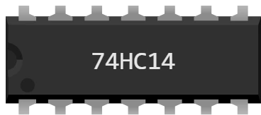

# 74xx14 — sextuple inverseur à trigger de Schmitt

Boîtier DIL-14 à enficher sur la platine d'essai : **six inverseurs indépendants**. Un inverseur sort l'**inverse** de son entrée — 1 devient 0, 0 devient 1.

Série 74 : le « xx » de la référence est sa **famille** (HC, LS, HCT…). Elle ne change ni la fonction ni le brochage, mais elle fixe la **plage d'alimentation** — donc la carte sur laquelle le boîtier fonctionne.

| Famille | Alimentation |
|---|---|
| HC, AC, ACT | 2 à 6 V |
| C | 3 à 15 V |
| HCT, ALS, F | 4,5 à 5 V |
| S, LS | 4,75 à 5,25 V |

Une Uno sort 5 V : toutes les familles y passent. Une **Pico ne sort que 3,3 V** :
seules HC, AC, ACT et C y fonctionnent — un 74LS14 sur une Pico ne fait rien.

Ces inverseurs sont à **trigger de Schmitt** : sur un vrai circuit, leur seuil de basculement remonte à la montée et descend à la descente, ce qui nettoie un signal lent ou bruité. En simulation les niveaux sont francs, l'hystérésis ne se voit donc pas. C'est le jumeau série 74 du [CD40106](cd40106.md).

## Broches

| Patte | Nom | Rôle |
|---|---|---|
| 1 | **a** | entrée de l'inverseur A |
| 2 | **a̅** | sortie de l'inverseur A (barre = inversé) |
| 3 | **b** | entrée de l'inverseur B |
| 4 | **b̅** | sortie de l'inverseur B (barre = inversé) |
| 5 | **c** | entrée de l'inverseur C |
| 6 | **c̅** | sortie de l'inverseur C (barre = inversé) |
| 7 | **GND** | masse — **fil noir** |
| 8 | **d̅** | sortie de l'inverseur D (barre = inversé) |
| 9 | **d** | entrée de l'inverseur D |
| 10 | **e̅** | sortie de l'inverseur E (barre = inversé) |
| 11 | **e** | entrée de l'inverseur E |
| 12 | **f̅** | sortie de l'inverseur F (barre = inversé) |
| 13 | **f** | entrée de l'inverseur F |
| 14 | **VCC** | alimentation — **fil rouge** |

## Table de vérité

Un inverseur ; les cinq autres sont identiques.

| a | a̅ |
|---|---|
| 0 | 1 |
| 1 | 0 |

## Propriétés

| Propriété | Rôle | Défaut |
|---|---|---|
| `ref` | Référence du boîtier — en changer change le brochage, pas le dessin | 74xx14 |
| `family` | Famille de la série 74 : elle décide de la plage d'alimentation | HC |

## Simulation

- **L'alimentation n'est pas facultative** : sans fil rouge sur VCC (patte 14) et fil noir sur GND (patte 7), le boîtier ne sort rien du tout.
- Hors de la plage **de la famille choisie (2 à 6 V en HC)**, Kablix affiche « Tensions d'alimentation incompatibles ». **En dessous**, le boîtier ne fait rien ; **au-dessus**, il est DÉTRUIT — croix rouge, et il le reste jusqu'à la simulation suivante.
- Une **entrée en l'air n'est pas un 0** : la sortie reste indéterminée tant que cette entrée compte — et pour cette fonction, elle compte toujours.
- Une sortie pilote le montage comme une broche de carte : LED **avec sa résistance**, base de transistor, ou entrée d'un autre boîtier.

## Utilisation

- Un inverseur transforme une logique en son contraire ; deux en cascade ne changent plus le niveau mais **régénèrent** le signal.
- Les 6 inverseurs du boîtier sont indépendants : un même circuit intégré peut servir à 6 usages sans rapport entre eux.
- Câbler les entrées sur des sorties de la carte et la sortie sur une entrée : le programme lit alors le résultat calculé par le composant, pas par le microcontrôleur.
- Test tout prêt : `CI-uno` et `CI-pico` dans `testkablix/` — les douze boîtiers câblés ensemble, toutes les portes vérifiées.

---

*Composant maison Kablix — dessin de Frank Sauret.*
