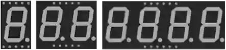

# Afficheur 7 segments

Afficheur à 7 segments (+ point décimal) pour chiffres et symboles simples. 1 à 4 digits, cathode ou anode commune.

## Broches

| Broche | Rôle |
|--------|------|
| **A–G** | Les 7 segments |
| **DP** | Point décimal |
| **COM / COM.1 / COM.2** | Commun (cathode ou anode) |
| **DIG1–DIG4** | Communs par digit (multi-digits) |

## Propriétés

| Propriété | Rôle | Défaut |
|-----------|------|--------|
| `color` | Couleur | red |
| `common` | Commun (cathode/anode) | cathode |
| `digits` | Nombre de digits (1/2/4) | 1 |
| `colon` | Deux-points horloge | — |

## Utilisation

- Une résistance par segment.
- Cathode commune : COM à la masse, segments au + ; anode commune : l'inverse.
- Multi-digits : multiplexage (allumer un digit à la fois, rapidement).
- **Mode horloge** (`colon`, 4 digits) : les points décimaux disparaissent au profit des deux points centraux, qui s'allument dès qu'un DP est piloté. Pour les laisser allumés en permanence, câbler DP au **+ de la carte** (3,3 V ou 5 V) à travers une résistance — sans passer par une broche : la simulation en tient compte.

---

*Fiche adaptée et traduite de la [documentation Wokwi](https://docs.wokwi.com/parts/wokwi-7segment) — © Wokwi. Composants `@wokwi/elements` (licence MIT).*
