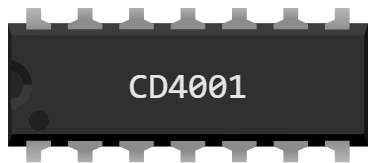

# CD4001 — quadruple porte NON-OU à 2 entrées

Boîtier DIL-14 à enficher sur la platine d'essai : **quatre portes NON-OU indépendantes**, chacune avec ses deux entrées et sa sortie. Une porte NON-OU sort 1 **seulement si ses deux entrées valent 0** : c'est un OU suivi d'un inverseur.

Série CMOS 4000 : elle s'alimente de **3 à 18 V**, la plage la plus large du lot — elle convient aussi bien aux 5 V d'une Uno qu'aux 3,3 V d'une Pico.

## Broches

| Patte | Nom | Rôle |
|---|---|---|
| 1 | **A1** | entrée A de la porte 1 |
| 2 | **B1** | entrée B de la porte 1 |
| 3 | **Q1** | sortie de la porte 1 |
| 4 | **Q2** | sortie de la porte 2 |
| 5 | **A2** | entrée A de la porte 2 |
| 6 | **B2** | entrée B de la porte 2 |
| 7 | **GND** | masse — **fil noir** |
| 8 | **A3** | entrée A de la porte 3 |
| 9 | **B3** | entrée B de la porte 3 |
| 10 | **Q3** | sortie de la porte 3 |
| 11 | **Q4** | sortie de la porte 4 |
| 12 | **A4** | entrée A de la porte 4 |
| 13 | **B4** | entrée B de la porte 4 |
| 14 | **VDD** | alimentation — **fil rouge** |

## Table de vérité

Une porte ; les autres sont identiques.

| A | B | Q |
|---|---|---|
| 0 | 0 | 1 |
| 0 | 1 | 0 |
| 1 | 0 | 0 |
| 1 | 1 | 0 |

## Propriétés

| Propriété | Rôle | Défaut |
|---|---|---|
| `ref` | Référence du boîtier — en changer change le brochage, pas le dessin | CD4001 |

## Simulation

- **L'alimentation n'est pas facultative** : sans fil rouge sur VDD (patte 14) et fil noir sur GND (patte 7), le boîtier ne sort rien du tout.
- Hors de la plage **3 à 18 V**, Kablix affiche « Tensions d'alimentation incompatibles ». **En dessous**, le boîtier ne fait rien ; **au-dessus**, il est DÉTRUIT — croix rouge, et il le reste jusqu'à la simulation suivante.
- Une **entrée en l'air n'est pas un 0** : la sortie reste indéterminée tant que cette entrée compte (ici, une seule entrée à 1 suffit à décider).
- Une sortie pilote le montage comme une broche de carte : LED **avec sa résistance**, base de transistor, ou entrée d'un autre boîtier.

## Utilisation

- Le NON-OU est universel lui aussi : deux NON-OU croisés forment une bascule RS, la mémoire d'un bit.
- Les 4 portes du boîtier sont indépendantes : un même circuit intégré peut servir à 4 fonctions sans rapport entre elles.
- Câbler les entrées sur des sorties de la carte et la sortie sur une entrée : le programme lit alors le résultat calculé par le composant, pas par le microcontrôleur.
- Test tout prêt : `CI-uno` et `CI-pico` dans `testkablix/` — les douze boîtiers câblés ensemble, toutes les portes vérifiées.

---

*Composant maison Kablix — dessin de Frank Sauret.*
