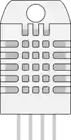

# Capteur température/humidité DHT22

Capteur numérique 1-wire de température et d'humidité.

## Broches

| Broche | Rôle |
|--------|------|
| **VCC** | Alimentation (+) |
| **SDA** | Données (1-wire) |
| **NC** | Non connecté |
| **GND** | Masse |

## Propriétés

| Propriété | Rôle | Défaut |
|-----------|------|--------|
| `temperature` | Température (°C) | 22 |
| `humidity` | Humidité (%) | 50 |

## Utilisation

- SDA vers une broche numérique (pull-up 10 kΩ).
- Bibliothèque DHT : une lecture toutes les ~2 s.
- En simulation, deux curseurs règlent la température et l'humidité **pendant** que le programme tourne : la lecture suivante renvoie la nouvelle valeur.
- Si la valeur affichée semble figée, vérifiez que le programme attend au moins 2 s entre deux lectures : la bibliothèque DHT renvoie sa **valeur en cache** quand on la sollicite plus vite, exactement comme avec un vrai capteur.

---

*Fiche adaptée et traduite de la [documentation Wokwi](https://docs.wokwi.com/parts/wokwi-dht22) — © Wokwi. Composants `@wokwi/elements` (licence MIT).*
