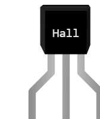

# Capteur à effet Hall

Détecteur de champ magnétique **tout ou rien** en boîtier TO-92 (A3144, A3141, US1881…). Tant qu'aucun aimant n'approche, sa sortie est relâchée ; dès que le champ dépasse son seuil, elle **tire à la masse**. C'est le capteur des compte-tours, des fins de course sans contact et des détections de fermeture de portes.

## Broches

| Broche | Rôle |
|--------|------|
| **V+** | Alimentation (+) |
| **GND** | Masse |
| **S** | Sortie numérique, **à drain ouvert** et **active à l'état bas** |

Le brochage change d'une référence à l'autre : les propriétés `V+`, `GND` et `S` disent sur **quelle patte** (1, 2 ou 3) se trouve chaque électrode. Les noms, eux, ne bougent jamais — changer de brochage n'orpheline aucun fil.

## Propriétés

| Propriété | Rôle | Défaut |
|-----------|------|--------|
| `text` | Inscription du boîtier (une ligne par saut de ligne) | Hall |
| `V+` | Numéro de patte de l'alimentation | 1 |
| `GND` | Numéro de patte de la masse | 2 |
| `S` | Numéro de patte de la sortie | 3 |
| `trigger` | Distance de déclenchement (mm) | 10 |

## Simulation

- Un **aimant** apparaît à côté du capteur dès que la simulation tourne : le **glisser à la souris** pour l'approcher ou l'éloigner. La cote au-dessus de lui donne la distance ; le trait devient **vert** quand le capteur commute.
- Sous la distance de déclenchement (`trigger`), la sortie passe **à l'état bas**. Au-delà, elle est relâchée — c'est le rappel qui la ramène en haut.
- **Une résistance de rappel est obligatoire** : soit celle du microcontrôleur (`pinMode(pin, INPUT_PULLUP)` ou `Pin.IN, Pin.PULL_UP`), soit une résistance de 10 kΩ entre S et le +. Sans elle, message *« La sortie du capteur à effet Hall est à drain ouvert »*, cadre rouge autour du coupable, et la sortie reste basse.
- La sortie **soudée en direct au +** (0 Ω) est un court-circuit : le capteur tire à la masse un rail qu'il ne peut pas tenir. Message et cadre rouge également.
- Capteur **non alimenté** (V+ ou GND en l'air) : même signalement, aucune détection.

## Utilisation

- Montage Arduino : V+ au +5 V, GND à la masse, S sur une entrée numérique, résistance de 10 kΩ entre S et le +5 V. Lire `digitalRead(pin) == LOW` pour « aimant présent ».
- Montage Pico : V+ au 3V3, GND à la masse, S sur une GPIO déclarée `Pin(n, Pin.IN, Pin.PULL_UP)` — pas de résistance à câbler.
- Un capteur **unipolaire** (A3144) répond à un seul pôle : si l'aimant ne déclenche rien dans la réalité, le retourner.

---

*Composant maison Kablix — dessin de Frank Sauret.*
