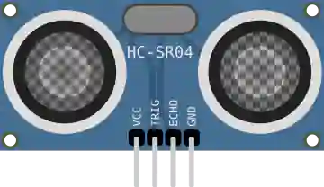

# Capteur ultrason HC-SR04

Télémètre à ultrasons : mesure une distance (2–400 cm) par temps de vol.

## Broches

| Broche | Rôle |
|--------|------|
| **VCC** | Alimentation (+5 V) |
| **TRIG** | Déclenchement (impulsion) |
| **ECHO** | Écho (durée ∝ distance) |
| **GND** | Masse |

## Propriétés

| Propriété | Rôle | Défaut |
|-----------|------|--------|
| `distance` | Distance simulée (cm) | 20 |
| `distancemin` / `distancemax` | Bornes du curseur de distance (cm) | 2 / 400 |
| `temperature` | Température de l'air au démarrage (°C) | 20 |

## Utilisation

- Impulsion 10 µs sur TRIG, mesurer la largeur de ECHO (`pulseIn`, `time_pulse_us`).
- distance_cm = durée_µs / 58.

## En simulation : deux curseurs

Le composant affiche **deux réglages** pendant la simulation :

- la **distance** de l'obstacle (curseur + saisie, bornée par `distancemin`/`distancemax`) ;
- la **température de l'air** (−20 à 60 °C), qui fixe la **vitesse du son** — la bulle d'aide affiche la vitesse obtenue.

Le capteur ne mesure jamais une distance : il mesure une **durée de vol** aller-retour. C'est le programme qui la convertit, en divisant par une constante — 58 µs/cm, juste **à 20 °C seulement** :

| Température | Vitesse du son | Durée d'écho | 100 cm lus par un programme divisant par 58 |
|---|---|---|---|
| −20 °C | 319,2 m/s | 62,7 µs/cm | 108 cm |
| 0 °C | 331,3 m/s | 60,4 µs/cm | 104 cm |
| 20 °C | 343,4 m/s | 58,2 µs/cm | 100 cm |
| 60 °C | 367,7 m/s | 54,4 µs/cm | 94 cm |

Bouger le curseur de température pendant la simulation **éloigne ou rapproche** l'obstacle vu par le programme, alors qu'il n'a pas bougé : c'est l'erreur à compenser. Formule employée : `c = 331,3 + 0,606 × T` (m/s), puis `durée = 2 × distance / c`.

---

*Fiche adaptée et traduite de la [documentation Wokwi](https://docs.wokwi.com/parts/wokwi-hc-sr04) — © Wokwi. Composants `@wokwi/elements` (licence MIT).*
