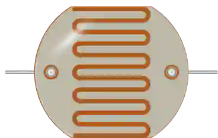

# LDR (photorésistance)



Photorésistance **nue**, à deux pattes : sa résistance chute quand la lumière augmente. À ne pas confondre avec le [module capteur de lumière](photoresistor.md), qui est une carte complète (VCC/GND, sorties analogique et numérique).

## Broches

| Broche | Rôle |
|--------|------|
| **1** | Borne 1 |
| **2** | Borne 2 (non polarisé) |

## Propriétés

| Propriété | Rôle | Défaut |
|-----------|------|--------|
| `r1lx` | Résistance sous 1 lux (Ω) | 50 000 |
| `gamma` | Coefficient de sensibilité (γ) | 0,7 |
| `lux` | Éclairement du point de repos (lux) | 500 |

## En simulation

Un **curseur d'éclairement** apparaît sur le composant pendant la simulation : il règle la lumière reçue, de l'obscurité au plein soleil. La résistance suit la caractéristique réelle d'une LDR :

```
R = r1lx x lux^(-gamma)
```

Avec les valeurs par défaut : 50 kΩ à 1 lx, ~650 Ω à 500 lx (pièce bien éclairée). La résistance est bornée à 10 MΩ dans le noir.

## Utilisation

- Monter la LDR en **pont diviseur** avec une résistance fixe (10 kΩ typique), le point milieu vers une entrée analogique.
- La tension lue par l'ADC suit le pont diviseur réel du montage : inutile de câbler un module tout fait pour obtenir une mesure crédible.
- Composant non polarisé : les deux pattes sont équivalentes.

---

*Composant Kablix — modèle photométrique `R = r1lx x lux^(-gamma)`.*
