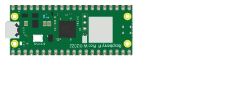

# Raspberry Pi Pico 2 W



Identique au Pico 2 (RP2350, double cœur Cortex-M33 à 150 MHz, 3,3 V, mêmes broches) avec un module **Wi-Fi/Bluetooth** intégré. Le brochage physique est le même que le Pico.

## Broches

| Broche | Rôle |
|--------|------|
| **GP0–GP28** | E/S numériques (GP26–GP28 = ADC0–ADC2) |
| **3V3** | Sortie 3,3 V |
| **VSYS / VBUS** | Alimentation d'entrée |
| **GND** | Masses |
| **RUN** | Reset (actif bas) |

## Utilisation

- Brochage complet via le bouton **K**.
- Niveau logique **3,3 V** (non tolérant 5 V).
- Programmable en **MicroPython** : Kablix charge le firmware `RPI_PICO2_W`.
- Le Wi-Fi n'est **pas émulé** par le cœur : les requêtes réseau passent par l'hôte — voir *Communication avec l'extérieur* ci-dessous.

> ℹ️ Le C/C++ bare-metal n'est pas encore pris en charge sur cette carte : utiliser MicroPython, ou le Pico W pour un programme Arduino.


## Communication avec l'extérieur

La puce Wi-Fi (CYW43439) n'est **pas émulée** : elle n'existe pas dans le cœur simulé. Kablix la remplace par un **pont réseau** — le script parle à l'extension, qui fait la vraie requête depuis votre machine et lui renvoie la réponse. Le programme reste donc celui d'une vraie carte :

```python
import network, urequests, time

wlan = network.WLAN(network.STA_IF)
wlan.active(True)
wlan.connect("mon-ssid", "mon-mot-de-passe")   # accepté tel quel, connexion immédiate
while not wlan.isconnected():
    time.sleep(0.1)
print(wlan.ifconfig())                         # ('192.168.1.50', ...) : adresse de façade

r = urequests.get("https://api.github.com/repos/FrankSAURET/kablix")
print(r.status_code, r.json()["name"])
r.close()
```

Ce qui est vrai, et ce qui ne l'est pas :

- `network.WLAN` est une **façade** : `connect()` réussit toujours (SSID et mot de passe ignorés), `isconnected()` passe à vrai, `ifconfig()` rend une adresse fixe. Aucun paquet Wi-Fi n'est émis.
- `urequests` (alias `requests`) fait de **VRAIES requêtes HTTP**, exécutées par VS Code : `get`, `post`, `put`, `patch`, `delete`, `head`, avec `data=`, `json=` et `headers=`. La réponse porte `status_code`, `reason`, `text`, `content` et `.json()`.
- Seuls **http://** et **https://** sont relayés, 15 s de délai maximum, corps de réponse plafonné à **64 Ko** : le tunnel emprunte la liaison série simulée, il est lent.
- `socket` **client** (connexion sortante) n'est pas relayé, ni MQTT, ni Bluetooth : passer par `urequests`. `socket` **serveur**, lui, fonctionne — voir ci-dessous.
- Pour couper tout accès sortant : décocher **`kablix.picowNetworkBridge`** dans les réglages (activé par défaut). Le script reçoit alors une `OSError`.


### Point d'accès et serveur web

Le montage classique — la carte se déclare en **point d'accès**, un téléphone s'y connecte et pilote la LED depuis une page web — fonctionne, à une différence près : c'est **votre machine** qui tient la prise TCP, pas la carte. Aucun réseau Wi-Fi n'est créé : le téléphone reste sur le **même réseau que le PC** et ouvre l'adresse annoncée au démarrage.

```python
import network, socket
from machine import Pin

led = Pin(15, Pin.OUT)

ap = network.WLAN(network.AP_IF)
ap.config(essid="Kablix-Pico", password="kablix2026")
ap.active(True)
print("Adresse :", ap.ifconfig()[0])          # l'adresse RÉELLE de la machine

adresse = socket.getaddrinfo("0.0.0.0", 80)[0][-1]
serveur = socket.socket()
serveur.bind(adresse)
serveur.listen(1)

while True:
    client, _ = serveur.accept()
    requete = client.recv(1024).split(b"\r\n")[0].decode()
    if "/on" in requete:
        led.value(1)
    elif "/off" in requete:
        led.value(0)
    client.send("HTTP/1.1 200 OK\r\n\r\n<a href='/on'>ON</a> <a href='/off'>OFF</a>")
    client.close()
```

- `network.WLAN(network.AP_IF)` est une **façade** : `config(essid=…, password=…)` est accepté et retenu, `active(True)` réussit, mais aucun point d'accès n'est diffusé. En revanche `ifconfig()[0]` rend l'**adresse IPv4 réelle** de votre machine — c'est elle qu'il faut ouvrir depuis le téléphone.
- Le `socket` **serveur** est relayé pour de bon : `getaddrinfo`, `bind`, `listen`, `accept`, `recv`/`read`/`readline`, `send`/`sendall`/`write`, `makefile`, `close`. Les octets vont et viennent tels quels — c'est votre programme qui parle HTTP, exactement comme sur la vraie carte.
- Le **port demandé n'est pas toujours obtenu** : le 80 est réservé sur la plupart des machines. Kablix se rabat alors sur 8080, puis sur un port libre, et imprime l'adresse ouverte dans la console : `[Kablix] serveur du Pico W : http://…`. C'est **cette** adresse qu'il faut viser, pas le port du programme.
- Au premier lancement, le **pare-feu** demande l'autorisation : l'accorder pour le réseau privé, sinon le téléphone frappe dans le vide.
- La prise se ferme à l'arrêt de la simulation ; le réglage **`kablix.picowNetworkBridge`** la coupe aussi (le script reçoit une `OSError`).
- Banc d'essai tout prêt : `testkablix/wifi-picow.projix` (et son jumeau `testkablix/wifi-pico2w.projix`).

---

*Composant maison Kablix. Dessin de la carte d'après les visuels officiels de Raspberry Pi Ltd. RP2350 © Raspberry Pi Ltd.*
