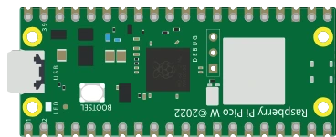

# Raspberry Pi Pico W



Identique au Pico (RP2040, 3,3 V, mêmes broches) avec un module **Wi-Fi/Bluetooth** intégré. Le brochage physique est le même que le Pico.

## Broches

| Broche | Rôle |
|--------|------|
| **GP0–GP28** | E/S numériques (GP26–GP28 = ADC0–ADC2) |
| **3V3** | Sortie 3,3 V |
| **VSYS / VBUS** | Alimentation d'entrée |
| **GND** | Masses |
| **RUN** | Reset (actif bas) |

## Utilisation

- Brochage complet via le bouton **K**.
- Niveau logique **3,3 V** (non tolérant 5 V).
- Le Wi-Fi n'est **pas émulé** par le cœur : les requêtes réseau passent par l'hôte — voir *Communication avec l'extérieur* ci-dessous.

## Communication avec l'extérieur

La puce Wi-Fi (CYW43439) n'est **pas émulée** : elle n'existe pas dans le cœur simulé. Kablix la remplace par un **pont réseau** — le script parle à l'extension, qui fait la vraie requête depuis votre machine et lui renvoie la réponse. Le programme reste donc celui d'une vraie carte :

```python
import network, urequests, time

wlan = network.WLAN(network.STA_IF)
wlan.active(True)
wlan.connect("mon-ssid", "mon-mot-de-passe")   # accepté tel quel, connexion immédiate
while not wlan.isconnected():
    time.sleep(0.1)
print(wlan.ifconfig())                         # ('192.168.1.50', ...) : adresse de façade

r = urequests.get("https://api.github.com/repos/FrankSAURET/kablix")
print(r.status_code, r.json()["name"])
r.close()
```

Ce qui est vrai, et ce qui ne l'est pas :

- `network.WLAN` est une **façade** : `connect()` réussit toujours (SSID et mot de passe ignorés), `isconnected()` passe à vrai, `ifconfig()` rend une adresse fixe. Aucun paquet Wi-Fi n'est émis.
- `urequests` (alias `requests`) fait de **VRAIES requêtes HTTP**, exécutées par VS Code : `get`, `post`, `put`, `patch`, `delete`, `head`, avec `data=`, `json=` et `headers=`. La réponse porte `status_code`, `reason`, `text`, `content` et `.json()`.
- Seuls **http://** et **https://** sont relayés, 15 s de délai maximum, corps de réponse plafonné à **64 Ko** : le tunnel emprunte la liaison série simulée, il est lent.
- `socket` brut n'est **pas** relayé (ni MQTT, ni Bluetooth) : passer par `urequests`.
- Pour couper tout accès sortant : décocher **`kablix.picowNetworkBridge`** dans les réglages (activé par défaut). Le script reçoit alors une `OSError`.

---

*Composant maison Kablix (dessin de la carte). RP2040 © Raspberry Pi Ltd.*
