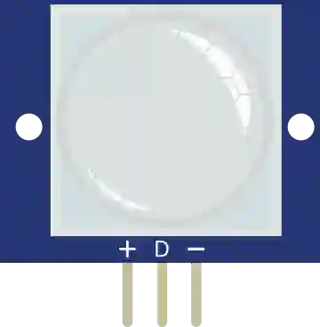

# Capteur de mouvement PIR

Détecteur de mouvement infrarouge passif. Sortie numérique haute en cas de détection.

## Broches

| Broche | Rôle |
|--------|------|
| **VCC** | Alimentation (+) |
| **OUT** | Sortie numérique (1 = mouvement) |
| **GND** | Masse |

## Propriétés

Aucune : en simulation, le mouvement se déclenche **à la souris** (voir ci-dessous).

## Utilisation

- OUT vers une entrée numérique.

## En simulation : la souris fait le mouvement

- **Bougez la souris au-dessus du capteur** → OUT passe à 1. C'est bien le *mouvement* qui compte, pas la simple présence du pointeur : la sortie retombe à 0 peu après l'arrêt de la souris.
- **Ctrl+clic** sur le capteur → mouvement **permanent** (OUT reste à 1, souris partie). Ctrl+clic à nouveau pour l'arrêter.
- Une **bulle d'aide** rappelle ces gestes : elle apparaît **25 px sous le pointeur**, centrée dessus, pour ne pas masquer le capteur. Elle reste affichée tant que la souris survole le capteur, même immobile, et garde sa taille comme sa distance au pointeur **quel que soit le zoom** de l'atelier.

---

*Fiche adaptée et traduite de la [documentation Wokwi](https://docs.wokwi.com/parts/wokwi-pir-motion-sensor) — © Wokwi. Composants `@wokwi/elements` (licence MIT).*
