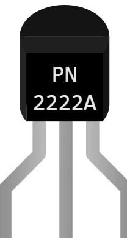

# Transistor PN2222A (NPN)

Transistor bipolaire NPN de petite puissance, en boîtier TO-92. En Kablix il sert d'**interrupteur commandé** : un courant de base fait passer un courant de collecteur jusqu'à 35 fois plus grand.

## Broches

| Broche | Rôle |
|--------|------|
| **E** | Émetteur — à la masse dans le montage classique |
| **B** | Base — commande, TOUJOURS derrière une résistance |
| **C** | Collecteur — la charge à commander (relais, moteur, LED) |

## Propriétés

| Propriété | Rôle | Défaut |
|-----------|------|--------|
| `angle` | Orientation (0/90/180/270°) | 0 |

Le PN2222A est une référence figée : gain 35, Vce max 40 V, Ic max 600 mA. Pour choisir soi-même ces valeurs, prendre le **transistor NPN générique**.

## Simulation

- Le transistor conduit quand la **base est haute et l'émetteur bas**.
- Le courant transmis est plafonné à **Gain × Ib** (35 × Ib) : c'est tout le modèle. On vise donc la **saturation** — si le montage aval demande plus, il ne fonctionne pas (le ventilateur ne démarre pas, le relais ne colle pas).
- Une base câblée **sans résistance** sature à coup sûr… et ferait chauffer un vrai transistor : mettre une résistance de base.

## Utilisation

- Calcul type : pour commander une bobine de relais de 40 mA, il faut Ib ≥ 40 / 35 ≈ 1,2 mA. Sous 5 V, une résistance de base de 1 kΩ donne (5 − 0,7) / 1000 ≈ 4,3 mA : largement saturé.
- Résistance de base trop forte (100 kΩ) → Ib = 43 µA → Ic max ≈ 1,5 mA : la charge ne démarre pas. C'est l'erreur classique à voir en simulation.
- Avec un relais, la **diode de roue libre est obligatoire** (cathode vers le +) : sans elle, la surtension de coupure détruirait le transistor.

---

*Composant maison Kablix — dessin de Frank Sauret.*
