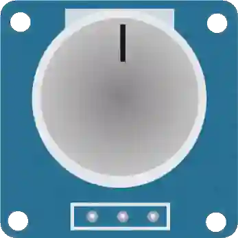

# Potentiomètre

Résistance variable à bouton rotatif. Le curseur fournit une tension proportionnelle à sa position.

## Broches

| Broche | Rôle |
|--------|------|
| **VCC** | Alimentation (+) |
| **SIG** | Curseur → entrée analogique |
| **GND** | Masse |

## Propriétés

| Propriété | Rôle | Défaut |
|-----------|------|--------|
| `ohms` | Valeur nominale : résistance totale entre VCC et GND (Ω) | 10 000 |
| `value` | Position initiale (0–100 %) | 50 |

## Utilisation

- SIG vers une entrée analogique (A0…), lecture `analogRead()` (0–1023).
- Régler en simulation : glisser le bouton, ou flèches / Page ↑↓.
- Pendant la simulation, une étiquette au-dessus du composant dit la position **et** les deux moitiés de la piste — « Position : 25 % (1,175 kΩ|3,525 kΩ) » : d'abord ce qu'un ohmmètre lirait entre le curseur et GND, ensuite le reste jusqu'à l'autre extrémité. Les deux bras du pont diviseur, d'un coup d'œil ; leur somme fait toujours la valeur nominale.

---

*Fiche adaptée et traduite de la [documentation Wokwi](https://docs.wokwi.com/parts/wokwi-potentiometer) — © Wokwi. Composants `@wokwi/elements` (licence MIT).*
