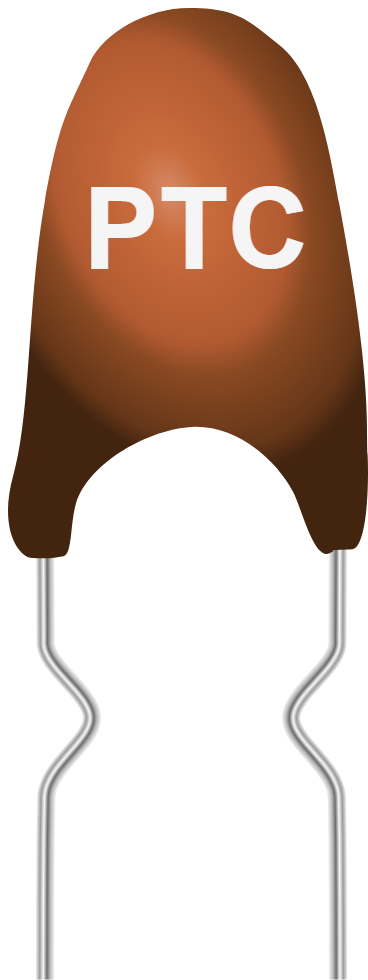

# Thermistance PTC



Thermistance à coefficient **positif** : sa résistance **monte** avec la
température. Sert de capteur linéaire (sondes type KTY) ou de protection
auto-rétablissable contre les surintensités.

## Broches

| Broche | Rôle |
|--------|------|
| **1** | Borne 1 |
| **2** | Borne 2 (non polarisé) |

## Propriétés

| Propriété | Rôle | Défaut |
|-----------|------|--------|
| `r25` | Résistance à 25 °C (Ω) | 2000 |
| `tc` | Coefficient de température (%/°C) | 0,79 |
| `tmin` | Température mini du curseur (°C) | -55 |
| `tmax` | Température maxi du curseur (°C) | 125 |

## En simulation

Un **curseur de température** apparaît sur le composant pendant la simulation,
borné par `tmin` et `tmax`. La résistance suit une loi linéaire :

```
R = r25 x ( 1 + (tc/100) x (T - 25) )
```

Avec les valeurs par défaut : 2 kΩ à 25 °C, ~1,6 kΩ à 0 °C, ~2,4 kΩ à 50 °C.

## Utilisation

- Même montage que la [NTC](ntc.md) : pont diviseur avec une résistance fixe
  proche de `r25`, point milieu vers une entrée analogique.
- Contrairement à la NTC, la tension lue **augmente** avec la température si la
  PTC est du côté haut du pont.
- Composant non polarisé : les deux pattes sont équivalentes.

---

*Composant Kablix — modèle linéaire `R = r25 x (1 + tc/100 x (T - 25))`.*
