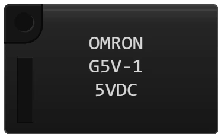

# Relais OMRON G5V

Relais électromécanique 1 RT (un contact inverseur). Une bobine, alimentée sous sa tension nominale, attire une lame et fait passer le commun du contact **repos** au contact **travail**. Il sépare complètement le circuit de commande (carte) du circuit de puissance (lampe, moteur, 230 V…).

## Broches

| Broche | Rôle |
|--------|------|
| **B1** | Bobine, première borne (pas de polarité) |
| **B2** | Bobine, seconde borne |
| **NF** | Contact **normalement fermé** (repos) |
| **NO** | Contact **normalement ouvert** (travail) |
| **Com** | Commun de la lame — sorti des deux côtés du boîtier, c'est la **même** broche |

Les deux pastilles « Com » sont électriquement identiques : câbler l'une ou l'autre revient exactement au même, c'est le confort de tracé qui décide.

## Propriétés

| Propriété | Rôle | Défaut |
|-----------|------|--------|
| `voltage` | Tension de commande : 3, 5, 6, 9, 12 ou 24 V | 5 |
| `angle` | Orientation (0/90/180/270°) | 0 |

La tension choisie est **inscrite sur le boîtier** (« 5VDC »), comme sur le vrai composant.

## Simulation

- La bobine colle si la tension qui lui arrive atteint **80 % de sa tension nominale** (« must operate voltage ») et si la source peut fournir son courant (environ 40 mA pour un G5V 5 V).
- Tension insuffisante → le relais **ne fonctionne pas**, le commun reste sur NF.
- Une **diode de roue libre est obligatoire** entre B1 et B2, **cathode vers le +**. Sans elle, message *« Une diode de roue libre est obligatoire »* ; montée à l'envers, message *« Diode à l'envers »* — dans les deux cas le relais ne colle pas.
- Chaque message **nomme le coupable** (« (Mod2) ») **et l'entoure d'un cadre rouge** sur le schéma, aux dimensions du rectangle de sélection : plus besoin de chercher lequel des relais reprendre. Le cadre disparaît quand le défaut est corrigé, et à l'arrêt de la simulation.
- À côté du cadre, une **étiquette jaune sur fond rouge explique le problème** et ce qu'il faut corriger (par exemple : *« La commande d'un relais est une bobine : à la coupure elle renvoie une surtension qui détruit le transistor de commande. La diode de roue libre l'absorbe — elle n'est pas facultative. »*). Elle ne s'affiche que pendant la simulation.
- Sortie de carte : une broche ne fournit que 40 mA. Commander la bobine directement passe tout juste ; le montage propre est un **transistor** (PN2222A) entre la bobine et la masse.

## Utilisation

- Montage type : broche MCU → résistance 1 kΩ → base du PN2222A ; émetteur à la masse ; collecteur sur B2 ; B1 au +5 V ; diode entre B1 (cathode) et B2 (anode).
- Le contact **NF** sert aux montages de sécurité : quand tout est éteint, le circuit est déjà fermé.

---

*Composant maison Kablix — dessin de Frank Sauret.*
