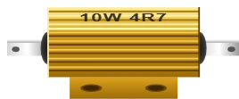
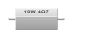

# Résistance

Résistance fixe. Limite le courant (LED) ou forme un pont diviseur / pull-up / pull-down.

## Broches

| Broche | Rôle |
|--------|------|
| **1** | Borne 1 |
| **2** | Borne 2 (non polarisé) |

## Propriétés

| Propriété | Rôle | Défaut |
|-----------|------|--------|
| `value` | Valeur en ohms | 220 |
| `rtype` | Boîtier : `film` (petite, à anneaux), `rp1` (puissance, aluminium à ailettes) ou `rp2` (puissance, céramique) | `film` |
| `power` | Puissance que le boîtier dissipe sans mourir, en watts | ¼ W en `film`, 10 W en `rp1`/`rp2` |
| `orientation` | Pose : `h` horizontale (couchée) ou `v` verticale (debout). Sans objet sur une résistance de puissance, trop massive pour tenir debout — la propriété disparaît de l'inspecteur | `h` |
| `angle` | Orientation (0/90/180/270°) | 0 |

## Les deux résistances de puissance

Une résistance de ¼ W chauffe dès qu'on lui demande un peu de courant. Pour un
diviseur de charge, un frein de moteur ou une résistance de puissance en série
sur une alimentation, il faut un boîtier qui évacue la chaleur : ce sont ces
deux-là, 10 W chacun.

Elles n'ont pas d'anneaux de couleur — à cette taille, la valeur est **écrite**
dessus, en code d'atelier : le symbole de l'unité prend la place de la virgule.
Le premier nombre est la puissance.

| Inscription | Se lit |
|-------------|--------|
| `10W 4R7` | 10 W, 4,7 Ω |
| `10W 4K7` | 10 W, 4,7 kΩ |
| `10W 470R` | 10 W, 470 Ω |
| `10W 1M` | 10 W, 1 MΩ |

Le boîtier céramique (`rp2`) écrit **Ω** là où l'aluminium écrit **R** :
`10W 4Ω7` est la même valeur que `10W 4R7`. C'est ainsi que ces pièces sont
marquées dans la réalité.

## Elle peut partir en fumée

La simulation calcule la puissance que chaque résistance **dissipe vraiment**,
au point de fonctionnement du montage : elle ouvre la résistance, mesure la
tension à ses deux pattes, en tire le courant qui la traverse, et compte
`P = R × I²`. Au-delà de sa propriété `power`, la résistance explose et une
étiquette dit pourquoi.

Deux conséquences utiles :

- **Une sortie de carte ne peut pas griller une résistance de puissance.** Elle
  a environ 25 Ω de résistance interne : même avec 4,7 Ω au bout, elle ne débite
  guère plus de 0,13 W. Pour faire chauffer une 10 W, il faut une alimentation
  de laboratoire (12 V sur 4,7 Ω = 30 W, elle ne tient pas une seconde).
- **En PWM, c'est la puissance qui est moyennée**, pas le courant. `R × I²` n'est
  pas proportionnel au courant : moyenner le courant sous-estimerait
  l'échauffement à rapport cyclique faible.

Une résistance grillée le reste jusqu'au prochain lancement de la simulation —
comme une LED ou un condensateur, elle est « remplacée » au démarrage suivant.

## Utilisation

- Non polarisée : les deux bornes sont équivalentes.
- LED : 220 Ω–1 kΩ. Pull-up/pull-down : 10 kΩ typique.
- Pose verticale : le corps est debout et une patte est repliée par-dessus, les
  deux bornes sortant côte à côte (20 px d'écart au lieu de 60). Pratique pour
  loger une résistance dans peu de place sur la platine. Debout, la résistance
  est vue de biais : ses anneaux sont dessinés en ellipses, l'anneau doré
  (tolérance) en bas, le premier anneau de valeur en haut.
- Debout, elle tient dans **30 × 30 px** au lieu de 30 × 60 : le dessin est
  raccourci de moitié en hauteur, comme la perspective le fait quand on regarde
  la pièce de plus haut — les anneaux s'aplatissent, le diamètre du corps ne
  change pas. C'est bien la même résistance, vue autrement, et l'encombrement
  gagné est celui qu'on cherchait en la mettant debout.

---

*Fiche adaptée et traduite de la [documentation Wokwi](https://docs.wokwi.com/parts/wokwi-resistor) — © Wokwi. Composants `@wokwi/elements` (licence MIT).*
