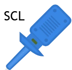

# Sonde logique

Petite pince crocodile de mesure. Elle ne se câble pas : on la **pose sur la pastille d'une broche** de la carte, et elle devient une **voie** de l'analyseur logique. Chaque pince prend une **couleur** à la pose : la pince bleue sur la planche est la voie bleue dans l'analyseur.

Catégorie de la palette : **Appareils de mesure**.

> **Expérimental.** L'analyseur logique est pour l'instant expérimental : il fonctionne, mais son interface et ses décodages peuvent encore changer d'une version à l'autre.

Elle n'écoute que du **tout ou rien** : 0 ou 1, et l'instant de chaque changement. Pour voir une tension qui varie, c'est l'[oscilloscope](oscillo.md) ; pour suivre une valeur calculée par le programme, le traceur de courbes.

## Broches

| Borne | Rôle                                                                     |
| ----- | ------------------------------------------------------------------------ |
| **G** | La **pointe** de la pince, en bas à gauche du dessin — l'unique pastille |

La pince ne consomme rien et n'impose rien : le montage se comporte exactement comme si elle n'était pas là. Aucun fil n'en part, jamais.

## La pose :

1. Glissez la pince depuis la palette.
2. Amenez son **crochet** sur la **pastille** de la broche à écouter.
3. Lâchez. La pince s'accroche, prend une couleur, et la broche apparaît dans l'analyseur.

## Propriétés

| Propriété   | Rôle                                                    | Défaut   |
| ----------- | ------------------------------------------------------- | -------- |
| `etiquette` | Nom de la voie dans l'analyseur (`horloge`, `donnees`…) | *(vide)* |

L'étiquette s'affiche **sur la planche, à côté de la pince**, dans la couleur de la voie. Vide, elle est masquée et la voie prend le **nom de la broche** (`Broche 8`, `A0`, `GP14`).

Un montage rouvert retrouve ses pinces là où elles étaient, avec leurs couleurs et leurs noms.

## L'onglet « Analyseur logique »

Il n'y a **rien à cliquer** : dès qu'au moins une pince est posée, le **lancement de la simulation** ouvre l'analyseur dans un **onglet séparé**, que l'on peut poser **à côté du schéma** — on lit les créneaux et le câblage en même temps. Pas de pince sur la planche, pas d'onglet.

L'onglet montre une **piste par voie**, dans la couleur de sa pince, avec une règle de temps en haut.

- **Molette** : zoom, autour du point sous la souris.
- **Glisser** : se promener dans l'enregistrement.
- **Flèches ◀ ▶** de la barre, ou touches **←** **→** : recule ou avance d'une demi-fenêtre, sans changer le zoom.
- **Survol** : un réticule donne l'instant, et le niveau (0 ou 1) de chaque voie à cet instant.
- **Toute la capture** : ramène toute la capture dans l'écran.
- **Suivre en direct** : recolle la vue à la fin de la capture, ce qu'elle fait d'elle-même pendant un run tant qu'on n'a pas zoomé.

Sous le nom de chaque voie, la **pastille de couleur** ouvre ses réglages : nom, vitesse, tolérance, et **masquer**. Une voie masquée quitte l'écran mais garde sa capture ; tant qu'il y en a une, la barre montre un bouton qui les **réaffiche** toutes, avec leur nombre.

Hors simulation, l'onglet montre la **dernière capture** de la session.

Cette capture s'écrit **au fur et à mesure** dans un fichier à part, pendant que la simulation tourne, et une simulation interrompue laisse quand même ce qu'elle a mesuré. Ce fichier est **supprimé à la fermeture du projet** — pour garder une mesure, exportez-la (**Exporter en CSV**).

Le projet, lui, garde les **réglages** de l'instrument (déclenchement, décodages, réglages de voie).

## Le déclenchement

Le menu **T** sous le nom d'une voie : choisissez le **sens** — front *montant* ou *descendant*. La capture reste alors **en attente** jusqu'au premier front de ce type, puis se **fige sur lui** : l'instant 0 de la règle devient ce front, et tout se lit en avance ou en retard par rapport à lui. Sans déclenchement, la règle part de l'instant du lancement de la simulation.

Changer de réglage **réarme** l'attente.

## Le décodage

Le menu **P** sous le nom d'une voie : `I²C / TWI`, `SPI`, `UART`, `1-Wire`, `DHT11 / DHT22` ou `DMX512`. Il faut ensuite dire **quelle voie joue quel rôle** :

| Protocole         | Rôles à désigner                                                                |
| ----------------- | ------------------------------------------------------------------------------- |
| **I²C / TWI**     | l'horloge (SCL) et la donnée (SDA)                                              |
| **SPI**           | l'horloge (SCK), MOSI, MISO, la sélection (CS), plus le **mode** 0 à 3          |
| **UART**          | la ligne série (TX ou RX), plus le **format** (`8N1`, `7E1`…) et la **vitesse** |
| **1-Wire**        | la ligne unique (DQ)                                                            |
| **DHT11 / DHT22** | la ligne unique (DATA), plus le **modèle** du capteur                           |
| **DMX512**        | la ligne de données                                                             |

Les octets et les repères de trame (`START`, `STOP`, `ACK`, `RESET`, numéros de canaux DMX) s'écrivent alors **sous la piste**, chacun à sa place dans le temps. Le décodage ne porte que sur la **partie visible** : zoomez sur la trame qui vous intéresse.

Les couleurs sont les mêmes pour tous les protocoles : le **départ** (bit de start, condition START, sélection CS) est en **vert**, l'**arrêt** (bits de stop, condition STOP, relâchement de CS) en **rouge**, les données en **bleu**, les repères de trame en **violet**, les contrôles (`ACK`, somme de contrôle) en **orange** et les erreurs en **magenta**. Les termes des normes (`Start`, `STOP`, `BREAK`, `MAB`…) ne sont jamais traduits : ce sont ceux des fiches techniques.

### Ce qui se règle

Le **modèle** d'un capteur DHT ne se devine pas. Le DHT11 et le DHT22 envoient exactement la même trame, avec les mêmes durées : **rien sur le fil ne permet de les distinguer**. Ce qui change est la façon de lire les quatre octets — dixièmes de degré et température négative possible pour le DHT22, entiers seulement pour le DHT11. Choisir le mauvais modèle ne donne pas d'erreur, il donne des valeurs fausses.

La **vitesse** et le **format** d'une ligne UART non plus : deux vitesses voisines produisent les mêmes fronts et des octets différents, et un même signal lu en `8N1` ou en `7E1` ne donne pas les mêmes caractères. Des octets en charabia : c'est presque toujours la vitesse qu'il faut revoir en premier (elle se saisit dans les réglages de la **voie**, pas du décodage — deux lignes série d'un montage ne tournent pas forcément à la même allure).

### Ce que chaque décodage montre

- **UART** — chaque caractère se découpe comme sur le fil : le `Start` (un bit, vert), la valeur et, quand il est imprimable, le caractère lui-même (`0x48 'H'`), puis le `STOP` (rouge). Un bit d'arrêt manquant est signalé `cadrage` à la place du `STOP`, une parité fausse `parité` sur le bit de parité — la valeur reste affichée, à vous de juger.
- **DMX512** — chaque trame se lit dans l'ordre de la norme : le `BREAK` (ligne basse d'au moins 88 µs), le `MAB` (le repos haut qui le suit), puis des créneaux de onze bits. Chaque créneau montre son `Start` (vert, un bit), sa valeur en hexadécimal et son `STOP` (rouge, deux bits). Le premier créneau est le `START code 0x00` (éclairage), les suivants les canaux : `c1=0xC8`, `c2=0x32`… Une `PAUSE` marque un repos entre deux créneaux, le `MBB` celui entre le dernier créneau et le `BREAK` suivant. Un start code non nul (RDM, texte…) est annoncé tel quel, sans numéroter de canaux.
- **1-Wire** — une seule ligne, aucune horloge : c'est la **durée du creux** qui porte le bit. Le décodeur repère le `RESET` et nomme les commandes courantes en clair (`SKIP ROM`, `CONVERT T`, `READ SCRATCHPAD`…), parce que `0x44` ne dit rien alors que `CONVERT T` dit tout. Il ne distingue pas qui parle du maître ou de l'esclave : sur le fil, c'est le même creux, et un appareil du commerce ne fait pas mieux avec une seule pince.
- **DHT11 / DHT22** — un seul fil lui aussi, mais **ce n'est pas du 1-Wire** : ici le bit est porté par la durée du palier **HAUT** (environ 28 µs pour un `0`, 70 µs pour un `1`), et il n'y a ni ROM ni commande. Vous voyez d'abord le `DÉPART` du microcontrôleur, puis le `PRÉSENT` du capteur qui accuse réception, puis la mesure, chaque valeur sous les bits qui la portent : l'humidité (`0x02 0x37 · 56,7 %HR`), la température (`0x00 0xEA · 23,4 °C`) et la somme de contrôle (`0x23 · somme ✓`). Quand la place manque, seule la valeur reste (`56,7 %HR`). Vue de loin, la trame ne fait que quelques pixels : la mesure s'écrit alors d'un bloc juste à sa droite, `56,7 %HR · 23,4 °C · somme ✓`, et reste lisible tant que le `DÉPART` l'est. La **somme de contrôle** est recalculée et annoncée : un `SOMME ✗` désigne une liaison douteuse — fil trop long, résistance de tirage absente — bien mieux que cinq octets en hexadécimal ne le feraient. Une trame coupée en route est signalée telle quelle (`17/40 bits`) plutôt que complétée au hasard.

---

*Dessin de la pince réalisé par Frank pour Kablix.*
