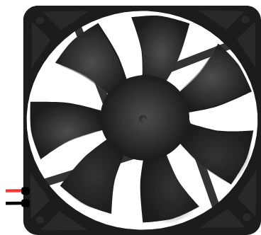

# Ventilateur

Ventilateur à courant continu. L'hélice tourne d'autant plus vite que la tension
appliquée est élevée ; il se commande aussi en **PWM**.

## Broches

| Broche | Rôle |
|--------|------|
| **+** | Alimentation (fil rouge) |
| **−** | Masse (fil noir) |

## Propriétés

| Propriété | Rôle | Défaut |
|-----------|------|--------|
| `voltage` | Tension nominale (V) | 5 |
| `current` | Courant consommé (A) | 0,85 |
| `angle` | Orientation (0/90/180/270°) | 0 |

## Utilisation

- Physique **stricte** : le ventilateur ne démarre que si la source peut
  réellement fournir `current`. Sous 30 % de sa vitesse nominale, il reste à
  l'arrêt, comme un vrai moteur qui ronfle sans tourner.
- **Une broche de microcontrôleur ne suffit pas** : elle donne 40 mA au mieux,
  contre 850 mA demandés. Il faut passer par une alimentation externe, commandée
  par un transistor ou un MOSFET.
- Commande PWM : `analogWrite()` (Arduino) ou `PWM` (MicroPython) sur la broche
  de commande ; la vitesse de l'hélice suit le rapport cyclique.
- Ajoutez une diode en roue libre en parallèle du moteur pour absorber la
  surtension de coupure.
- **Lecture de la vitesse à l'écran** : à 3000 tr/min, une hélice à 7 pales en
  fait défiler 350 par seconde — l'œil n'y voit qu'un scintillement, et changer
  la tension n'y change rien de visible. L'hélice tourne donc **au ralenti** :
  de 1,5 à 7 pales par seconde selon le régime. Ce n'est pas la vraie vitesse,
  c'est son **évolution** qui compte — l'accélération et le ralentissement se
  voient d'un coup d'œil. Le **flou de l'hélice** vient appuyer la moitié haute
  de la plage.

---

*Composant maison Kablix — dessin de Frank Sauret.*
