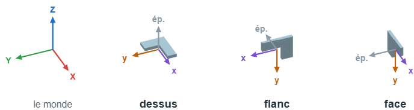
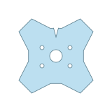
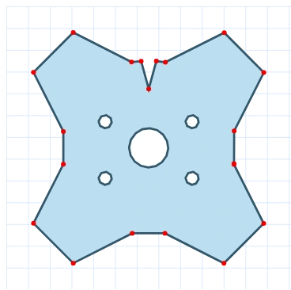
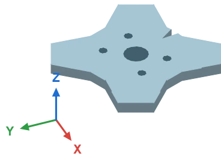
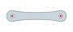
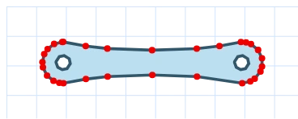
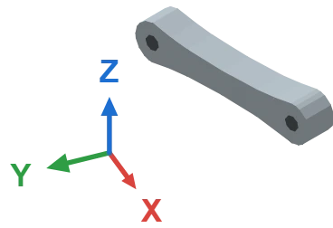
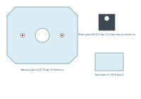
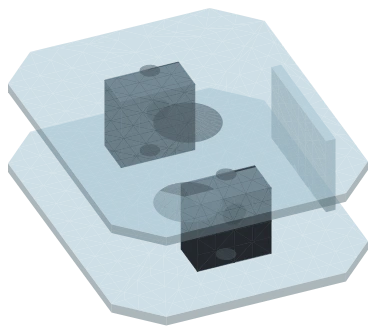
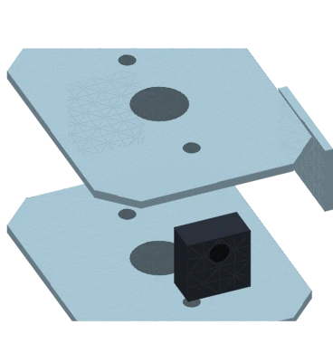

# 绘制 3D 系统（蜘蛛、腿、板）

蜘蛛机器人和它的腿并不是贴在屏幕上的 SVG 文件：它们是由等轴测引擎 [`iso3d.mts`](../../src/webview/composants/iso3d.mts) **每一帧计算出来的立体**。正因如此，腿才能真正抬起来——平面图形无论转动基节还是弯曲膝节，得到的都是同一张图。

代价是形状都**写死在代码里**：底盘是 `regularPoly(8, 55)`，一个八边形；骨骼是长方体。没有一笔是画出来的。本指南介绍 v2026.8.23 开辟的路径：**您画出零件的轮廓，引擎把它变成立体**。图形归您；运动学、明暗和深度排序归引擎。

有**两种**绘制方式，本指南依次介绍：

| | 您画的是 | 得到的是 | 用于 |
| --- | --- | --- | --- |
| **轮廓（profil）** | **一个**平面零件，任意比例 | 该零件，由元件缩放 | 一个剪影：机器人底盘、腿骨、一块板 |
| **装配（assemblage）** | **多个**平面零件，**以毫米为单位**，各带姿态 | 完整的装配体，保留尺寸 | 夹层机身：两块 3 mm 侧板，中间夹着舵机 |

区别一句话就能说清：轮廓只关心**比例**；装配中**尺寸本身就是信息**——两块侧板之间 3 mm 的材料和 25 mm 的间隙不是重新计算出来的，而是量出来的。

本指南面向在**代码仓库**上工作的人。普通的平面元件（二极管、传感器）走的是另一条流程，见 [创建 Kablix 元件](Creating-components.md)。

赶时间？直接跳到 [原始图形与输出结果](#原始图形与输出结果)：三张图胜过整页文字。为夹层机身而来？请看 [装配多个零件](#装配多个零件)。腿装不成您想要的样子？请看 [绘制一条腿，从基节到足端](#绘制一条腿从基节到足端) 及其症状表。

---

## 准备工作

- 已克隆仓库，已执行 `npm install`，Node 20+。
- **Inkscape**（或任意 SVG 编辑器），用于在 `Composants3D.svg` 中绘图。
- 已安装 **Chrome / Chromium**：轮廓通过无头浏览器读取。在 Node 中手工展平贝塞尔曲线和椭圆弧，等于两次写出错误的代码——`getPointAtLength` 做得又对又省事。

### 两张图纸，而不是一张

原始图形放在仓库根目录的**两张** A3 图纸上：

| 图纸 | 在上面画什么 | 由谁读取 |
| --- | --- | --- |
| `Composants2D.svg` | 元件库中的**平面**元件：二极管、继电器、晶体管的外部图形和内部原理图 | `node scripts/_extract-composants.mjs` |
| `Composants3D.svg` | 需要做成**立体**的零件：轮廓、装配体、蜘蛛机器人 | `npm run profil`、`npm run assemblage`、`npm run montre` |

本指南只涉及**第二张**。工具会自动选择它；`--source=` 可读取另一张图纸（本指南的示例来自 `docs/exemples/`）。旧的单一图纸 `Composants.svg` 只要还在，就会作为备用继续被读取：拆分过程中什么都不会坏。

---

## 流程一览

**轮廓**——一个零件，任意比例：

| # | 步骤 | 命令 / 文件 |
| --- | --- | --- |
| 1 | 画出零件轮廓 | `Composants3D.svg`，组 `<名称>-profil` |
| 2 | 读取 | `npm run profil <名称>` → `src/webview/composants/profils.mts` |
| 3 | 查看 | `node scripts/_capture-profil.mjs <名称>:plat`，然后 `<名称>:plaque` 或 `<名称>:piece` |
| 4 | 变成立体 | 如果名称已被预期（见下表）则无需操作，否则修改元素 |
| 5 | 检查 | `npm run verify:profils` |

**装配**——多个零件，以毫米为单位：

| # | 步骤 | 命令 / 文件 |
| --- | --- | --- |
| 1 | 画出各零件，每个带**姿态标签** | `Composants3D.svg`，组 `<装配名>-<零件名>` |
| 2 | 读取并**旋转查看** | `npm run montre <前缀>` |
| 3 | 仅保存（不开窗口） | `npm run assemblage <装配名>` → `src/webview/composants/assemblages.mts` |
| 4 | 生成文档插图 | `node scripts/_capture-profil.mjs <装配名>:assemblage` 和 `:eclate` |
| 5 | 检查 | `npm run verify:assemblage` |

在常见情况下，轮廓流程的第 4 步是空的：元件**已经在按名称查找**自己的轮廓，只要图形还不存在，就退回到写死的形状。画出 `araignee-chassis` 并提取，就足以改变机器人的剪影，无需改动一行 TypeScript。

装配方面，`npm run montre` 一次完成第 1 到第 3 步：重新读取图形、保存，并在一个可旋转的窗口中打开场景。这就是**核心**工作循环——在 Inkscape 中重画，点击 **↻ recharger**，查看。给它一个前缀，整个机器人会一次性出现。

---

## 什么是轮廓

**轮廓**是零件的**平面**外形，就像激光切割图：剪影加上孔。引擎用两种方式、也只用这两种方式把它变成立体。

| 摆放方式 | 图形的视角 | 得到的立体 | 函数 |
| --- | --- | --- | --- |
| **板（plaque）** | 从**上方** | 轮廓按厚度**向上**拉伸 | `prismFaces` |
| **件（pièce）** | 从**侧面**，平躺 | 轮廓按厚度**放在两点之间** | `extrudeProfile` |

板就是机器人底盘、一块电路板、一个平面支架。件就是腿骨、舵机块、连杆：**从一个关节到下一个关节**、并跟随运动的东西。

孔并不会真的挖在材料上：它们作为**深色贴花**贴在可见的那一面上（`decalFaces`）。画面完全一样，还避免了对带孔多边形进行三角剖分——在这里那毫无益处。

---

## 朝向：图形的上方去了哪里

这是唯一无法替您猜的事情，也是图形结果出乎意料时首先要看的地方。

### 世界坐标系

**X 向右，Y 向后，Z 向上。** 这是引擎的坐标系，本指南中**每一张** 3D 图的一角都画着它，查看器中也有（**repère X Y Z** 复选框）。它随场景一起旋转：转动机器人时，坐标系也跟着转，随时告诉您前方在哪里。



同一个 L 形零件，分别放在三个平面上。**紫色**和**橙色**箭头是**您图纸上的** `x` 和 `y`；灰色箭头是厚度方向。

| 平面 | 图形的视角 | 图形 `x` 指向 | 图形 `y` 指向 | 厚度方向 | 示例 |
| --- | --- | --- | --- | --- | --- |
| `dessus` | 从上方，**前方在上** | 右 | **后** | 竖直 | 板、平台、桥 |
| `flanc` | 从侧面，**前方在左** | **后** | **下** | 横穿机器人 | 两块侧板、平躺的舵机 |
| `face` | 从正面 | 右 | **下** | 从前到后 | 隔板、垫块、前盖 |

记住它有两个办法，也就够了：

- **俯视图保留平面图的方向**：图纸的上方就是机器人的前方，和任何俯视图一样。
- **另外两个按画的样子立起来**：图形**完全按您绘制的样子**竖起，图纸上方朝上。画在上面的就在上面；画在左边的朝前（`flanc`）或朝左（`face`）。

SVG 的 `y` 是**向下**的——这解释了“下”那一列，也解释了为什么画在图纸下方的零件最终位于机器人的下方。

### 轮廓图形的上方

- **板**：**从上方看**绘制，**图形的上方就是机器人的前方**。
- **件**：**从侧面、水平平躺**绘制。**左边缘**落在第一个关节上，**右边缘**落在第二个关节上。图形的上方仍然朝上。

两个结论，能省去很多意外：

1. **图形的尺寸无关紧要，比例才重要。** 板按底盘直径缩放；件则**整体**缩放（长度*和*高度用同一系数），以便从一个关节延伸到另一个关节。因此同一根股节既能用于单独的腿，也能用于机器人更长的腿，而不会变形。以方便的尺寸绘制即可，不必追求“精确”。
2. **居中是自动的**，以包围盒中心为准。无需把图形对齐到图纸原点。

保存的坐标以画布 **10 px 网格的像素**为单位。如果您的 Inkscape 图纸以毫米为单位——`Composants3D.svg` 正是如此——读取时会自动换算。

---

## 绘制轮廓

在 `Composants3D.svg`（需要做成立体的零件的 A3 图纸）中：

- **轮廓是一个 `id` 为 `<名称>-profil` 的组（或单个路径）。** 不带后缀的名称也可作为备用接受，但后缀可以避免把轮廓和同名元件的平面图形混淆。
- **零件有一条闭合轮廓。** **完全包含**在其中的轮廓就是它的**孔**（安装孔、减重孔）。既不是零件本身、也不被它包含的轮廓会被报告并忽略——一个组里有两个零件，是需要修改的图形，而不是需要猜测的问题。
- **轮廓不得自相交。** 8 字形剪影、边缘折回自身：对它三角剖分毫无意义，`verify:profils` 会拒绝。
- **欢迎使用曲线**：贝塞尔曲线、圆弧、圆、矩形、多边形。一切都会先展平再简化——一个采样后的圆最终约有三十个点，而不是两百个。
- **绕行方向无关紧要**（顺时针或逆时针）：读取时会统一。
- **红色焊盘不属于轮廓**——但**有名称**的焊盘会与零件一起保存：它是一个关节（`coxa`、`patella`），带有一条**轴**（一条直线，而不是一个点），其**第一个单词**说明它与什么对接。见 [轴](#轴)：约定与装配完全相同——轮廓被当作平放的零件读取，因此其轴是竖直的。没有名称的焊盘和任何文字都只是图纸上的普通标记，会被忽略。

> 典型的陷阱是**倒退的轮廓**。在示例底盘上，前方缺口起初画得比两侧的肩部还宽：路径折回自身，发生了翻折。缺口的边缘位于机身圆**之上**，绝不超出。

代码已经在查找的名称——画出来就行，无需任何接线：

| 组名 | 零件 | 摆放方式 | 无图形时的备用形状 |
| --- | --- | --- | --- |
| `araignee-chassis` | 蜘蛛机器人底板 | 板 | 八边形 |
| `araignee-picow` | 放在机器人背上的 Pico W 板 | 板 | 46 × 18 长方体 |
| `araignee-pca9685` | 16 路舵机板，放在底板上 | 板 | 40 × 24 长方体 |
| `araignee-batterie` | 电池组，放在底板上 | 板 | 34 × 18 长方体 |
| `patte-femur` | 基节 → 膝节的骨骼 | 件 | 长方体 |
| `patte-tibia` | 膝节 → 足端的骨骼 | 件 | 长方体 |

> **板载电子器件和其他一切一样可以重画**（v2026.8.26）。每块板都**从上方看、接插件朝左**绘制：轮廓按其**长度**缩放（46、40 或 34 个场景单位），孔以板颜色的暗色调贴花，**它在底板上的位置不变**——位置由代码控制，因此不会重叠。在 Pico W 上，射频屏蔽罩和 USB 插座仍由代码叠加在上面。

---

## 读取

```bash
npm run profil araignee-chassis patte-femur     # = node scripts/_extract-profils.mjs
```

输出：

```text
  ✓ araignee-chassis : 24 points, 112.4×110.8 px, 5 trou(s)
  ✓ patte-femur : 30 points, 73.83×13.98 px, 2 trou(s)

  → src/webview/composants/profils.mts (3 profil(s))
```

| 选项 | 作用 |
| --- | --- |
| `--list` | 显示已保存的内容，不读取也不写入任何东西。 |
| `--source=文件.svg` | 读取 `Composants3D.svg` 以外的文件（本指南的示例来自 `docs/exemples/`）。 |
| `--step=0.35` | 曲线采样步长，以图形单位计。默认比肉眼更精细。 |
| `--tol=0.25` | 简化容差，以网格像素计。低于此值，一个点不再改变剪影，只会拖慢渲染。 |

生成的模块 `src/webview/composants/profils.mts` **本身就是存档**：工具在重写前会先读回它，因此只提取一个轮廓不会让其他轮廓消失。它在 `git diff` 中可读性很好——是纳入版本管理的图形——但**不要手工编辑**：下一次提取会覆盖修改。

---

## 变成立体

元件按名称请求自己的轮廓，如果尚不存在就退回到写死的形状。整个接线就是这些，三行搞定。以腿骨为例（[`patte-element.mts`](../../src/webview/composants/patte-element.mts)）：

```ts
function bone(name: string, a: Vec3, b: Vec3, t: number): Face[] {
  if (!hasProfile(name)) return boxFaces(a, b, t, t, COLORS.bone);
  const p = profile(name);
  return extrudeProfile(p, a, b, t, COLORS.bone, p.holes);
}
```

对于板（[`araignee-element.mts`](../../src/webview/composants/araignee-element.mts)），轮廓还会缩放到预期直径，并按展示偏航角旋转，**让图形决定剪影而不是尺寸**：基节、腿、电路板和接线端子都留在元件其余部分预期的位置。

```ts
const plate = prismFaces(outline.poly, CHASSIS.height, CHASSIS.height + CHASSIS.thickness, COLORS.chassis);
const faces = [
  ...plate,
  ...outline.holes.flatMap((h) => decalFaces(h, CHASSIS.height + CHASSIS.thickness, '#8fb3c4', plate)),
];
```

引擎的三个细节，解释了其余代码：

1. **场景中所有的面一起排序**，由远及近（画家算法）。分别对每个零件排序会破坏错觉：正是统一排序让后腿位于底板之后、前腿位于底板之前。
2. **大面会被细分**为大小相近的小块。面按其**平均**深度排序：整块底板若是一个整体，就会跑到它承载的一切之前——或之后——放在其边缘的 Pico 过去就曾消失在它下面。
3. **贴花排在承载它的面的正前方**，而不仅仅是抬高零点几：底板由几十个三角形组成，后缘的三角形会跑到中心物体之前。其他东西都不会被遮住——一条从底板上方掠过的腿，离眼睛的距离依然远比底板的任何一块都近。

---

## 原始图形与输出结果

两个完整示例，每种各一个。图形在 [`docs/exemples/`](../exemples/) 中，轮廓以 `chassis-demo` 和 `femur-demo` 为名保存，**右侧的图片由真实引擎生成**——绝不是截图。

### 一块板：`chassis-demo`

| 图形 | 读取器的理解 | 引擎的输出 |
| --- | --- | --- |
|  |  |  |
| 从上方看：四条 ±45° 的臂、前方一个 V 形缺口、五个孔。在 SVG 编辑器中绘制，`fill-rule: evenodd`。 | 20 个点（红色圆点），106×106 px。曲线先展平再简化；五个孔之所以被识别为孔，是因为它们**包含**在零件内。 | `prismFaces` 把轮廓拉伸 8 px 厚，`decalFaces` 把孔贴在上面。缺口是真正镂空的：能透过它看到地面。 |

### 一个件：`femur-demo`

| 图形 | 读取器的理解 | 引擎的输出 |
| --- | --- | --- |
|  |  |  |
| 从侧面看，零件平躺：两个圆头、一段收腰的杆身、两个轴孔。左边缘将落在第一个关节上，右边缘落在第二个上。 | 30 个点，73.83×13.98 px。收腰的杆身只需几个点，每个圆头约十个。 | `extrudeProfile` 把零件放在两个关节之间，加厚 10 px。轴孔贴在**两个侧面**上：零件看起来是贯穿钻孔的。 |

中间那张渲染——`:plat` 模式——是图形生成意外立体时**首先要看的地方**。它准确显示读取器保留了什么：轮廓、孔，以及每个保留顶点的一个红点。翻折的轮廓在这里一眼就能看出。

---

## 查看与检查

截图脚本的三种摆放方式：

```bash
node scripts/_capture-profil.mjs chassis-demo:plat     # 读取到的轮廓，在网格上
node scripts/_capture-profil.mjs chassis-demo:plaque   # 向上拉伸
node scripts/_capture-profil.mjs femur-demo:piece      # 放在两个关节之间
```

图片保存在 `docs/img/systemes/` 中，透明背景，WebP 格式。`--width=720` 可生成更大的图片，便于仔细检查可疑的渲染。

然后运行测试台：

```bash
npm run verify:profils
```

它是**纯计算**——无需浏览器，不到一秒。它先检查引擎（三角剖分覆盖整个面积、没有三角形越出形状、没有过大的面、贴花位于其板之前、件确实从一个关节延伸到另一个关节），**再检查每个已保存的轮廓**：轮廓可用、尺寸一致、居中、三角剖分完整且严格在内部、每个孔都在零件内。最后以一个反向测试收尾：自相交的轮廓**必须失败**，否则测试台什么也证明不了。

---

## 装配多个零件

轮廓只表达一件事：剪影。它无法表达一个零件相对于另一个零件**在哪里**，而这恰恰是**夹层机身**所需要的：两块 3 mm 的 PMMA 侧板，基节舵机夹在中间，前方一个垫块。这些在平面图纸上都看不出来——一张静态图片也无法告诉您舵机是否放得下。

**装配**回答了这个问题。它是一组平面零件，**以毫米为单位**，每个零件都在图形中用文字写明其**姿态**。图形仍然保持它应有的样子：一张**激光切割图**，零件在图纸上并排摆放。零件在图纸上的位置无关紧要；它的标签才重要。

### 图形

在 `Composants3D.svg`（或另一张图纸，见 `--source=`）中：

- **一个零件 = 一个 `id` 以装配名开头的组**，后接零件名：`araignee-corps-flanc`、`araignee-corps-servo`。仍然容许 `-profil` 后缀（`araignee-corps-flanc-profil`）；保留的名称是装配名之后的部分。
- **图纸必须以毫米为单位。** `Composants3D.svg` 已经是（`width="…mm"`，`viewBox` 数值相同：1 单位 = 1 mm）。以 CSS 像素为单位的图纸会被换算，但您就不再清楚自己在标注什么尺寸了。
- **组内的一段文字给出姿态**：`flanc pos=28,0,0 ep=12 mat=servo miroir=x`。它就是一个普通的 `<text>`，放在组内任意位置——放在零件下方便于阅读。
- **轮廓、孔和曲线**完全遵循轮廓的规则（闭合轮廓、孔在内部、路径不自相交）。
- **有名称的红色焊盘 = 一个关节。** 由其 **Inkscape id** 命名，否则取其**上方**的文字；其中心成为装配的一条 3D **轴**——方向与所在零件的厚度一致、以其零点为中心的直线。其**第一个单词**是类别：它说明与哪张图形对接（[详情](#轴)）。

### 姿态标签

先写一个平面单词，然后是任意顺序的 `键=值` 对：

```text
flanc pos=28,0,0 ep=12 mat=servo miroir=x
```

| 单词 | 作用 | 默认值 |
| --- | --- | --- |
| `dessus` / `flanc` / `face` | **必填，放在最前**：图形的摆放方式（上 / 侧 / 前） | — |
| `pos=x,y,z` | 零件在装配坐标系中的中心，单位 mm | `0,0,0` |
| `ep=3` | 零件厚度，单位 mm | `3` |
| `mat=pmma` | 材料——**仅用于无填充的零件**：以图形颜色为准 | `pmma` |
| `miroir=x` | 零件以镜像方式放置**两次** | 无镜像 |

单独的 `miroir`（不带 `=`）表示 `miroir=y`。未知的值（`mat=titane`、`pos=3,4`）会被忽略并使用默认值：零件因此会明显地放错，而不是悄无声息地出错。

#### 小数分隔符是点

这是标签的头号陷阱，因为图上看不出来：法语数字键盘输入的是逗号，而逗号已经用来分隔三个坐标。

```text
dessus pos=24,501,-38,083,0 ep=21,5     ← 五个数而不是三个：无法读取
dessus pos=24.501,-38.083,0 ep=21.5     ← 正确
```

无法读取的标签不算错误：零件会**回到中心，厚度 3 mm**。它确实在那里，只是不在您以为的位置。现在读取时会明确说明：

```text
  ! araignee-patte-tibia-servo : « pos=24,501,-38,083,0 » illisible, pièce remise au centre
    — le séparateur décimal est le POINT : pos=24.501,-38.083,0
```

未知单词或未知材料也一样：读取时都会逐一报告。**在怀疑图形之前，先读一读 `npm run montre` 的输出。**

关键字保持法文，与图形中的 id 一致：它们在 Inkscape 中写在 `plaque` 和 `flanc` 旁边，一张图纸只用一种语言，就少一分混乱。

### 系统尺寸标签

装配以毫米标注尺寸，但完成的图形要放进一张**元件图**中，以 10 px 网格的像素为单位。宽度是多少像素？**写在图纸上**，放在零件旁边：

```text
système : araignee largeur : 800
système : patte largeur : 456
```

一个普通的 `<text>`，**放在所有零件组之外**（它不属于任何零件，说的是整个系统）。名称是元件的名称——`araignee`、`patte`——宽度是其**整张图的总宽度**，包括接插件和边距。重音、大写、用 `=` 代替 `:`、顺序颠倒都可以接受：`Largeur=456 Systeme=patte` 同样能读取。

| 写的内容                            | 作用                                              |
| ----------------------------------- | ------------------------------------------------- |
| `système : araignee largeur : 800`  | 机器人的图宽 800 px                                |
| `système : patte largeur : 456`     | 单独一条腿的图宽 456 px                            |
| 没有标签                            | 元件保持代码中写的**备用尺寸**                      |
| `système : araignee`（没有宽度）    | 被忽略，读取时给出提示                             |

尺寸保存在 `assemblages.mts` 中，由 `systemeLargeur('araignee')` 读取。**因此放大机器人是在 Inkscape 中完成的**，不再在代码中：所有以像素计量的东西——轮廓细化、面的纹理、阴影、边距——都跟随这一个数字。

### 三个平面

与轮廓的三个平面完全相同，图中给出了每个平面上图纸的 `x` 和 `y`。

**X 向右，Y 向后，Z 向上。** 这是引擎的坐标系，本指南中**每一张** 3D 图的一角都画着它，查看器中也有（**repère X Y Z** 复选框）。它随场景一起旋转：转动机器人时，坐标系也跟着转，随时告诉您前方在哪里。


同一个 L 形零件，分别放在三个平面上。**紫色**和**橙色**箭头是**您图纸上的** `x` 和 `y`；灰色箭头是厚度方向。

**零件按其中心放置**（包围盒的中心）：`pos` 是零件的中心，而不是角点。这让镜像变得直接——`pos=-9,0,0` 加 `miroir=x` 的一块侧板就给出两块侧板，**中心相距 18 mm**。

这一行里有两个陷阱，也正是会让您白切一次的两个：

- **`miroir` 作用在平面的法线上**，而不是随意的某个轴：`flanc` 的厚度沿 **x**，`dessus` 沿 **z**，`face` 沿 **y**（见上文三个平面的表格）。`flanc` 加 `miroir=y` 并不会把两块侧板分开——而是在同一平面上一前一后各放一块。
- **18 mm 是中心到中心**的距离，不含厚度。两块 3 mm 侧板位于 `pos=±9` 时，中间留 **15 mm**，总宽 **21 mm**。需要标注的是您想要的间隙：两块 3 mm 侧板之间要留 18 mm 空隙，就写 `pos=-10.5,0,0`——即 `(间隙 + ep) / 2`。

### 颜色：以图形为准

**零件在 3D 中的颜色就是它在图纸上的颜色**——包括透明度。把 PMMA 侧板填充为 55 % 的蓝色，您看到的就是蓝色且能透过它看到后面；把电路板涂成深绿色，它就是深绿色。标签里什么都不用写：颜色已经在图形里了，而这正是引擎唯一读取的东西。

几个能避免意外的细节：

- 这是**实际生效**的填充，由浏览器计算：`fill`、`fill-opacity`，以及承载该形状的每个组的不透明度——Inkscape 常把透明度设在图层上，而不是零件上。
- 保留的颜色取自组内**面积最大的填充形状**：即零件的轮廓。孔、标记或文字都不决定整体的颜色。
- **没有填充**的零件（切割轮廓，只画了描边）没有颜色可提供：此时由 `mat=` 决定，默认为 PMMA。

因此，`mat=` 对于未上色的零件，或想在不改动切割图的情况下强制指定色调时，依然有用：

| `mat=` | 颜色 | 用于 |
| --- | --- | --- |
| `pmma` | 浅蓝 | 激光切割的 PMMA——默认值 |
| `alu` | 浅灰 | 支架、金属垫块 |
| `servo` | 黑色 | 舵机、电机、实心块 |
| `carte` | 绿色 | 印刷电路板 |
| `laiton` | 金色 | 螺钉、螺纹支柱 |
| `pile` | 石板灰 | 电池、电池组 |

这个单词只给出颜色，别无其他：不涉及仿真，也不涉及质量。

**半透明材料不加接缝描边。** 一块板会被切成几十个三角形；在每条内部边上，用于填补接缝的描边会自我重叠。不透明时这看不出来；半透明时，它会在整个零件上画出一张蛛网。因此一旦颜色是透明的，就会取消描边。

### 贴在零件上的图片

颜色对 PMMA 来说足够了，对电子板来说却不够。**把照片放在轮廓上，放在零件的组内**——它会在 3D 中原位、按原尺寸贴到零件上。

```svg
<g id="corps-demo-entretoise-profil">
  <path class="piece" d="M 135,75 H 175 V 100 H 135 Z" />
  <image x="140" y="79" width="30" height="18" opacity="0.85" href="pico.webp" />
  <text x="155" y="107">face pos=0,-36,0 ep=3</text>
</g>
```

需要知道的就这些：

- **在图纸上放在哪里，在零件上就在哪里**：相同的毫米、与轮廓相同的坐标系。超出轮廓的照片会**按轮廓裁剪**——在带缺口的板上，它止于板的边缘。较小的照片仍然较小：它是贴上去的，而不是铺满。
- **透明度取自图形**（图片的 `opacity`，或承载它的图层的不透明度），因此在 Inkscape 中拖一下滑块即可：100 % 时照片遮住材料，40 % 时能透过它看到板。
- **它贴在您看得见的那一面上。** 不是事先选定的一面：零件的两个面都会被投影，离眼睛较近的那一面获得图片。视角转半圈，它会自动换到另一面。
- **旋转它，它会跟随**：Inkscape 写入一个矩阵，图片会保留它。斜放的板在 3D 中依然是斜的。
- **每个零件一张图片**：它是一层皮，不是拼贴。第二张会被忽略。
- **支持的格式：`.webp`、`.png`、`.jpg`。** 链接的图片会在**图纸旁边**查找，并**嵌入**到保存的模块中——webview 从不从磁盘读取文件。所以请优先使用 WebP：贴在 30 mm 板上的 4 MB JPEG 看起来不会更好，却会在扩展中占用 4 MB。链接缺失或格式不支持：图片会被忽略，提取时给出提示。Inkscape 不能导入 WebP？在图纸上放 **PNG**，结果相同。

[`corps-demo.svg`](../exemples/corps-demo.svg) 的垫块上就带有一张——就是下面图片中侧面可见的那块绿色小板。

#### 单独一张图片即构成零件，其裁剪决定轮廓

图片是一层皮：下面没有零件，它就无物可覆盖，整个组就会从装配中消失。与其让一块板无声无息地蒸发，**单独的图片也算作轮廓**：

| 组中包含                         | 零件的轮廓                                       |
| -------------------------------- | ------------------------------------------------ |
| 一条闭合路径（带或不带图片）     | 照常是**路径**——图片只是贴花                      |
| 一张**被裁剪**的图片（Inkscape 裁剪） | **裁剪路径**：真实的剪影、缺口和孔           |
| 一张单纯的图片                   | 位图的**矩形**                                   |

裁剪就是 `对象 → 剪裁 → 设置`：在照片上放一条路径，同时选中两者，剪裁。照片保留其剪影，**并**把它交给零件——机器人的 16 路舵机板就是这样得到切角和五个螺丝孔的，无需重画路径。读取时会像其他零件一样报告：

```text
  ✓ pca9685 : 100 points, 40×29.18 mm, dessus ép.1 carte, 5 trou(s)
```

当零件**确实**要激光切割时，切割路径仍然更可取：它就是图纸。裁剪适用于不需要切割的零件——买来的电路板、电池组、贴在机器人背上的照片。

### 轴

零件组中的**红色焊盘**标记一个关节：基节轴、膝节、枢轴。其坐标在**装配坐标系中**计算，包括姿态。

#### 焊盘承载的是一条直线，而不是一个点

这是切割图没有明说却隐含的意思，也正是它让零件彼此嵌套：

> **镜像的零件被放置两次，在两个副本之间有一条旋转轴，方向与 `ep` 箭头——即其厚度方向——一致。** 焊盘说明这条直线*从哪里*穿过；**零件的平面**说明*朝哪个方向*。

| 零件是……   | 其厚度方向     | 其焊盘的轴      | 作用                           |
| ---------- | -------------- | --------------- | ------------------------------ |
| `dessus`   | 竖直           | **竖直——Z**     | 基节：腿左右摆动               |
| `flanc`    | 横穿机器人     | **横向——X**     | 膝节：腿上下弯曲               |
| `face`     | 从前到后       | **前后——Y**     | 盖子的铰链                     |

机身的两块支撑板（`dessus pos=0,0,-13.75 ep=3 miroir=z`）位于 ∓13.75 mm：基节舵机夹在它们之间，其轴是从**正中间**穿过的竖直线。保存的正是这个中点——**轴的零点**——而不是画在两块板之一上的焊盘本身。没有镜像的零件遵循同样的规则：其轴保存在装配的零点处。

所以**无需再做任何事**：在零件上画出焊盘，方向和中点由平面和镜像推导出来。读取时按类别逐一报告，装配结果歪了时就要重读这一行：

```text
    famille « coxa » : 4 pastille(s), axe Z — coxa-gh, coxa-dh, coxa-gb, coxa-db
```

在查看器中，**axes dessinés** 复选框会在点及其名称之上，用红色虚线画出整条直线。

给焊盘命名有两种方式，按以下优先顺序：

1. 它的 **Inkscape id**——选中圆点，`对象 → 对象属性`，输入 `coxa-gh`；
2. 否则取**最近的独立文字**，优先取上方的文字——与元件图纸上的引脚名称完全一样。

id 优先，因为它**附着在圆点上**：移动后依然保留，旁边加了文字也不受影响，而且当零件带四个焊盘时，不必在图纸上堆四个标签。如果圆点被**编组**了（在 Inkscape 中移动参考线时就会编组），**组**的名称同样有效：读取时会向上找到第一个手工命名的父级。Inkscape 自动生成的 id（`circle91`、`path102`、`g1-1`）不算名称：此时该焊盘会被**忽略**，读取时给出警告。

这正是该约定的关键：**由图形说明基节在哪里**，而不是代码里的某个常量。在 Inkscape 中移动孔，轴会随之移动。

> **圆形的红色零件要画成路径，绝不画成圆。** 焊盘是红色的 `<circle>`：用圆形工具画的机器人眼睛就会变成焊盘，零件将变成关节而不是被切割出来。用路径工具画这个圆盘（`路径 → 对象转化成路径` 可转换现有的圆），它就恢复为本来的身份——一个零件。

#### 一个焊盘 = 一个关节，其第一个单词说明与什么对接

一句话就能概括，本节其余部分只是细节：

> **一个红色焊盘本身就是一个关节。** 其**第一个单词**是**类别**——说明它*与什么对接*；后面的部分只是按 Inkscape 的要求，给两个相邻焊盘**不同的 id**。

| 焊盘名称     | 类别 = 与什么对接 | 名称其余部分的作用           |
| ------------ | ----------------- | ---------------------------- |
| `coxa-gh`    | `coxa`            | 区分机身上的四个基节         |
| `coxa-db`    | `coxa`            | 同上                         |
| `coxa`       | `coxa`            | 在其类别中独一个：无需区分   |
| `patella-f`  | `patella`         | **股节一侧**的膝节           |
| `patella-t`  | `patella`         | 同一个点，**胫节一侧**       |
| `pied`       | `pied`            | 一个普通标记，没有对应项     |

没有什么需要编组，也没有什么需要配对：**有多少焊盘，就有多少关节**。

#### 四个 `coxa…` 焊盘 = 四条腿

副本的数量就来源于此，而图上看不出来：

```text
机身：   coxa-gh ─┐
         coxa-dh  ├─ “coxa” 类别的四个焊盘
         coxa-gb  │
         coxa-db ─┘

股节：   coxa     ─── 同一类别的一个焊盘
                        → 股节被复制四次
```

股节的另一端带有 `patella-f`；胫节带有 `patella-t`。**第一个单词相同，因此接触轴相同**——`-f` 和 `-t` 只是因为 Inkscape 不允许两个相同的 id。于是四根股节提供四个膝节，**四根胫节**随之产生。

> 机身中间只有一条腿？四个基节被画成了**同一个名称**（只读到一个焊盘），或者其中三个根本没有名称——读取时会列出各类别及其焊盘，在那里就能看出来。

#### 共同的类别 = 两张图形对接

关节不只用于转动：**它们是图形相互装配的方式**，无需搬运任何尺寸。

规则很简短：

1. 焊盘**第一个单词相同**的两个组件会对接：机身有 `coxa…`，股节也有 → 股节装到机身上。名称相同时，**两条轴方向一致**的类别优先：竖直的基节寻找竖直的基节。
2. **提供关节最多的一方承载另一方。** 机身有四个，股节有两个：机身承载，于是产生**四根股节**。
3. **两条轴重合——同一条直线——并以各自图形的零点为中心对齐。** 因此股节不会贴到某一块侧板上：它会**居中于两板之间**，因为它自己的零点就是其两块侧板的中点。位置不是计算出来的，而是从图形中读出的。
4. 当该类别在父级上有**多个**焊盘时（四个基节），每个副本都会**朝向自己的焊盘**：腿会自动张开。当只有**一个**时（股节的膝节），子级保持父级的朝向：胫节延续股节。

因此，一条完整的链只需要三张图形和六个名称：

```text
araignee-corps          coxa-gh  coxa-dh  coxa-gb  coxa-db
araignee-patte-femur    coxa          ← 对接到机身（“coxa” 类别）
                        patella-f         ← 提供一个膝节
araignee-patte-tibia    patella-t         ← 对接到股节（“patella” 类别）
```

屏幕上：**一个机身、四根股节、四根胫节**，各就各位，无需一行代码。这就是 `npm run montre araignee` 所做的事。

不与其他组件共享任何类别的组件留在**自己的原点**：不去猜测，只是简单摆放。如果没有任何组件共享类别，查看器会说明，并退回到并排显示。

#### 轮廓也一样

单独绘制的零件（轮廓）遵循**相同的约定**：其有名称的焊盘与轮廓一起保存，在同一个居中的坐标系中。当元件把它放在两个关节之间时，`profileAxes` 会带着它们一起——按比例、在原位。画在股节上的膝节始终是股节的膝节，无论腿是否被加长。

### 旋转查看

```bash
npm run montre araignee            # 所有以 “araignee” 开头的内容
npm run montre araignee-corps      # 单个装配
```

参数是一个**前缀**，而不是精确名称：工具会取出图纸上所有以它开头的**装配和轮廓**，并**以相同比例一起**显示。整个前缀只读取图纸**一次**（读取要经过 Chrome：等待就在这里，所以只付一次代价）。

**请求全局前缀就是请求整个机器人。** `npm run montre araignee` 不是把三张图形并排摆放：而是把它们**装配**起来，每个都装在前一个的关节上，轴线重合——一个机身、四根股节、四根胫节。图纸上三张图，屏幕上一个机器人。这就是默认勾选的 **monté sur ses articulations** 复选框；取消勾选即可恢复分开的图形。

单独绘制、没有尺寸的轮廓被视为只有一个零件的装配：其 10 px 网格变为毫米，平放、厚 3 mm，放在真正的装配旁边。

读取的内容也会被**保存**：`assemblages.mts` 和 `profils.mts` 会被重写，与 `npm run assemblage` 和 `npm run profils` 的效果完全一样。

| 窗口中 | 用途 |
| --- | --- |
| **↻ recharger** 按钮 | **不离开窗口**重新读取 `Composants3D.svg`：在 Inkscape 中修改，点击，查看。角度、缩放和勾选的复选框都会保留 |
| **在视图中拖动**（或 *lacet* 滑块） | 绕着它旋转：出问题的角度从来不是第一个 |
| **éclaté** 滑块 | 沿厚度方向把零件拉开——这是看清相距 3 mm 的两块侧板之间有什么的唯一办法 |
| **zoom** 滑块 | 检查细节 |
| 组件的**标题复选框** | 隐藏整个装配——无需重新运行命令即可单独查看股节 |
| 标题旁的 **×4** 复选框 | 该组件得到了四个副本（四个基节、四条腿）。取消勾选只保留**一个**：四条腿会挡住您想看的机身。它承载的东西也随之变化——一根股节只带一根胫节 |
| **pièces** 复选框 | 隐藏一块侧板以查看内部 |
| **axes dessinés** 复选框 | 在 3D 位置显示有名称的关节：点、名称以及**红色虚线表示的轴线**。借此检查它们是否在您以为的位置——以及方向是否正确 |
| **repère X Y Z** 复选框 | 角落里的世界坐标系，随场景旋转：随时告诉您前方在哪里 |
| **monté sur ses articulations** 复选框 | **装配好的机器人**：每个组件放在前一个的关节上，轴线重合、零点一致，每个关节一个副本。取消勾选则回到分开的图形 |
| **côte à côte** 复选框（仅未装配时） | 取消勾选后，每个组件回到**自己的原点**——即绘制时的位置 |

面板会显示**以毫米为单位的总体尺寸**（`100 × 80 × 31 mm`）：这是在装配图上读到的数字，也是零件放反了的第一个迹象。

选项：`--source=docs/exemples/corps-demo.svg` 读取另一张图纸，`--sans-lire` 基于已保存的内容重新打开（仅引擎有改动时），`--sans-ranger` 只查看而不重写生成的模块，`--sans-ouvrir` 只提供页面而不打开窗口，`--port=8731` 指定端口。

### 原始图形与输出结果

完整示例见 [`docs/exemples/corps-demo.svg`](../exemples/corps-demo.svg)：一个夹层机器人机身，**画了三个零件**，摆放后变成**五个**。

| 图形 | 装配后 | 分解图 |
| --- | --- | --- |
|  |  |  |
| 三个组并排摆放，就像切割图：板（`dessus pos=0,0,14 ep=3 miroir=z`）、舵机（`flanc pos=28,0,0 ep=12 mat=servo miroir=x`）、垫块（`face pos=0,-36,0 ep=3`）。 | 两块板位于中间平面两侧各 14 mm 处：中间有 25 mm 空间，正好容纳一个平躺的舵机。总体尺寸：100 × 80 × 31 mm。 | 每个零件沿厚度方向拉开。舵机显露出来：这就是回答“放得下吗？”的视图。 |

图纸上的 PMMA 以 **55 %** 填充：板在 3D 中是半透明的，不用分解机身就能看到舵机。舵机本身在图纸上涂成了深灰色——它的 `mat=servo` 现在已经没用了，这很合理：切割图本身就说明了一切。

右侧两张图片都由真实引擎生成：

```bash
node scripts/_capture-profil.mjs corps-demo:assemblage corps-demo:eclate
```

### 保存与检查

```bash
npm run assemblage araignee-corps      # 读取并保存，不开窗口
npm run assemblage -- --list           # 已保存的内容
npm run verify:assemblage              # 测试台
```

读取的输出：

```text
  ✓ entretoise : 5 points, 40×25 mm, face ép.3 #bcdff08c
  ✓ plaque : 10 points, 100×80 mm, dessus ép.3 #bcdff08c miroir=z, 3 trou(s)
  ✓ servo : 5 points, 23×23 mm, flanc ép.12 #3f4750ff miroir=x, 1 trou(s)
    famille « coxa » : 2 pastille(s), axe Z — coxa-g, coxa-d
  → corps-demo : 3 pièce(s), 2 axe(s), 100×80×31 mm
```

要读的是 `famille « coxa »` 这一行：**两个焊盘，所以两个基节**，将来有两条腿。这就是腿的数量，打开窗口之前就能看到——蜘蛛机身在这里必须显示 `4 pastille(s)`。`axe Z` 说明关节朝哪个方向转动；焊盘分布在不同平面上的类别会显示 `axe X/Z` 并给出警告——它画在了错误的零件上。没有名称的焊盘也会在这一行报告（`! …-supports : pastille sans nom (id « circle91 »), ignorée`）：该在 Inkscape 中给它一个 id 了。

显示的颜色是**从图形中读取**的（`#rrggbbaa`，包括透明度）——末尾的 `8c` 就是 55 % 的 PMMA。未上色的零件则显示其 `mat=` 的单词。

`src/webview/composants/assemblages.mts` 是**生成的**，并且**本身就是存档**：工具在重写前会先读回它，因此只提取一个装配不会让其他装配消失。与 `profils.mts` 一样，它在 `git diff` 中可读性很好，但不要手工编辑。

`verify:assemblage` 测试台和轮廓的一样是纯计算。它检验**标签解析**（负数位置必须完整保留——`pos=0,-9,0` 曾被读成三个单词）、**平面**（平放的 100 mm 板是 100 × 80 × 3，绝不是 103 × 83 × 35）、**镜像**、**分解图**（每个零件朝它本来所在的一侧移动，中央零件不动），然后是**每个已保存的装配**：平面和材料已知、轮廓居中、尺寸一致、总体尺寸与计算相符、轴在包围盒内。它还检验**从图形读取的颜色**——绘制的色调优先于 `mat=`，透明度在光照后依然保留，半透明面没有接缝描边——以及**关节**：每个焊盘都是一个关节，其第一个单词构成其类别，已保存的焊盘不带 Inkscape 的复制编号，轮廓的焊盘在零件放大时跟随零件。

它单独检验**轴**的规则：焊盘承载一条由其零件法线决定方向的直线（`dessus`→Z、`flanc`→X、`face`→Y），保存在其**零点**——镜像零件两个副本的正中间——每个已保存的装配都要通过这项检查。

最后，它检验**装配**，先在一个测试机器人上，然后**在实际绘制的蜘蛛上**——一个带四个基节的机身、一根股节、一根胫节：机身作为承载方（它提供的关节最多），产生四根股节和四根胫节，各在不同的基节上，轴线**精确到毫米地重合、零点一致**，每个副本都通过与承载它的轴**方向相同**的轴挂接，四条腿朝向四个不同的方向，胫节保持其股节的朝向。不共享任何类别的组件留在原处，两张毫无共同点的图形不会被装配在一起，而不是凭空编造。

---

## 绘制一条腿，从基节到足端

完整的案例，把上面的一切首尾相连：一个机身、一根股节、一根胫节，最后得到**四条腿**。只有三张图形——四个副本不用画，它们由四个基节产生。

### 1. 三个组，三个装配

```text
araignee-corps-…          机身：板、电路板、电池
araignee-patte-femur-…    基节 → 膝节的骨骼，以及它携带的膝节舵机
araignee-patte-tibia-…    膝节 → 足端的骨骼
```

每个都可以画在**图纸上任意位置**，像切割图一样并排摆放。它们在图纸上的位置无关紧要：姿态标签和焊盘才重要。

### 2. 机身：四个焊盘，四个基节

基节绕**竖直轴**转动：因此画在 **`dessus`** 零件上，其厚度朝上（[原因](#焊盘承载的是一条直线而不是一个点)）。在真正夹持基节舵机的支撑件上——两块镜像的平板，舵机夹在中间——每个基节画**一个**红色焊盘：

```text
coxa-gh        左前
coxa-dh        右前
coxa-gb        左后
coxa-db        右后
```

四个都以 `coxa` 开头：正是这个单词、也只有这个单词会把股节带过来。后面的部分只是给它们**四个不同的 id**——Inkscape 不允许重复。**把每个焊盘放在舵机轴真正穿过的位置**：腿就绕那里转动。板是 `miroir=z`？在图形上只画**一次**焊盘：轴会自动位于两块板的正中间。

读取时必须显示 `famille « coxa » : 4 pastille(s), axe Z`。如果显示 `axe X`，说明焊盘画在了侧板上：基节会上下弯曲而不是左右摆动。

用 **Inkscape id** 给它们命名（`对象 → 对象属性`）：在图纸上放四段文字会让图形很杂乱。

### 3. 股节：两个关节，而不是一个

这是最常出错的地方。股节带有**两个**关节，两个都需要：

| 焊盘         | 用途                                                                                                                              |
| ------------ | --------------------------------------------------------------------------------------------------------------------------------- |
| `coxa`       | **股节挂接到机身的位置。** 类别 `coxa`：机身用的也是这个单词，仅凭这一点它们就会对接。像机身一样画在平放的零件上：两条轴都必须是**竖直**的 |
| `patella-f`  | **股节提供给胫节的轴。** 类别 `patella`。画在 `flanc` 上，因此是**横向（X）**：胫节上下弯曲                                       |

只有基节焊盘的股节确实能装到机身上——但胫节就无处挂接，只能孤零零地待在角落里。**膝节要画在股节上**，而不只是画在胫节上。

股节是 `flanc`：从侧面绘制，**按画的样子**立起来。画在上面的最终在机器人的上方。如果腿是倒着的，是图形翻了，而不是引擎的问题——勾选 **repère X Y Z**，看看 Z 指向哪里。

### 4. 胫节：膝节

```text
patella-t         与股节的 “patella-f” 第一个单词相同：两条轴重合
```

`patella-t` 焊盘在胫节上的位置必须与 `patella-f` 在股节上的位置**相同**：这是接触轴，也就是要重合的轴。和股节一样画在 `flanc` 上——方向不一致的两条轴不会对接。`-f` 和 `-t` 的意思仅仅是“股节一侧”和“胫节一侧”——只是需要两个不同的 id 而已。

股节只提供**一个** `patella` 类别的焊盘：因此胫节继承股节的朝向并延续它，而不是像机身周围的腿那样张开。

### 5. 查看

```bash
npm run montre araignee
```

勾选 **axes dessinés**、**repère X Y Z** 和 **monté sur ses articulations**。您应该看到一个机身、四根股节、四根胫节。股节和胫节旁边会出现 **×4** 复选框：取消勾选一个，只保留一条腿以便看清机身。

然后在 Inkscape 中修改，点击 **↻ recharger**，查看。角度和复选框都会保留。

### 结果不对——原因

| 您看到的                                        | 原因（几乎总是）                                                                                                                   |
| ----------------------------------------------- | ---------------------------------------------------------------------------------------------------------------------------------- |
| **只有一条腿**，在机身中间                      | 机身只有**一个** `coxa…` 焊盘。需要四个——每个基节一个，放在真实位置                                                                 |
| **两条腿**而不是四条                            | 只有两个 `coxa…` 焊盘。腿的数量就是该类别的焊盘数量，别无其他                                                                       |
| **五条腿**，其中一条在同一位置重复              | Inkscape 中复制出的焊盘：名为 `coxa-gh-3`。重命名它，如果是重复的就删除（读取时会报告）                                               |
| **胫节孤零零的**                                | 股节没有 `patella…` 焊盘。膝节要画在**两个**零件上                                                                                  |
| **什么都没装配**，查看器用黄色提示              | 没有共同的类别：两张图形用的第一个单词不同（一边是 `coxa`，另一边是 `epaule`）                                                       |
| **腿的方向不对**，或歪斜                        | 基节不在您以为的位置：勾选 **axes dessinés**，名称会显示在焊盘的真实位置                                                             |
| **腿的转动方向不对**（弯曲而不是摆动）          | 轴的方向由**零件的平面**决定：竖直的基节画在 `dessus` 上，横向的膝节画在 `flanc` 上。勾选 **axes dessinés**：红色虚线显示这条直线      |
| **腿贴在一块板上**，而不是居中于两块板之间      | 焊盘被手工画了两次，每块板一个，而不是在 `miroir` 零件上只画一次。这样轴的零点就错了，并且会产生两个关节而不是一个                     |
| **两张图形没有对接**，尽管类别相同              | 它们的轴方向不一致：读取时显示 `axe X/Z` 并给出警告。其中一个画在了错误的零件上                                                      |
| **某个零件位于机身中心**，厚 3 mm               | 其标签无法读取——几乎总是因为用了小数逗号。读一读命令的输出，上面写着                                                                 |
| **某个焊盘没有出现**                            | 它没有名称：其 Inkscape id 仍然是 `circle97`。读取时会报告                                                                          |
| **某块板从装配中消失了**                        | 它的组里只有照片，而且没有裁剪：裁剪它（`对象 → 剪裁 → 设置`）或重新画一条轮廓                                                       |
| **某个圆形零件变成了关节**                      | 它被画成了红色的 `<circle>`：`路径 → 对象转化成路径`                                                                                |
| 修改标签后**图形尺寸没有变化**                  | 系统名称与元件不对应（`araignee`、`patte`），或者标签放在了某个零件组**内部**：那样它就会落到零件旁边                                  |

---

## 速查表

**轮廓**（一个零件）：

- 轮廓就是**一条闭合外形**加上它的孔，放在名为 `<名称>-profil` 的组中。
- 板 = 从**上方**看，图形上方 = 前方。件 = 从**侧面**看，左 → 右 = 第一个 → 第二个关节。
- 重要的是**比例**，而不是尺寸：一切都会重新缩放。
- 孔必须**完全包含**在零件内，否则会被忽略（并给出警告）。
- 轮廓**绝不能自相交**：这是引擎唯一无法变成立体的路径。
- **有名称的红色焊盘**与零件一起保存：它是一个关节——一条**轴**，对轮廓而言是竖直的——并在零件缩放时跟随零件。
- `profils.mts` 是**生成的**：可以读，不要改。
- 提取一个轮廓不会丢失其他轮廓。
- 在怀疑引擎**之前**，先看 `:plat` 模式。

**装配**（多个零件）：

- 一个零件 = 一个 `<装配名>-<零件名>` 组，加上一段文字写成的**姿态标签**。
- 一切以**毫米**为单位，尺寸保持不变：这是切割图，而不是比例。
- 标签**总是**以平面开头：`dessus`、`flanc` 或 `face`。
- `pos` 是零件的**中心**，而不是角点。
- `miroir` 把零件放置**两次**：画一块侧板就得到两块侧板。它作用在**平面的法线**上（`flanc`→`x`、`dessus`→`z`、`face`→`y`），得到的间距是**中心到中心**：`pos=(间隙 + ep) / 2`。
- 小数分隔符是**点**：`pos=24.501,-38.083,0 ep=21.5`。用逗号会使标签无法读取，零件会回到中心——读取时会说明。
- **有名称的红色焊盘 = 一个关节**——由图形说明基节在哪里。用 **Inkscape id** 命名；上方的文字依然有效。
- 名称的**第一个单词**是**类别**：说明它与什么对接。后面的部分只是给出**不同的 id**（`coxa-gh`、`patella-f` / `patella-t`）。
- **一个焊盘 = 一个关节。** 机身上四个 `coxa…` 焊盘 = **四个基节**，因此四条腿。两个焊盘永远不会合并。
- **焊盘承载的是轴，而不是点**：一条方向与其零件厚度一致的直线——`dessus`→**Z**（左右摆动的基节）、`flanc`→**X**（上下弯曲的膝节）、`face`→**Y**。`miroir` 零件会放置两次：轴从两个副本**之间**穿过。
- 轴保存在其**零点**：两个镜像副本的正中间。无需计算，也无需画两次。
- **相同类别 = 图形对接**，**轴线重合、零点一致**：提供最多的一方承载另一方，并且**每个焊盘**产生一个副本（四个基节 → 四根股节 → 四个膝节 → 四根胫节）。方向不同的两条轴不会对接——读取时显示 `axe X/Z` 并发出警告。
- 股节带有**两个**类别：`coxa` 用于挂接到机身，`patella-f` 用于承载胫节。
- 以 **`-3`、`-1`……** 结尾的名称几乎总是 Inkscape 在复制粘贴时加上的后缀：读取时会报告，请重命名。
- **零件的颜色就是图形的颜色**，包括透明度；`mat=` 只是未上色零件的备用方案。
- **贴在轮廓上的图片**（`.webp`、`.png`、`.jpg`）会应用到零件上，**贴在您看得见的一面**，**按轮廓裁剪**，并采用**图形的透明度**。每个零件一张；链接的文件在提取时嵌入。
- **单独一张图片即构成零件**：其**裁剪路径**（Inkscape 的）给出轮廓——剪影、缺口和孔——否则取位图的矩形。因此删除电路板的路径不会再让它消失。
- **圆形的红色零件要画成路径**：红色的 `<circle>` 会被读成**焊盘**（关节），而不是零件。
- `npm run montre <前缀>` 以相同比例读取、保存并打开**所有以它开头的内容**：这就是工作循环。在 Inkscape 中修改，点击 **↻ recharger**。
- **éclaté** 滑块是看清两块侧板之间有什么的唯一办法。
- `assemblages.mts` 是**生成的**，并且本身就是存档。
- **完成后系统的尺寸**写在**图纸上**、所有组之外：`système : araignee largeur : 800`。机器人按此尺寸取景填满，腿有它自己的（`système : patte largeur : 456`，整张图），所有以像素计量的东西（轮廓简化、面的纹理、阴影、边距）都随之调整。因此放大或缩小都在 Inkscape 中完成；没有标签时，元件保持其备用尺寸。
