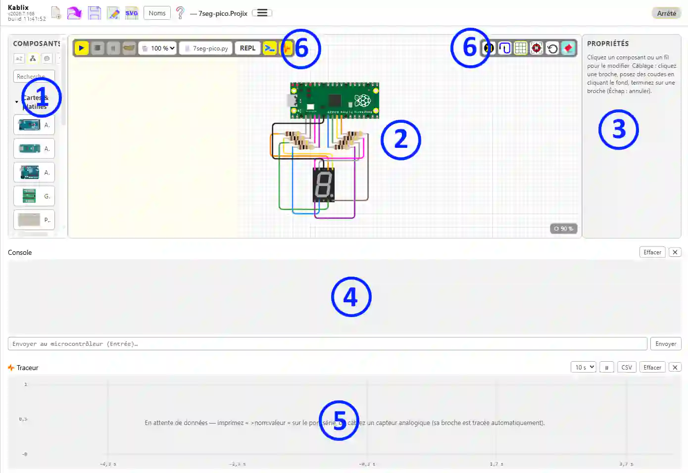
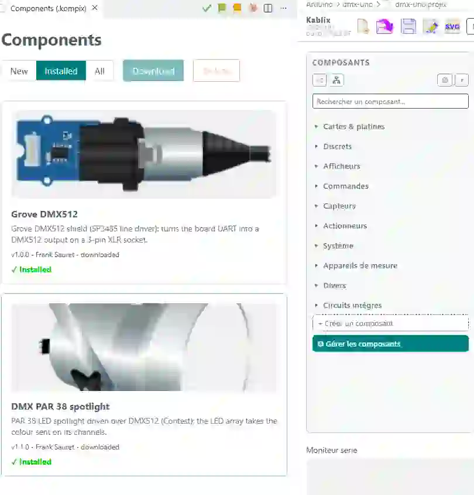

# Kablix — 用户指南


> Version française : [USAGE.md](../fr/USAGE.md) · English version: [USAGE.md](../en/USAGE.md)

## 目录

> 本目录仅供在 GitHub 上阅读文件时使用：在 Kablix 内部，帮助面板会根据标题自动生成目录，显示在正文左侧。

1. [快速上手](#快速上手)
2. [界面](#界面)
   1. [使用本帮助](#使用本帮助)
3. [搭建电路](#搭建电路)
   1. [放置与移动](#放置与移动)
   2. [面包板](#面包板)
   3. [接线](#接线)
   4. [修改导线](#修改导线)
   5. [可用元件](#可用元件)
   6. [新元件](#新元件)
4. [仿真](#仿真)
   1. [运行代码](#运行代码)
   2. [添加库](#添加库)
   3. [在 Pico 上运行 MicroPython](#在-pico-上运行-micropython)
   4. [将程序发送到真实的 Pico 开发板](#将程序发送到真实的-pico-开发板)
   5. [调试](#调试)
   6. [串口监视器](#串口监视器)
   7. [绘图器](#绘图器)
   8. [DMX512 灯光](#dmx512-灯光)
5. [导出元件清单（CSV 物料清单）](#导出元件清单csv-物料清单)
6. [将电路图导出为 SVG](#将电路图导出为-svg)
7. [创建自己的元件](#创建自己的元件)
   1. [元件管理器（安装与卸载）](#元件管理器安装与卸载)
8. [元件文件格式（.kompix）](#元件文件格式kompix)
   1. [创建自己的元件](#创建自己的元件-1)
   2. [让 AI 生成元件](#让-ai-生成元件)
9. [在哪里找到现成的元件](#在哪里找到现成的元件)
10. [保存 / 打开项目（.projix）](#保存--打开项目projix)
11. [与 Wokwi 互通（diagram.json）](#与-wokwi-互通diagramjson)
12. [库更新](#库更新)
13. [推荐的扩展](#推荐的扩展)
    1. [在 Kablix 中选择的开发板即成为 Arduino 项目的开发板](#在-kablix-中选择的开发板即成为-arduino-项目的开发板)
    2. [代码中不再出现红色波浪线](#代码中不再出现红色波浪线)
14. [键盘快捷键](#键盘快捷键)
    1. [在项目之间复制粘贴](#在项目之间复制粘贴)

---

## 快速上手

1. 首先，单击左侧活动栏中的  图标；
  - 或者，在项目文件夹中双击一个 projix 文件；
  - 或者，如果设置了文件关联，在 Windows 资源管理器中双击一个 projix 文件。

<video src="../../media/demarrer.mp4" title="启动 Kablix" controls autoplay loop muted playsinline></video>

1. **搭建电路**：从左侧元件栏拖放元件。直接连接引脚，然后单击自动布线按钮（对所选元件布线；没有选择时对整个电路布线）。

<video src="../../media/dessiner.mp4" title="搭建电路" controls autoplay loop muted playsinline></video>

1. **运行代码**：关联一个代码文件（注意，`.ino` 文件必须放在同名文件夹中），然后单击 **▶ “启动”**：
  - `.ino`/`.c`/`.cpp` -> 用本地工具链编译；
  - `.py` -> 在仿真的 Pico 上运行 MicroPython（需要 `.uf2` 固件，见下文）；
  - `.hex` / `.uf2` / `.elf` / `.bin` -> 直接加载，无需编译。
  **▶ 会先保存**：仿真开始前，电路和代码文件都会写入磁盘，因此运行的永远是磁盘上的内容。从未保存过（还没有名称）的项目不会被处理 — 不会有对话框打断启动。
2. **保存电路**：“Kablix：保存项目 (.projix)”；之后在资源管理器中双击 `.projix` 即可重新打开。重新打开时，项目的代码文件 **也会** 在电路旁边的代码窗格中打开 — 而光标仍留在 Kablix 中。也支持 Wokwi 格式（`diagram.json`）的导入/导出。

<video src="../../media/simuler.mp4" title="在 Kablix 中仿真" controls autoplay loop muted playsinline></video>

## 界面

  
*Kablix 界面：**①** 左侧的元件 **元件栏**，**②** 中间的电路 **画布**，**③** 右侧的 **检查器**（属性/变量），**④** **串口监视器/控制台/REPL**，**⑤** 底部的 **绘图器**，以及 **⑥** **工具栏** — Kablix 工具栏在最上方，**仿真** 工具栏在画布左侧，**绘图** 工具栏在右侧。*

- **元件栏**：单击元件即可把它放到画布上。有两种排序方式可选（顶部按钮）：按字母或按类别。**“最近使用”** 区域（最多 10 个）可以一直显示在顶部（第三个按钮）。最后一个按钮改变元件栏的响应方式。
- **折叠侧边面板**：**元件库**（左侧）和 **属性/变量**（右侧）各自用其靠画布一侧边缘上的 **小箭头** 折叠。面板变成一条窄条，竖向显示其名称；同一个箭头可按原来的宽度重新打开。状态会被记住：重新打开的工作台会保持你离开时的面板状态。
  - **仿真开始时**，元件库会自动折叠（电路图已锁定，不会再放置元件），停止时重新打开。如果是你自己折叠的，仿真不会改变它。Kablix 设置中的 *Fold Library On Run*（`kablix.foldLibraryOnRun`）可以关闭这种自动折叠。
- **Kablix 工具栏**（窗口顶部）  

  - **加载二进制文件**：从工作区加载已编译的 .hex/.uf2，无需重新编译。**默认隐藏** — 在 Kablix 设置中勾选 *显示 “加载二进制文件” 按钮* 即可恢复。
  - 常用的文件管理功能：**新项目**、**打开**、**保存**、**另存为**、**将电路图导出为 SVG**。
  - **名称** 按钮，在 **所选** 元件或所有元件上显示名称，或显示元件 id（位号）。
  - **重新排列**：恢复 Kablix 的布局（一侧是代码，另一侧是 Kablix，面板关闭）。你可以交换两个区域并用鼠标调整宽度，然后使用 **将此布局保存为默认**（汉堡菜单）：Kablix 所在的一侧 **和** 宽度都会被记住，“重新排列” 会恢复它们 — 如果之后改变过，还会把 Kablix 移回所选的一侧。
  - **文本模式**（“T” 图标）：在图纸上放置自由 **标签** — 电路标题、备注、区域名称。**选中** 的标签在右侧面板中编辑：**文字颜色**、**背景颜色**、**背景透明度**（可降到零：只剩文字，没有彩色底框）、**文字大小** 和 **字体**。标签只是装饰：仿真会忽略它们，但 SVG 导出会包含它们。
  - **汉堡菜单** 提供不常用的功能：导入 / 导出 **Wokwi** 电路图、导出 **元件清单 (CSV)**、更新 **Pico 固件**、检查 **库更新**、保存默认布局、打开 Kablix 的 **设置**（VS Code 设置界面中已过滤好的扩展设置）。
  - 打开本 **帮助**。
  - 当前 **项目名称**。
  - 项目的 **代码文件**，紧挨着名称：**单击 = 更换**，**双击 = 打开**（在代码一侧打开）。
  - **状态** 区（“就绪”、编译消息…），以及仅当页面跟不上时才出现的 **“已减速：0.45× 实时”** 标记。
- **仿真工具栏**（画布左侧）  

  - **▶ 启动**（先保存电路图和代码）
  - **■ 停止**
  - **⏸ 暂停/继续**
  - **单步**
  - **速度** 选择器，每档一种动物：🦅 500 %、🐆 200 %、🐇 100 %（实时）、🐢 10 %、🐌 1 %。加速只是一种 **愿望**：仿真会尽可能快地运行，但绝不会更快。
  - **REPL**：仅用于 Pico，显示传统的 Python 控制台（只有画布上的开发板是 Pico 时才出现）
  - **串口监视器 / 控制台**
  - **绘图器**
  - **重新打开逻辑分析仪**：只有在分析仪标签页被关闭、而电路图上仍有夹子时才出现。单击即可重新打开，并保留最近一次的测量。
  - **故障说明**：标在故障元件上的红框和黄色标签。默认开启；妨碍查看电路图时可用这个按钮隐藏它们。

  逻辑分析仪 **没有用来打开它的按钮**：由 [逻辑探头](composants/sonde-logique.md) 触发。在引脚上至少放一个夹子，启动仿真，它的标签页就会自动打开，可以把它放在电路图旁边。没有夹子时什么也不会打开 — 分析仪没有东西可显示。工具栏上的按钮只用于重新打开已关闭的标签页。
- **绘图工具栏**（画布右侧）  

  - **元件按钮**：显示所选元件的 **内部原理图**，或开发板的 **完整引脚图**。只有所选元件提供时才出现。
  - **自动布线**：对所选内容或整个电路布线
  - **网格**（显示/隐藏）
  - **重新居中/适应视图**
  - **⟲ 复位所有元件**：将每个元件恢复到空闲状态（开关松开、滑块归位），不改动接线。**默认隐藏** — 在 Kablix 设置中勾选 *显示 “复位所有元件” 按钮* 即可恢复。
  - **橡皮擦**：清空整个电路图，包括元件和导线（Ctrl+Z 可撤销）。同样 **默认隐藏** — 勾选 *显示 “清空电路图” 按钮*。
- **属性/变量**（检查器）：
  - 绘图时，编辑所选元件（颜色、数值、角度…）或导线（杜邦线颜色、删除、节点 [等电位]）
  - 仿真时，显示变量。
  - 设置很多的元件（蜘蛛机器人有 33 个设置）会把属性分放在 **可折叠的抽屉** 中，选中元件时全部收起。它们像 **手风琴** 一样工作：打开一个就会关闭之前打开的那个。

### 使用本帮助

指南打开时 **目录在左侧**，滚动时保持不动，并 **高亮正在阅读的章节**。目录根据文档标题生成：不会漏掉任何章节。

- **搜索框**（目录顶部）：输入两个字母起，只显示包含该词的章节，并高亮匹配处。忽略重音和大小写 — “repere” 能找到 “repère”。按 **Esc** 清空搜索框并显示整页。
- **可折叠章节**：单击章节标题即可收起。**全部折叠** 可在一屏内总览整个指南；**全部展开** 则重新打开。
- 在目录中单击会 **打开目标章节**，即使它已被收起。

## 搭建电路

### 放置与移动

- **放置**：单击元件栏中的元件（放在中间），或把它从元件栏 **拖放** 到画布上任意位置。
- **移动**：拖动元件（元件本体的任意位置），或 **按住右键拖动** — 对于可交互的元件（按钮、电位器、开关、摇杆）这是必需的，因为它们的左键用于操作控件。右键还能 **穿过黄色圆点**：插在面包板上的 LED 或电阻，即使光标下有孔被点亮，也仍然可以抓住。而左键仍会从那个孔开始画导线。
- **旋转**：选中元件后按 **`+`**（顺时针 45°）或 **`-`**（逆时针 45°）。引脚和导线随之转动；检查器的帮助区会显示提示。
- **缩放**：在画布上滚动 **鼠标滚轮**（以光标为中心）。右下角的 **⟳ %** 标记显示缩放比例；单击它可重置视图。**适应视图** 按钮框住电路的 **图形** — 而不是元件那些比实际显示内容更大的不可见边框：单独一个蜘蛛机器人现在会充满屏幕，而不是漂在一片空白中间。
- **删除**：检查器中的 🗑 按钮，或 `Del` 键（或 `Backspace`）。它删除所有选中的内容：一个元件、一根导线，或一整批 — 被选择框一起框住的元件 **和** 导线。只要在图纸上单击一下，键盘就回到电路图：即使你刚才在元件栏搜索框或检查器字段中输入，按键也会作用于电路图。不过，只要文本光标还在某个字段中闪烁，`Del` 就是删除文字 — 这正是人们所期望的。

**图纸四边都有边界。** 它的尺寸为 4000 × 3000 px，元件不能移出图纸：无论右边、下边，还是上边、左边，都会停在边缘。碰到边缘的是它的 **图形**，而不是不可见的边框 — 因此，图形没有填满边框的元件（例如机器人的腿）可以一直往上移，直到真正碰到顶边。选中的一批元件会 **整体** 停下，只要其中一个元件碰到边缘：相对位置保持不变。反复粘贴（`Ctrl+D`）也会停在同一位置，而不会把副本放到图纸外面。

### 面包板

**面包板** 元件（开发板与面包板类别）有三种尺寸 — *mini*（17 列，无电源轨）、*half*（30 列）和 *full*（63 列）— 在 **属性** 中设置。仿真真实的内部连接：**a–e** 列和 **f–j** 列按条连通，**+/− 电源轨** 贯穿全长。

把元件拖到面包板上时，**将要接收其引脚的导电条会以黄色高亮**。松开后，元件会 **插上**：吸附到孔上，连接自动完成（没有可见的导线）。导线画在开发板和面包板的上方。

### 接线

1. 单击一个 **引脚**（金色圆点）：开始画导线。
2. 每在 **画布背景** 上单击一次就增加一个 **拐点**。接近水平或垂直（±15°）的线段会 **吸附** 到轴线上。
3. 单击 **另一个引脚** 结束导线。`Esc` 取消。
4. 直接从引脚拖到引脚也可以，这也是我推荐的方法 — 自动布线会完成其余工作。

每次改变方向都画成 **圆角**。颜色：

- 接触 **地**（GND）的导线一开始是 **黑色**；
- 接触 **电源轨**（5V、3V3、VBUS、VSYS、VCC…）的导线一开始是 **红色**；
- 其他导线按 **彩虹杜邦排线**（10 种颜色）依次取色。

颜色始终可以在检查器中 **一键修改** — 不会再被强制改回。

一些特殊元件（目前只有 RGB LED）有预设的初始颜色（这种情况下是哪些颜色，留给你猜）。

### 修改导线

- **选中导线**：每个拐点上会出现 **手柄**。
- **拖动手柄** 移动拐点。
- 拖动时 **按住 Ctrl**：会出现 **水平/垂直十字线**，拐点与相邻拐点对齐 — 线段变得完全水平或垂直。
- **双击导线**：在该位置插入一个新拐点。
- **拖动导线的一段直线**：它会 **垂直于** 自身方向移动 — 水平线段上下移动，垂直线段左右移动。相邻线段随之伸缩，路径的其余部分不动。这是把一个分支推到一边的快捷方法，不必一个个移动拐点。移动时吸附网格；**按住 Ctrl** 则可自由移动。斜线段不能移动。

### 可用元件

元件栏中有 **76 个内置元件**（另有其变体：有极性电容、PN2222A/NPN/PNP 三极管、3×4 和 4×4 键盘…）。每个元件都有 **帮助页** — 图形、引脚、属性、仿真了什么和没仿真什么 — 选中元件后用检查器中的 **元件帮助** 按钮打开。通过 **元件库** 可以添加更多元件（见 [元件管理器](#元件管理器安装与卸载)）。

**开发板与支架**

| 元件                                    | 仿真行为                                                                          |
| --------------------------------------- | --------------------------------------------------------------------------------- |
| Arduino Uno、Nano、Mega 2560            | 仿真的 AVR 处理器 (avr8js)：Uno 和 Nano 为 ATmega328P，Mega 为 ATmega2560           |
| Raspberry Pi Pico、Pico W               | 运行 MicroPython 的仿真 RP2040 处理器 (rp2040js)                                    |
| Grove 扩展板 (Pico)                     | 扩展板：Grove 接口接到 Pico 的引脚                                                  |
| 面包板（mini / half / full）            | a–e / f–j 导电条和 +/− 电源轨，自动插接                                            |
| 实验室电源、充电宝                      | 直流电压源（电压在属性中设置）                                                     |

**无源器件与半导体**

| 元件                                             | 仿真行为                                                                                    |
| ------------------------------------------------ | ------------------------------------------------------------------------------------------- |
| 电阻                                             | 连通两根引脚（阻值和角度可编辑，画出色环）                                                  |
| 电容（无极性、有极性）                           | 连通两根引脚；数值由图形显示                                                                |
| 二极管                                           | 单向导通（图形和阴极标记）                                                                  |
| 三极管（PN2222A、NPN、PNP）                      | 定制的 TO-92 封装：印字和内部原理图取决于型号                                               |
| NTC / PTC 热敏电阻、NTC 温度传感器               | 模拟输入：温度在属性中设置（或仿真时用滑块设置）                                            |
| LDR / 光敏电阻                                   | 模拟输入：亮度在属性中设置                                                                  |

**指示与显示**

| 元件                              | 仿真行为                                                                                      |
| --------------------------------- | --------------------------------------------------------------------------------------------- |
| LED、RGB LED、10 段 LED 条        | 根据节点电平点亮（阳极高、阴极低），亮度考虑串联电阻                                          |
| 7 段数码管                        | A–G 段 + 小数点，共阴极 DIG1（跟踪动态扫描）                                                  |
| NeoPixel、灯环、点阵              | 逐位解码 WS2812 协议：每个像素的真实颜色                                                      |
| 字符 LCD (HD44780)                | 仿真控制器：4 位或 8 位、光标、自定义字符                                                     |
| OLED 显示屏 SSD1306               | 解码并绘制显存（SPI + DC + CS）                                                               |
| TFT 显示屏 ILI9341 (SPI)          | SPI 渲染，跟踪显示方向和写入窗口                                                              |

**输入**

| 元件                                            | 仿真行为                                                                                  |
| ----------------------------------------------- | ----------------------------------------------------------------------------------------- |
| 按钮（标准、6 mm）                              | 按下时把单片机引脚拉低（所接引脚 ↔ GND）                                                   |
| 拨动开关                                        | 把公共端 (2) 接到 1 侧或 3 侧                                                              |
| 8 位拨码开关                                    | 8 个独立通道（na ↔ 单片机，nb ↔ GND）                                                      |
| 矩阵键盘（3×4、4×4）                            | 行列矩阵：单击的按键把它所在的行与列连通                                                   |
| 电位器（旋转、滑动、微调）                      | 可交互的模拟输入（Uno 上为 A0–A5，Pico 上为 GP26–GP28）；微调电位器以 3 位代码印出其阻值     |
| 模拟摇杆                                        | 2 个模拟轴（VERT / HORZ）+ SEL 按键                                                        |

**传感器**

| 元件                                       | 仿真行为                                                                                               |
| ------------------------------------------ | ------------------------------------------------------------------------------------------------------ |
| 光线、气体 (MQ)、火焰和声音传感器          | 模拟输出 AO 和数字输出 DOUT（低电平有效）；仿真时用滑块设置强度                                         |
| PIR 传感器、倾斜传感器                     | 数字输出 OUT；鼠标在 PIR 上方移过时触发                                                                 |
| 霍尔效应传感器                             | 开漏输出 S（低电平有效），仿真时用鼠标拖动磁铁                                                          |
| 心率传感器                                 | 模拟输出：脉搏频率在属性中设置                                                                          |
| 超声波传感器 (HC-SR04)                     | 回波时长根据距离 和 声速计算；仿真时有两个滑块（距离、空气温度）                                         |
| 温湿度（DHT11、DHT22）                     | 完整的单总线协议（数据帧、校验）；数值在属性中设置                                                      |

**执行器与电源**

| 元件                                  | 仿真行为                                                                                              |
| ------------------------------------- | ----------------------------------------------------------------------------------------------------- |
| 蜂鸣器                                | 引脚间有电压时显示动画音符                                                                            |
| 舵机                                  | 舵盘位置由脉宽 (PWM) 决定                                                                             |
| 风扇、直流电机                        | 转速跟随实际加上的电压；欠压、电流不足和过压都会在电路图上标出                                        |
| 继电器 OMRON G5V                      | 线圈在额定电压的 80 % 时吸合，常开/常闭触点；必须加续流二极管                                          |
| 16 路 PWM 驱动板 (PCA9685)            | 仿真的 I²C 寄存器：16 路 PWM 输出，前提是 V+ 端子已供电                                               |
| microSD 卡 (SPI)                      | 内存中约 2 MB 的 FAT16 卡：可读写文件，停止后内容丢失                                                  |

**逻辑（DIP 封装）**

| 元件                                   | 仿真行为                                       |
| -------------------------------------- | ---------------------------------------------- |
| CD4001、CD4011、CD4070、CD4071、CD4081 | 四路 CMOS 或非、与非、异或、或、与门           |
| CD40106                                | 6 个施密特触发反相器                           |
| 74xx00、74xx02、74xx08、74xx32、74xx86 | 四路 TTL 与非、或非、与、或、异或门            |
| 74xx14                                 | 6 个施密特触发反相器                           |

**机械**

| 元件                     | 仿真行为                                                                                      |
| ------------------------ | --------------------------------------------------------------------------------------------- |
| 蜘蛛机器人、蜘蛛腿       | 完整的运动学（33 个设置，检查器中可折叠的抽屉），由舵机驱动                                   |

### 新元件

可以通过 **管理元件** 按钮下载，按需添加或删除。扩展自带的元件不能删除。分享也更容易，因为一个完整的元件就是一个文件（`.kompix`）：要么通过管理器下载，要么直接把文件放进项目文件夹 — 它会自动加入可用元件。

你还可以添加外部元件仓库。

> 注意：可仿真的元件包含代码。请确认来源可靠。



## 仿真

### 运行代码

**编译并运行当前文件**按钮（或同名命令）——处理方式取决于当前文件的扩展名：

| 文件                             | 处理方式                     | 前提条件                        |
| -------------------------------- | ---------------------------- | ------------------------------- |
| `.ino`、`.c`、`.cpp`（Uno 板）   | 本地编译后运行               | `arduino-cli` **或** `avr-gcc`  |
| `.c`、`.cpp`（Pico 板）          | 直接编译到 RAM（无操作系统） | `arm-none-eabi-gcc`             |
| `.py`                            | 在仿真的 Pico 上运行 MicroPython | `.uf2` 固件（见下文）       |
| `.hex`                           | 直接加载（Uno）              | —                               |
| `.uf2`、`.elf`、`.bin`           | 直接加载（Pico）             | —                               |

#### 未修改的程序不再重新编译

编译结果保存在**磁盘**上，按源代码**内容**的校验和归档（程序文件夹及其 `src/`，加上目标板和 Kablix 版本）。运行一个未改动的程序时直接使用已生成的二进制文件：只需几十毫秒，而不是几十秒。只要修改任何一个源文件，该条目即失效；最近 60 次编译结果会被保留。

> 一次 Arduino 编译会启动几十个工具并写出同样多的目标文件：如果在您的电脑上特别慢，多半是杀毒软件在逐个检查。将 `%LOCALAPPDATA%\Arduino15`、`%TEMP%\arduino` 和项目文件夹加入排除列表，效果立竿见影。

#### 开发板上的板载 LED

仿真期间，开发板会像真实板子一样点亮：只要程序在运行，**绿色 ON LED** 就保持常亮；**L LED**——即 `LED_BUILTIN` 对应的 LED，在 Uno、Nano 和 Mega 上为 **D13** 引脚——跟随该引脚的状态。因此，对 `LED_BUILTIN` 的 `blink` **无需连接任何 LED** 即可看到。在 Pico 上，由板载 **GP25** LED 承担这一角色。

#### 仿真速度

仿真跟随**实时**：屏幕上的一秒就是真实开发板上的一秒，`delay(1000)` 确实持续一秒。当页面短暂繁忙时（正在绘制元件、串口监视器正在滚动），仿真一旦重新获得控制权就会**追回**落后的时间；只有长时间卡顿（超过四分之一秒、标签页被置于后台）才会被放弃——这段时间被**跳过**，绝不会快进重放。

动物选择器可有意放慢执行速度——🐢 10 %、🐌 1 % 实时——以便观察快速现象。反过来，🐆 200 % 和 🦅 500 % **请求**加速：仿真会占用机器能提供的全部算力，但只有在程序让内核休眠时才会超过实时。🐇 100 % 即实时。

如果开发板仍然跟不上，状态栏右侧会出现 **“已减速：0.45× 实时”** 徽标：页面负载过重，仿真无法跟上（电路图很大、机器繁忙）。选择器有意设定的减速不算故障。一旦仿真恢复实时，或停止仿真，徽标即消失。

#### 故障元件：红框与说明

当仿真检测到接线错误或元件损坏时，会在电路图上**用红框圈出出问题的元件**，并在**旁边显示红底黄字的标签**，说明问题及修正方法。状态栏只保留最后一句话：标签则一直留在正确的位置，就在您眼前。

| Kablix 检测到的情况           | 标签内容                                                             |
| ----------------------------- | -------------------------------------------------------------------- |
| 续流二极管装反                | 二极管反接                                                           |
| 继电器没有续流二极管          | 线圈断开时会反向产生电压尖峰；它会击穿驱动晶体管，二极管可将其吸收   |
| 线圈供电不足                  | 继电器不吸合：请按额定电压为线圈供电                                 |
| 电源不足以驱动线圈            | 提高最大电流，或减少同一电源上的线圈数量                             |
| 电机没有续流二极管（💥）      | 电机就是线圈：断电时的尖峰会击穿驱动晶体管，二极管可将其吸收         |
| 电源不足以驱动电机            | 开发板引脚远远不够：请通过电源和晶体管驱动                           |
| 电机过压（💥）                | 超过额定电压的 1.5 倍：绕组无法承受                                  |
| LED 烧毁（💥）                | 没有串联电阻（或电阻太小），电流超过了 PN 结的承受能力               |
| 电容爆裂（💥）                | 超过额定工作电压：请选用耐压更高的电容                               |
| 16 路舵机板烧毁（💥）         | V+ 端子最高只能接 5 V                                                |

红框和标签只在**仿真期间**出现；故障一旦排除，或停止仿真，它们即消失。

### 添加库
Raspberry Pi Pico 与 Arduino 开发板的工作方式不同，这源于它们的软件架构和内存管理方式。
Arduino 在上传前把 C++ 代码编译成机器语言。Pico（使用 MicroPython 时）则自带一个实时解释器，直接读取脚本文件。

#### Arduino
由于需要编译，库必须安装在负责把程序上传到 Arduino 开发板的电脑上。这一步很简单：点击活动栏中的图标启动 “Arduino VsCode IDE” ，命令面板随即打开。点击库管理器 ，搜索所需的库并安装。安装完成后，它对您所有的项目都可用。
#### Pico pi
对于使用 MicroPython 的 Pico 开发板则完全不同。库必须和调用它的程序放在同一个文件夹中（也有其他方法，但我们保持简单）。它还必须存在于开发板本身上。只要库在文件夹中，“发送到 Pico” 按钮就会把程序所需的库一并发送过去。
以下模块内置于 Pico 开发板的 MicroPython 中：machine、rp2、framebuf、neopixel、time、math、cmath、os、gc、sys、struct、uctypes、json、network、socket、bluetooth（注意最后三个需要带 Wi-Fi/蓝牙的型号，如 Pico W 或 Pico 2 W）。**在仿真中**，Wi-Fi 芯片不会被仿真：Kablix 用一个外观层替代 `network`，并通过主机转发真实的 HTTP 请求（`urequests`），而 `socket` 和 `bluetooth` 不在仿真范围内——参见 [Pico W](composants/picow.md) 说明页。
Pico 首先是一块微控制器。因此您也可以用 C 语言为它编程，Kablix 也支持（Pico 和 Pico W；Pico 2 的 RP2350 尚未移植），但我没有为此制作开发套件。Raspberry Pi 官方提供了一套，建议安装他们的扩展。

### 在 Pico 上运行 MicroPython

1. 打开一个 `.py` 文件 → **编译并运行当前文件**。
2. 首次运行时，如果找不到固件，Kablix 会**提议自动下载**（可选 **Pico / Pico W**），来源为 [micropython.org](https://micropython.org/download/RPI_PICO/)。固件保存在扩展的存储区中，并**在您的所有项目中复用**——这个问题只会问一次。

如需使用自己的固件（离线、特定版本……）：把官方 `.uf2` 放到**工作区中**（任意文件夹），或在 **`kablix.micropythonUf2`** 设置中填写其路径；它将优先使用。

> ⚠ **完全离线运行。** 为了让没有互联网的电脑永远不必下载固件，请**把 `.uf2` 放在项目文件夹中**：它会随项目一起纳入版本管理并分发。Kablix **首先在工作区中**查找固件，然后是已下载/已保存的固件，最后才提议下载。携带固件的项目因此可复现且自成一体。

固件在仿真器内启动（bootrom + flash + USB），然后通过 **raw REPL** 注入脚本。`print()` 的输出显示在串口监视器中；脚本结束后，仍可通过输入框或点击 REPL 按钮使用**交互式 REPL**。

### 将程序发送到真实的 Pico 开发板

打开 `.py` 文件时，其标签栏中会出现一个 **⬆** 按钮。点击一次即可把程序发送到通过 USB 连接的开发板，并**重命名为 `main.py`**：开发板此后每次上电都会自动运行它。

- **按钮会自动亮起。** 呈灰色表示未检测到开发板；Kablix 每 4 秒检查一次制造商为 Raspberry Pi（标识符 `2E8A`）的 USB 端口，从而避免把主板的 COM1 端口误认成开发板。插上开发板，按钮即自动亮起，无需其他操作。
- **只发送实际用到的模块。** Kablix 读取程序中的 `import` 语句，再读取这些模块中的 `import` 语句，依此类推：一个含有五十个 `.py` 文件的文件夹只会发送程序真正需要的那几个。放在 `lib/` 下的模块在开发板上保持原位置。这正是仿真器所用的同一份清单：**在 Kablix 中能运行的，在开发板上也能运行**。
- **只有一个文件时不会询问。** 一旦有多个文件，会弹出一个列表，您可以取消勾选不想发送的文件（主程序总会被发送）。
- **未修改的文件不会重写。** 比较依据的是内容（SHA-256 指纹），而不是日期：Pico 的时钟断电后不保存，每次启动都会回到 2021 年。

> 传输需要 Python 3 和 **pyserial**（`pip install pyserial`）。请关闭所有占用该端口的串口监视器（Thonny、终端……），否则无法访问开发板。上传详情显示在 **Kablix — Pico upload** 输出中。

### 调试

- **⏸ 暂停 / ▶ 继续**：冻结仿真；引脚和 LED 的状态保持显示。动物选择器（🦅 500 % → 🐌 1 %）设置执行速率。
- **单步**：执行源文件中的一行，然后再次暂停。**变量**面板随即显示当前行和程序中可读取的变量；该行也会在 VS Code 编辑器中高亮显示。刚刚改变的变量显示为红色。
- **数组、结构体和指针**：每个元素和每个字段各占一行，名称与 C 中的写法一致——`notes[0]`、`p1.x`，结构体数组则两者结合（`path[1].y`）。字符串按字母逐个显示（`'s'`、`'a'`……），而不是 ASCII 码；指针显示其保存的地址（十六进制）。超过 32 个元素时，数组只显示开头部分。
- **哪些变量可见（C / Arduino）**：具有**固定内存地址**的变量——全局变量，以及**在函数内声明的 `static` 变量**，后者显示在其函数名下（`loop::memo`）。在 `setup()` 或 `loop()` 中声明的普通变量位于栈上，没有稳定的地址：无法读取，但面板会**列出其名称**，以免您白白寻找。两种解决办法：把它声明在所有函数之外，或者如果它的值需要在两次调用之间保留，就给它加上 `static`。
- **断点**：在运行前或运行中点击编辑器的装订线（行号左侧）；仿真运行到该行时暂停。断点可以带条件。

前提条件与限制：

| 语言                | 实现方式                                                                    | 限制                                                                                      |
| ------------------- | --------------------------------------------------------------------------- | ----------------------------------------------------------------------------------------- |
| C / Arduino（Uno）  | 编译时提取调试数据（`avr-objdump`，随 arduino-cli 或 avr-gcc 提供）         | **全局**变量和函数内的 **`static`** 变量（普通局部变量没有固定地址；只列名称，不读取）；较长的 `delay()` 以 0.25 秒的仿真时间片推进 |
| MicroPython（Pico） | 注入前自动对脚本进行插桩                                                    | 仅**全局**变量；暂停在下一行生效；不支持慢动作                                            |

直接加载的产物（`.hex`、`.uf2`、`.elf`、`.bin`）运行时没有调试信息：暂停和慢动作仍可用，单步执行则不可用。

#### 隐藏变量

程序常常会暴露一些无关紧要的变量（常量、配置对象），淹没了您正在关注的两三个变量。**变量**面板可以帮您筛选：

- **隐藏**：点击变量左侧的 **👁**（提示 “单击隐藏”）。该变量从面板中消失。
- **重新显示**：点击标题 **🔍 变量 ▾**——会展开当前已隐藏变量的下拉列表。点击其中一个即可让它回到面板；**全部重新显示**则全部恢复。
- **记住设置**：无需任何操作。隐藏变量列表保存**在项目中**（`.projix`），重新打开时再次应用。它会在下次**保存**项目时写入，与页面取景完全一样：隐藏一个变量不会把项目标记为“已修改”。

被隐藏的变量仍在后台**持续跟踪**：当它重新出现时，它的红色（“上一步已改变”）是准确的，就像它从未离开过面板一样。只要项目尚未保存，隐藏状态对当前打开的工作台有效——停止并重新启动仿真后依然保留。

#### 变量的显示进制

位掩码或寄存器用二进制比用十进制更易读。变量的名称和值都**可以点击**（光标变成手形）：**单击**会打开一个菜单，提供四种显示进制：**二进制**、**十六进制**、**十进制**（默认）和**字符**。当前选中的进制带有 ✓。右键单击会打开同一个菜单。

此时值会带上其进制的**前缀**——与 C 或 Python 中的写法相同，可以直接抄回程序中——并对数字分组以便阅读：

| 进制       | `160` 显示为   | 分组      |
| ---------- | -------------- | --------- |
| 二进制     | `0b 1010 0000` | 4 位      |
| 十六进制   | `0x A0`        | 4 位数字  |
| 十进制     | `160`          | 3 位数字  |
| 字符       | `' '`          | —         |

分组分隔符与分隔前缀的符号一样，是一个**窄不换行空格**：各组一目了然，而且即使在很窄的面板中，数字也绝不会在行尾断开。

在**字符**进制下，控制字符以转义形式显示（`'\n'`、`'\t'`、`'\0'`……），其他不可打印的值显示为 `'\x1f'` 形式。非整数的值（浮点数、字符串、列表、对象）无论选择哪种进制都**保持原样**。在所有情况下，值的提示框都会给出原始形式。

该选择只作用于**这个变量**，并与隐藏设置一样**保存在项目中**：重新打开 `.projix` 时，每个变量都会恢复其进制。由于这些设置属于文件的一部分，修改它们会把项目标记为**待保存**（标签上的 ● 圆点）：`Ctrl+S` 即可写入。

### 串口监视器

- **输出**：USART（Uno）、USB-CDC 和 UART0（Pico），实时显示。
- **输入**：输入框 + `Enter`（或“发送”按钮）。在 Pico 上，输入会同时送往 USB-CDC（MicroPython REPL）**和** UART0。
- **编译错误**：程序无法编译时，编译器的**完整**信息会显示在这里，位于 `── Build failed ──` 标题下（如果监视器处于折叠状态，会自动展开）。通知气泡只提示**第一个**错误——`file.ino:12: 'digitalWrit' was not declared in this scope`：它几乎总是需要首先修正的那个，其他错误往往由它引起。

### 绘图器

位于屏幕底部的面板：实时显示数值量，无需离开 Kablix，也无需添加依赖。

有两种数据源会被自动绘制：

- **程序遥测**：通过串口输出的每一行 **Teleplot** 格式 `>名称:值`（可选单位 `§u`）都会变成一条曲线。与真实硬件上的 Teleplot 工具兼容——同一个程序在这里和那里都能绘图。这些行会被绘图器**吸收**：不会挤占串口监视器。
- **内部探针**：每个模拟传感器施加在其引脚上的电压会被绘制出来，程序中**无需写一行代码**（阶梯曲线，值在两次变化之间保持不变）。曲线以**转换器通道加引脚**命名——Arduino 上为 `ADC0 (A0)`，Pico 上为 `ADC0 (GP26)`——让您一眼就能对应到程序中的 `analogRead(A0)` 或 `machine.ADC(0)`。

输出示例：

| 语言                  | 代码行                                                              |
| --------------------- | ------------------------------------------------------------------- |
| C / Arduino           | `Serial.print(">temp:"); Serial.println(t);`                        |
| C / Arduino（带单位） | `Serial.print(">voltage:"); Serial.print(v); Serial.println("§V");` |
| MicroPython           | `print(">temp:{}".format(t))`                                       |

面板控件：

- **窗口**：显示的时长（5、10、30 或 60 秒），滑动窗口跟随实时。
- **⏸ / ▶**：冻结显示；数据采集在后台继续。
- **图例标签**：点击可隐藏/显示一条曲线；标签上实时显示当前值。
- **悬停**：十字准线 + 提示框，显示指针所在时刻每条曲线的值。
- **CSV**：导出所有序列（长格式 `时间 ; 物理量 ; 值 ; 单位`，分隔符和小数点随语言而定——可直接在本地化的 Excel 中打开）。
- **清除**：清空曲线。

仿真停止后，曲线仍保持显示以供分析。

### DMX512 灯光

Kablix 完整仿真一条 **DMX512 线路**：程序发送数据帧，解码器读取它，**灯具真正按所要求的颜色点亮**。

该电路使用**元件库**中的两个元件（通过 **⚙ 管理元件** 安装）：

- **Grove DMX512**——接口：其 **SIG** 输入连接到开发板引脚，输出为差分对 **+** / **−**；
- **PAR 38 灯具**——灯：其 **+** / **−** 引脚连接到接口的对应引脚，**GND** 连接屏蔽层。**差分对的两根线都必须连接**：只接了 Data+ 的灯具不会被识别，它只接了一半。

灯具的 **DMX 地址**在检查器中设置（**属性 → DMX 地址**，1 到 512）。从该地址起占用三个通道：红、绿、蓝。多个灯具可以监听同一条线路，各自使用自己的地址——这正是 DMX 的意义所在。

两种发送方式都能被识别：

- **硬件 UART**——Arduino 上为 `Serial.begin(250000, SERIAL_8N2)`（引脚 1；Mega 上还有 18、16 和 14），Pico 上为 `machine.UART(0, …, stop=2)`（GP0）。帧起始的 BREAK 需要手动产生，与真实开发板一样。数据帧的 513 个字节**不会进入串口监视器**：否则控制台将无法阅读。
- **位操作（bit-bang）库**——**DmxSimple** 之类的库，在**普通引脚**（默认 3）上手动生成数据帧。此时 Kablix 会逐个边沿地直接解码**线路本身**：现成的程序无需修改即可运行。

> 只有起始码 0（灯光）会被采纳：因此在同一引脚上的 `Serial.println` 不会点亮任何灯具。

## 导出元件清单（CSV 物料清单）

汉堡菜单 → **“导出元件清单 (CSV)”**。每个元件一行，共五列：

| 位号 | 元件     | 类型         | 值      | 备注                                       |
| ---- | -------- | ------------ | ------- | ------------------------------------------ |
| `C2` | 电解电容 | `condo-p-1`  | `10 µF` | `最大电压: 400 V`                          |
| `R1` | 电阻     | `resistor`   | `10 kΩ` | `功率: 0.25 W`                             |
| `T1` | 晶体管   | `transistor` |         | `Vce 最大值: 40 V · 电流增益 (β): 100 · …` |

- **值**：元件上标注的数值，带单位和词头（`10 µF`、`100 kΩ`、`4.7 mH`）。没有标称值的元件——晶体管、显示器——该单元格留空。
- **备注**：检查器中的所有其他特性，用 `·` 分隔，形如 `最大电压: 400 V`。
- 三种电容按名称区分：**薄膜**、**钽**或**电解**。
- 清单先按类别再按编号排序（`R2` 在 `R10` 之前），建议的文件名为 **`<项目名>.csv`**，与项目放在一起。

分隔符 `;`、UTF-8 标记和 CRLF 换行：文件可直接在电子表格中打开。

## 将电路图导出为 SVG

**SVG 软盘**按钮：整个电路图（带旋转的元件、带圆角的彩色导线）通过保存对话框导出为**独立的 SVG 文件**。可用于文档、网站、打印……

> 注意：少数由内部 CSS 设置样式的元件在导出时可能丢失一些装饰细节；几何形状和主要颜色都会保留。

## 创建自己的元件

> ⚠ 实验性 ⚠

> 详细指南：[修改元件的 SVG 及其内部原理图](Editing-svg-components.md)——修改 SVG 图形、10 px 网格，以及编辑内部原理图（K 视图）。

元件栏底部的 **“+ 创建元件”** 按钮：打开一个全屏窗口，左侧是表单，右侧是**两个预览**（外部视图和内部视图）。顶部的**缩放**按钮（−、%、+、⛶ *适应*）同时缩放两个预览。

**1. 名称和类别。** 名称是元件栏中显示的标签。类别决定元件归入元件栏的哪个分区（开发板与面包板、无源器件、显示器与 LED、控制器件、传感器、执行器、系统、测量仪器、其他、集成电路）；留空则归入**自定义元件**。

**2. 仿真模型。** 定义电气行为：

| 模型                        | 引脚角色                   | 行为                                   |
| --------------------------- | -------------------------- | -------------------------------------- |
| LED                         | `A`（阳极）、`C`（阴极）   | A=高电平且 C=低电平时发出光晕          |
| 按钮                        | `1.l`、`2.l`               | 点击图形 = 按下（引脚拉到 GND）        |
| 电阻                        | `1`、`2`                   | 在电气上连接其两个引脚                 |
| 蜂鸣器                      | `1`、`2`                   | 两引脚之间有电压时出现光晕             |
| 数字信号源                  | `OUT`                      | 0/1 状态在属性中设置                   |
| 模拟信号源                  | `AO`                       | 0–100 % 数值在属性中设置               |
| 超声波传感器 HC-SR04        | `TRIG`、`ECHO`             | 距离回波（可调）                       |
| I²C LCD 显示屏（HD44780）   | —（I²C 总线）              | 由 I²C 总线驱动的屏幕                  |
| I²C PWM 驱动器（PCA9685）   | —（I²C 总线）              | I²C 总线上的 16 路 PWM 输出            |
| I²C OLED 显示屏（SSD1306）  | —（I²C 总线）              | I²C 图形屏幕                           |
| SPI OLED 显示屏（SSD1306）  | `DC`                       | SPI 图形屏幕                           |
| 装饰性                      | —                          | 无行为（注释、装饰）                   |

列表旁的 **⇪** 按钮可从 `.json` 导入额外的**仿真模型**（角色和属性已预先分配）；它们会添加到“已导入的模型”下并被保存。

**3. 外部图形。** **“加载 SVG…”** 按钮：从 `.svg` 文件加载图形。Kablix 会读取 SVG 中放置的**约定标记**（例如用 Inkscape 绘制），并从最终元件中移除它们：

- **红色圆**（不透明度 0.8）= 一个引脚 → 自动识别并放置；
- 引脚附近的**红色文字** = 引脚名称（成为提示文字）；
- **绿色圆**（不透明度 0.5）= 内部视图的对齐锚点（见 5）。

如果没有红色标记，请**点击预览**手动放置每个引脚。

> ⚠ 引脚必须位于 10 px 网格上，无一例外。

**4. 连接点。** “连接点”下的列表可以**重命名**每个引脚、精确到像素地调整其 **x / y** 坐标，或将其删除（✕）。在外部预览上点击总会添加一个点。

**5. 内部视图（可选）。** 内部一栏的 **“加载 SVG…”** 按钮：第二张图（原理图视图），在打开元件时显示。它通过两个 SVG 中都有的**绿色圆**（锚点）与外部视图对齐——两者比例必须相同。**叠加**复选框用于在外部预览上检查对齐；**✕** 删除内部视图。

**6. 定义参数**（**＋** 按钮）。命名的数值字段（电阻的标称值等）：它们会出现在元件的检查器中，**并且**成为可在仿真控件特性中复用的变量。

**7. 仿真控件。** 在仿真期间为元件添加一个**滑块**（模拟输出）或一个**开关**（数字输出）：

- **滑块**：标签、单位、最小值 / 最大值 / 步长，以及一个**特性**——以 `x`（滑块位置）和第 6 步定义的参数为变量、给出输出电压（**单位为伏**）的表达式。留空 = 从最小到最大的线性斜坡。表达式会实时校验。
- **开关**：一个标签，0/1 输出。

**8. 保存。** 元件出现在元件栏中（★），并**在会话之间保留**。**“提交给 Kablix…”** 按钮说明如何分享该元件（GitHub 的 “Submit new component” issue 或 pull request）。

在元件栏中管理：**单击** = 放到画布上，**双击** = 重新打开创建器进行编辑，**⇩** = 导出为 `.kompix`。⇩ 只出现在**在此创建的**元件上（标有 ★）：对于来自元件库的元件，其 `.kompix` 已存在于发布者处。**删除**功能已不在元件栏中——它位于 **⚙ 管理元件**（元件栏底部突出显示的按钮），那里列出真正已安装的元件，并会请求确认。

### 元件管理器（安装与卸载）

元件栏底部的 **⚙ 管理元件** 按钮（或 **Kablix：管理元件** 命令）会打开元件列表，可按以下方式筛选：

- **新增**：仓库提供但尚未安装的元件，以及仓库中有更新版本的已安装元件（橙色边框，“有可用更新”）；
- **已安装**：本地元件库中的全部内容，包括在此创建的元件和任何仓库都不提供的元件；
- **全部**：两者都显示。

> 📦 官方仓库所提供元件的图文清单见 [kablix_components/README.md](../../kablix_components/README.md)。

卡片上可能带有**实验性**标记（一个徽标和虚线边框）：该元件已发布且可以使用，但尚未定型——它的图形、引脚或仿真可能在版本之间发生变化。您尽可以使用它；只是要预料到需要更新。

单击选中卡片，然后**下载**进行安装，**删除**进行卸载。删除会请求确认，从元件库中清除 `.kompix` 文件，并将该元件从元件栏**和**已打开的电路图中移除。此操作不可撤销：重新安装需通过原始仓库，或通过事先导出的 `.kompix`（**⇩**）。

**启动时提示。** Kablix 打开时会检查各仓库：当已安装的元件在仓库中有更新版本，或自上次检查以来出现了新元件时，会弹出通知。其 **打开管理器** 按钮直接进入列表。每个更新和每个新元件只提示一次；如果没有任何变化或网络不可用，则不显示任何内容。第一次检查只提示更新：不会把整个仓库都宣布为“新增”。**Kablix › Check Components On Startup** 设置（默认开启）可关闭此提示。

已安装元件的存放位置：本机**所有 Kablix 项目共用**的一个文件夹——Windows 上默认为 `%APPDATA%\Code\User\globalStorage\electropol-fr.kablix\kablix_components`（macOS 上为 `~/Library/Application Support/Code/User/globalStorage/...`，Linux 上为 `~/.config/Code/User/globalStorage/...`）。**Kablix › Components Folder** 设置可指向其他文件夹，而 **Kablix：打开元件库** 命令会打开实际使用的那个文件夹，无论该设置是否填写。管理器查询的仓库也以同样方式设置（**Kablix › Component Repositories**）。

## 元件文件格式（.kompix）

Kablix 元件以 **`.kompix`** 格式保存——一个自包含的 ZIP 压缩包，包含：

- 元数据（`manifest.json`）
- 外部图形（`schema.svg`）
- 可选：内部原理图、缩略图、仿真代码

完整细节参见 [kompix_specification.md](../kompix_specification.md)。

### 创建自己的元件

1. **内置创建器**（元件栏 → **+ 创建元件**）：
  - 导入 SVG（外部图形 + 可选的内部原理图）
  - 点击放置引脚
  - 配置仿真模型（类型、角色、属性）
  - **保存** 会在本地元件库中创建一个 `.kompix`
  - **⇩** 导出 `.kompix` 文件（另存为）
2. **通过 AI 提示词**：
  - 复制下面的提示词
  - 让 Claude、ChatGPT 等生成一份基础 JSON
  - 在创建器中**导入**该 JSON
  - 完善后**保存**

生成元件的提示词（复制后填写第一行）：

```json
{
  "type": "custom-m4k2xyz",
  "label": "我的特殊 LED",
  "kind": "led",
  "svg": "<svg width=\"40\" height=\"56\" xmlns=\"http://www.w3.org/2000/svg\">…</svg>",
  "pins": [
    { "name": "plus",  "x": 12, "y": 50 },
    { "name": "minus", "x": 28, "y": 50 }
  ],
  "pinRoles": { "A": "plus", "C": "minus" },
  "attrs": {}
}
```

| 字段                      | 类型   | 说明                                                                                                                                                         |
| ------------------------- | ------ | ------------------------------------------------------------------------------------------------------------------------------------------------------------ |
| `type`                    | string | 唯一标识符。导入时若缺失则自动生成。                                                                                                                         |
| `label`                   | string | **必填。** 元件栏中显示的名称。                                                                                                                              |
| `kind`                    | string | 仿真模型：`led`、`pushbutton`、`resistor`、`buzzer`、`digital-source`、`analog-source` 或 `passive`（默认）。                                               |
| `svg`                     | string | **必填。** 图形的完整 SVG 代码（`<svg>` 标签，`width`/`height` 以像素为单位）。                                                                              |
| `pins`                    | array  | **必填。** 连接点：`name`（唯一）、`x`、`y`，以像素为单位，**相对于图形的左上角**。                                                                          |
| `pinRoles`                | object | *模型角色* → *引脚名称* 的映射（见模型表）。如果缺失，引脚必须直接使用角色名称。                                                                             |
| `attrs`                   | object | 初始属性。`digital-source`：`{ "state": "0" }`；`analog-source`：`{ "value": "50" }`。                                                                       |
| `category`                | string | 元件栏分区（`Boards`、`Passive`、`Displays & LEDs`、`Controls`、`Sensors`、`Actuators`、`Systems`、`Instruments`、`Misc`、`Integrated circuits`）。缺失 = “自定义元件”。 |
| `params`                  | array  | 定义参数：`name`（标识符）、`label`、`value`（数值）。检查器字段，可在 `control.expr` 中复用。                                                               |
| `control`                 | object | 仿真控件：`{ "type": "slider", "label", "unit", "min", "max", "step", "expr" }`（电压单位为伏，`expr` 是 `x` 和 `params` 的函数）**或** `{ "type": "switch", "label" }`。 |
| `innerSvg`                | string | 可选的内部视图（打开元件时显示的原理图）。                                                                                                                   |
| `innerOffset`             | object | 内部视图在外部图形坐标系中的偏移 `{ x, y }`（对齐用）。                                                                                                      |
| `extAnchor` / `intAnchor` | object | 导入时测得的绿色锚点 `{ x, y }`；只重新导入一个 SVG 时用于重新计算对齐。                                                                                      |

完整 I²C/SPI 模块可用的 `kind` 值还有：`ultrasonic`（HC-SR04，角色 `TRIG`/`ECHO`）、`i2c-lcd`、`i2c-pwm`、`i2c-oled`（I²C 总线，无角色）、`spi-oled`（角色 `DC`）。

SVG 图形的建议：

- 设置合理的 `width`/`height`（40–200 px）：这就是它在画布上的显示尺寸。
- 避免使用 `<style>` 和脚本；优先使用呈现属性（`fill`、`stroke`……）——它们在电路图导出为 SVG 时能够保留。
- 在声明 `pins` 的位置画出可见的连接点。

### 让 AI 生成元件

把下面的提示词复制到您喜欢的 AI 助手（Claude、ChatGPT……）中，填写第一行，然后通过 **⇪ 导入 (.json)** 导入得到的 JSON：

```text
为 Kablix 仿真器创建一个元件：[在此描述你的元件，例如“一个带指示 LED 的 5V 继电器模块”]。

只回复一个有效的 JSON 文件（前后不要有任何文字），格式如下：

{
  "label": "<元件栏中显示的简短名称>",
  "kind": "<仿真模型，见列表>",
  "svg": "<写在一行内的完整 SVG 图形>",
  "pins": [ { "name": "<名称>", "x": <px>, "y": <px> } ],
  "pinRoles": { "<角色>": "<引脚名称>" },
  "attrs": {}
}

约束：
- "kind" 取值之一："led"（角色 A=高电平且 C=低电平时点亮）、"pushbutton"（点击 =
  引脚拉到 GND，角色 1.l 和 2.l）、"resistor"（连接角色 1 和 2）、"buzzer"（角色 1
  和 2 之间有电压时工作）、"digital-source"（数字输出，角色 OUT，状态由用户设置）、
  "analog-source"（模拟输出，角色 AO，0-100 % 数值由用户设置）、"passive"（装饰性，
  无角色）。
- "pinRoles"：把所选 kind 的每个角色对应到你的某个引脚的 "name"。
- "attrs"：digital-source 用 { "state": "0" }，analog-source 用 { "value": "50" }，
  其他情况用 {}。
- SVG：<svg> 标签，width/height 以像素为单位（60 到 200），只用呈现属性（fill、
  stroke……），不要 <style> 和脚本，不要使用排版引号。在所声明引脚的精确位置画出
  金色圆点（约 4 px 的圆）。
- 引脚的 x/y 坐标以像素为单位，从 SVG 的左上角算起。
- 正确转义 "svg" 值中的引号。
```

相应的帮助（角色、字段、约束）见 [元件文件格式](#元件文件格式kompix) 一节——提示词已复述了要点，AI 无需其他上下文。

## 在哪里找到现成的元件

- **Kablix 内置**：整个元件栏（见上表）——基于 [@wokwi/elements](https://github.com/wokwi/wokwi-elements)（MIT 许可证），可视化图库见 [elements.wokwi.com](https://elements.wokwi.com)。
- **用于自定义元件的 SVG 图形**：
  - [Wikimedia Commons](https://commons.wikimedia.org/wiki/Category:Electronic_component_symbols)（电子符号，自由许可证）；
  - [SVG Repo](https://www.svgrepo.com) 和 [Openclipart](https://openclipart.org)（免费图形）；
  - [wokwi-elements](https://github.com/wokwi/wokwi-elements/tree/master/src) 的源代码包含每个元件的 SVG（MIT——可在自定义元件中复用）；
  - [Fritzing](https://github.com/fritzing/fritzing-parts)（SVG 格式的“面包板”视图，CC-BY-SA 许可证）。
- **分享**：导出的元件（`.kompix`）可以放入另一台电脑的元件库文件夹（**Kablix：打开元件库**），也可以发布到仓库，让 **⚙ 管理元件** 提供下载——官方仓库及操作步骤见 [kablix_components/README.md](../../kablix_components/README.md)。

## 保存 / 打开项目（.projix）

一个 **Kablix 项目**把**电路图**（元件、导线、自定义元件）和目标**开发板**集中在一个 `.projix` 文件（ZIP 压缩包）中。`.projix` 轻巧且自成一体——非常适合归档、分享或提交电路图。它**不包含代码**：代码文件只是被**引用**（通过其路径），仍保留在电脑上。

- **💾 保存项目**（工具栏按钮或 **“Kablix：保存项目 (.projix)”** 命令）：选择 `.projix` 文件的保存位置。Kablix 会把当前电路图、用到的自定义元件和开发板放进去。关联的代码文件（如有）以**引用**形式记录在清单中；其内容不会复制到压缩包里。
- **`Ctrl+S`** 与 💾 按钮的作用完全相同：对于**从未保存过**且已有代码文件的项目，建议的文件名取自**代码文件**（`my-program.py` → `my-program.projix`），而不是“新项目”。对于已经有名称的项目，它会直接重写文件，不做任何询问。
- **📂 打开项目**（按钮或 **“Kablix：打开项目 (.projix)”** 命令）：选择一个 `.projix`。电路图和开发板会重新加载到仿真器中。如果引用了代码文件，Kablix 会按以下顺序在电脑上查找：`.projix` 旁边的相对路径，然后是各个工作区文件夹，再然后是旁边**与项目同名的程序**（`my-project.ino` 或 `my-project.py`），最后是保存时记录的绝对路径。
- **另存为**到其他文件夹：电路图用到的**元件库元件**会被重新写入新的压缩包（这样即使在未安装这些元件的电脑上，电路也能完整打开），并采用旁边**与项目同名的程序**（如果存在）——否则工作台会继续编译原项目的程序。

`.projix` 压缩包的内容：

| 条目           | 作用                                                                        |
| -------------- | --------------------------------------------------------------------------- |
| `kablix.json`  | 清单：格式、版本、应用版本、开发板、日期、代码文件的**引用**                |
| `diagram.json` | 电路图（元件 + 导线）、自定义元件**以及所用元件库元件的图形**               |

> ⚠ 代码**不包含**在 `.projix` 中：只归档电路图。如果也要分享代码，请把源文件和 `.projix` 一起提供。

## 与 Wokwi 互通（diagram.json）

Kablix 的内置元件就是 **@wokwi/elements** 元素（相同的类型、相同的引脚名称），因此可以与 **Wokwi** 项目格式（`diagram.json`）交换电路图。

- **导出**（汉堡按钮或命令面板 → **“Kablix：导出 Wokwi 电路图 (diagram.json)”**）：以 Wokwi 格式写出当前电路图。
- **导入**（汉堡按钮或 **“Kablix：导入 Wokwi 电路图 (diagram.json)”**）：加载一个 `diagram.json`；Kablix 不支持的 Wokwi 类型会被忽略（数量显示在状态栏中）。

> ⚠ **翻转**（flipH/flipV）和**导线拐角**在 `diagram.json` 中没有标准对应项：Kablix 把它们保存在一个 `kablix` 扩展块中（Wokwi 会忽略该键），因此 Kablix → diagram.json → Kablix 的往返能原样恢复它们。在 Wokwi 中打开时，电路图依然有效（标准元件和连接），只是没有翻转和拐角。
> 仍存在的限制：Kablix 的**自定义元件**（`kablix-custom-part`）和未知的 Wokwi 类型不会被转换（被忽略，并计入状态栏）。

## 库更新

Kablix 内置了三个仿真库（`avr8js`、`rp2040js`、`@wokwi/elements`）。扩展**默认离线运行**：未经您同意不会联系任何远程服务。

- **手动检查**：命令面板（`Ctrl+Shift+P`）→ **“Kablix：检查库更新”**。Kablix 随即查询 npm 仓库，告诉您是否有更新版本（或一切都是最新的）。
- **启动时检查**（可选）：开启 **`kablix.checkUpdatesOnStartup`** 设置（默认关闭）。此后只有在有可用更新时才会弹出通知，否则保持安静。
- **通知提供三个选项**：**安装**（打开 npm 页面；在扩展仓库内部则直接运行 `npm install`）、**稍后**（下次启动时再次提示）和 **跳过此版本**（该版本不再提示；更新的版本仍会提示）。手动检查总会给出答复——即使是已被跳过的版本。

> **注意**：更新这些库可能会**破坏扩展**（API 变化）。如果出现问题，请在 GitHub 仓库提交 issue：[github.com/FrankSAURET/kablix/issues](https://github.com/FrankSAURET/kablix/issues)。网络检查缺失或失败时保持静默，不影响离线运行。

## 推荐的扩展

Kablix 负责**仿真**；这两个扩展负责工具链的其余部分，与它相得益彰。它们是**可选的**——Kablix 可以独立工作。

| 扩展                                                                                                                       | 用途                                                                     |
| -------------------------------------------------------------------------------------------------------------------------- | ------------------------------------------------------------------------ |
| [`electropol-fr.arduino-vscode-ide`](https://marketplace.visualstudio.com/items?itemName=electropol-fr.arduino-vscode-ide) | VS Code 中的 Arduino 工具链：开发板、库、编译以及**上传到真实开发板**    |
| [`raspberry-pi.raspberry-pi-pico`](https://marketplace.visualstudio.com/items?itemName=raspberry-pi.raspberry-pi-pico)     | 使用 MicroPython 的 Raspberry Pi Pico：向开发板发送文件、硬件 REPL       |

Kablix **只在首次激活时**推荐它们一次。如需再次查看：命令面板（`Ctrl+Shift+P`）→ **“Kablix：推荐的扩展”**。

### 在 Kablix 中选择的开发板即成为 Arduino 项目的开发板

如果安装了 **`electropol-fr.arduino-vscode-ide`**，在 Kablix 的开发板选择器中选择 **Uno**、**Nano** 或 **Mega**，**也会在它那边**选中同一块板：您的 `.ino` 程序会同时被识别（语言、IntelliSense、编译、上传），无需在另一个扩展中再选一次开发板。打开 `.projix` 项目时同样如此——其中保存的开发板会被同步过去。

另一个扩展的设置是一个文件：**`.vscode/arduino.yaml`**，Kablix 在其中写入两行：`board`（完整的开发板标识符，例如 `arduino:avr:mega`）和 `configuration`（处理器选项，`cpu=atmega2560`）。文件中的其他内容——程序、端口、输出文件夹——保持不变。

三项保护措施：

- **Pico 和 Pico W 不做任何改动**：它们是 MicroPython 开发板，不会抹掉已选的 Arduino 开发板。
- **不会在与 Arduino 无关的文件夹中生成文件**：只有当 `.vscode/arduino.yaml` 已经存在，或文件夹中有 `.ino` 程序时，Kablix 才会写入。
- **开发板已设置好时不做任何重写**。

关闭同步：**`kablix.syncArduinoIdeBoard`** 设置（默认开启）。

### 代码中不再出现红色波浪线

`.ino` 程序不是桌面 C++，MicroPython 程序也不是桌面 Python。如果没有提示，VS Code 的分析器一边不认识 `Serial` 和 `pinMode`，另一边不认识 `machine` 和 `neopixel`：即使程序没有问题，也会满屏波浪线。Kablix 会自动设置这些提示，因为它知道您选择了哪块开发板。

- **Arduino 开发板**（Uno、Nano、Mega）：在把开发板写入 `.vscode/arduino.yaml` 之后，Kablix 立即请求 **`electropol-fr.arduino-vscode-ide`** 为这块开发板重建 IntelliSense 配置。`.vscode/c_cpp_properties.json` 归该扩展所有；Kablix 从不修改它。**当前打开的程序**也写入同一个文件（`sketch:` 键）：没有它，另一个扩展就不知道指的是哪个程序，会静默放弃。
- **Pico 开发板**（Pico、Pico W、Pico 2、Pico 2 W）：Kablix 让 Pylance 使用 **MicroPico** 扩展（`paulober.pico-w-go`）自带的 **MicroPython 声明文件**。在工作区文件夹的 `.vscode/settings.json` 中添加五项设置：`python.analysis.extraPaths`、`python.analysis.typeshedPaths`、将 `reportMissingModuleSource` 设为 `none`，以及将 `python.languageServer` 设为 **Pylance**、将 `python.analysis.typeCheckingMode` 设为 `basic`——后两项是因为其他分析器既不读取存根文件，也不读取您旁边的文件；而 `reportMissingModuleSource` 是因为这些声明是没有源代码的 `.pyi` 文件：真正的模块位于芯片内部，在磁盘上找不到它是正常的。

这里同样有三项保护措施：

- **不覆盖任何内容**：您自己的路径和诊断设置都会保留，Kablix 只补充缺少的部分。
- **不写入任何内容**：当对应的扩展未安装，或一切都已就位时。
- **每块开发板、每个文件夹只做一次**：重新打开项目不会重复这项工作。

这项自动工作是**静默的**：Kablix 写入设置，但不做任何提示。而**输出面板**属于 Arduino 扩展：它每次编译时都会显示该面板，包括为了生成 IntelliSense 配置而进行的编译。Kablix 不会关闭它——那等于接管了对方的面板，而且还会隐藏您自己发起的编译。

如果这还不够，命令面板（`Ctrl+Shift+P`）提供 **Kablix：修复此开发板的代码分析**：按需重做这项工作，**并说明缺少什么**——需要安装的扩展、需要先打开的 `.ino` 程序、已写入的设置，或“一切已就位，请重新加载窗口”。

> **在您自己文件中声明的函数**或**放在旁边的库**（`grove_16_channels_pwm.py`）无需任何设置，Pylance 就能自行找到。如果它们仍有波浪线，说明 Pylance 尚未运行：执行上述命令，然后重新加载窗口。

关闭此功能：**`kablix.syncIntelliSense`** 设置（默认开启）。

> **`raspberry-pi.raspberry-pi-pico`** 扩展面向的是 Pico 的 C/C++ SDK，而不是 MicroPython：它与 `.py` 文件中出现的波浪线无关。提供声明文件的是 **MicroPico**。

## 键盘快捷键

| 按键                           | 操作                                                                     |
| ------------------------------ | ------------------------------------------------------------------------ |
| `+` / `=`                      | 将选中的元件旋转 +45°                                                    |
| `-`                            | 旋转 −45°                                                                |
| `Del` / `Backspace`            | 删除选中内容：一个元件、一根导线或整批内容（元件**和**导线）             |
| `Esc`                          | 取消正在绘制的导线 / 取消选择                                            |
| `Ctrl`（拖动控制点时）         | 十字准线 + 拐角的水平/垂直对齐                                           |
| `Ctrl`（拖动线段时）           | 自由移动线段，不受网格限制                                               |
| `Ctrl+A`                       | 选中所有元件                                                             |
| `Ctrl+C`                       | 复制选中内容（元件 + 导线）——仿真期间也可以                              |
| `Ctrl+V`                       | 粘贴选中内容，**包括粘贴到另一个 Kablix 项目中**                         |
| `Ctrl+D`                       | 原位复制选中内容                                                         |
| `Ctrl+S`                       | 保存项目——与**保存**按钮相同（建议的名称 = 代码文件的名称）              |
| `Enter`（串口输入框）          | 把这一行发送给微控制器                                                   |

### 在项目之间复制粘贴

`Ctrl+C` 会把选中内容的 **SVG 图像**放入剪贴板：粘贴到文档、邮件或绘图软件中，它依然是和以前一样的矢量图。同一个 SVG 还在一个 `<metadata>` 标签中悄悄携带了电路图数据（元件、位置、设置、导线），查看器会忽略该标签。

结果：在**另一个 Kablix 项目**中按 `Ctrl+V` 会重建这些元件及其导线，并偏移 20 px 以便看得见；再粘贴一次会再次偏移。接收项目不认识的元件（缺少的自定义元件）会被忽略，其余部分照常粘贴。粘贴其他任何文本都不会有反应，仿真期间也不允许粘贴。
